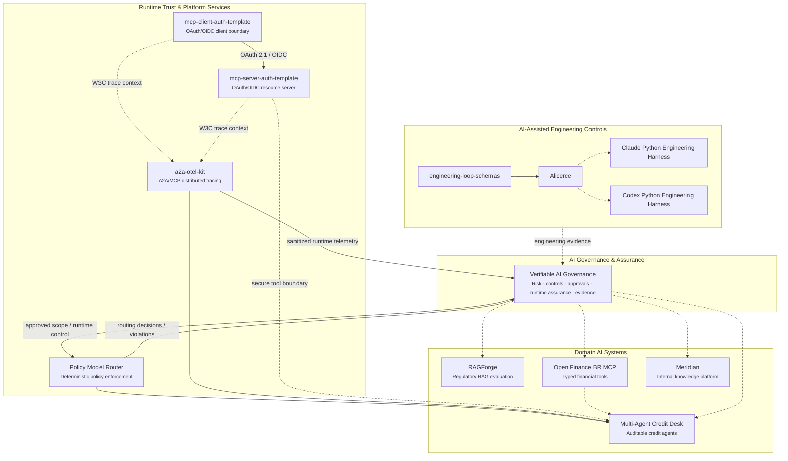
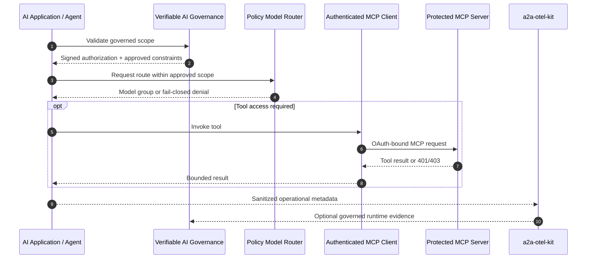

# Portfolio Architecture Map

> 🇧🇷 [Leia em Português](./PORTFOLIO_ARCHITECTURE.pt-BR.md)

This portfolio is organized as an engineering ecosystem rather than a collection of isolated demos.

The projects explore how to build, secure, operate, observe, evaluate, and govern AI systems. The common architectural direction is to keep high-impact decisions deterministic, place model behavior behind explicit contracts, and treat identity, agents, tools, model providers, retrieved data, and telemetry as trust boundaries.

## Ecosystem map



## 1. AI Governance & Assurance

### [Verifiable AI Governance](https://github.com/brunovicco/verifiable-ai-governance)

The governance plane turns policy requirements into executable and independently inspectable controls.

Its core chain is:

```text
Policy
  → Risk and controls
  → Independent approval
  → Signed runtime authorization
  → Runtime enforcement
  → Violation / runtime assurance
  → Governed response
  → Evidence
```

The project covers inventory, deterministic risk classification, control applicability, segregation of duties, evidence validation, scope-bound approvals, runtime authorization, Policy Model Router integration, sanitized telemetry, incident response, governed actuation, audit history, and release evidence.

The project provides a functional, production-oriented reference implementation and a [public read-only demo](https://vaigov-app.duckdns.org). wich may trail `main`; the repository README states the deployed version explicitly.

## 2. Runtime Trust & Platform Services

These projects provide reusable security, policy, and observability boundaries that should not be reimplemented independently in every AI application.

### [Policy Model Router](https://github.com/brunovicco/policy-model-router)

A fail-closed runtime policy enforcement service.

It selects a logical model group only after deterministic policy evaluation and can enforce governance-issued runtime authorization, preserve denial evidence, and consume runtime-control state such as a kill switch. It does not let an LLM choose its own authorization boundary.

### [mcp-server-auth-template](https://github.com/brunovicco/mcp-server-auth-template)

A production-oriented OAuth 2.1 resource-server reference for remote MCP.

It covers Microsoft Entra ID and generic OIDC, Protected Resource Metadata, exact resource/audience validation, delegated scopes versus application roles, progressive authorization, stateless MCP, hardened discovery/JWKS egress, privacy-safe telemetry, release provenance, and Official MCP Registry publication.

### [mcp-client-auth-template](https://github.com/brunovicco/mcp-client-auth-template)

The companion MCP client reference.

It demonstrates Authorization Code + PKCE, Client Credentials, CIMD-first discovery, exact resource binding, bounded scope step-up, wrong-audience rejection, stateless MCP, and distributed-trace continuity with the companion server.

Together, the two repositories provide an executable client/server authorization reference rather than independent configuration examples.

### [a2a-otel-kit](https://github.com/brunovicco/a2a-otel-kit)

A vendor-neutral OpenTelemetry library for A2A agents and MCP services.

It continues W3C Trace Context across protocol boundaries and keeps built-in protocol telemetry metadata-only by construction. The same library is used across the portfolio for trace continuity and governed runtime telemetry.

## 3. Domain AI Systems

| Project | Role | Main signal |
| --- | --- | --- |
| [RAGForge](https://github.com/brunovicco/ragforge) | Retrieval evaluation platform | Reproducible RAG experiments over regulatory and financial documents |
| [Multi-Agent Credit Desk](https://github.com/brunovicco/multi-agent-credit-desk) | Auditable multi-agent credit system | Deterministic credit policy, MCP/A2A boundaries, governed routing and runtime telemetry |
| [Open Finance BR MCP](https://github.com/brunovicco/openfinance-br-mcp) | Financial MCP reference | Typed tools, consent journeys, FAPI-BR security patterns, mock-first execution |
| [Meridian](https://github.com/brunovicco/meridian) | Internal knowledge reference | Semantic routing, retrieval-time access control, structured queries and grounded answers |

## 4. AI-Assisted Engineering Controls

| Project | Role |
| --- | --- |
| [engineering-loop-schemas](https://github.com/brunovicco/engineering-loop-schemas) | Canonical contracts for evidence, verdicts, and execution results |
| [Alicerce](https://github.com/brunovicco/alicerce) | Trusted deterministic execution and evidence-gated engineering loops |
| [Claude Python Engineering Harness](https://github.com/brunovicco/claude-python-engineering-harness) | Repository-owned rules, hooks, architecture boundaries, and quality gates for Claude Code |
| [Codex Python Engineering Harness](https://github.com/brunovicco/codex-python-engineering-harness) | Equivalent deterministic engineering baseline for Codex workflows |

## How the current runtime pieces connect



## Shared engineering principles

### Deterministic authority

Credit decisions, policy evaluation, access control, authorization, approval state, command authorization, and promotion remain outside LLM reasoning.

### Explicit trust boundaries

Agents, MCP servers, OAuth/OIDC providers, model gateways, retrieved documents, telemetry exporters, Git, filesystems, and execution environments are treated as separate trust boundaries.

### Evidence over self-report

Important claims are tied to executable checks, versioned policy, commits, hashes, scopes, traces, and independently inspectable artifacts.

### Privacy-aware observability

Protocol instrumentation is intentionally metadata-oriented. Prompts, responses, credentials, authorization material, arbitrary business payloads, and exception text are excluded from built-in A2A/MCP telemetry paths.

### Human authority for high-impact actions

Models can assist with analysis, drafting, and implementation, but approval, deployment, overrides, containment, restoration, and promotion remain explicitly governed.

## Recommended reviewer path

For a five-to-ten-minute technical review:

1. Start with **Verifiable AI Governance** to understand the overall governance and runtime assurance model.
2. Review the **MCP Server + Client Auth** pair for identity, authorization, and protocol-security depth.
3. Run or inspect the **a2a-otel-kit** end-to-end trace demo.
4. Review **Policy Model Router** for deterministic runtime policy enforcement.
5. Use **RAGForge** or **Multi-Agent Credit Desk** to inspect applied AI architecture.
