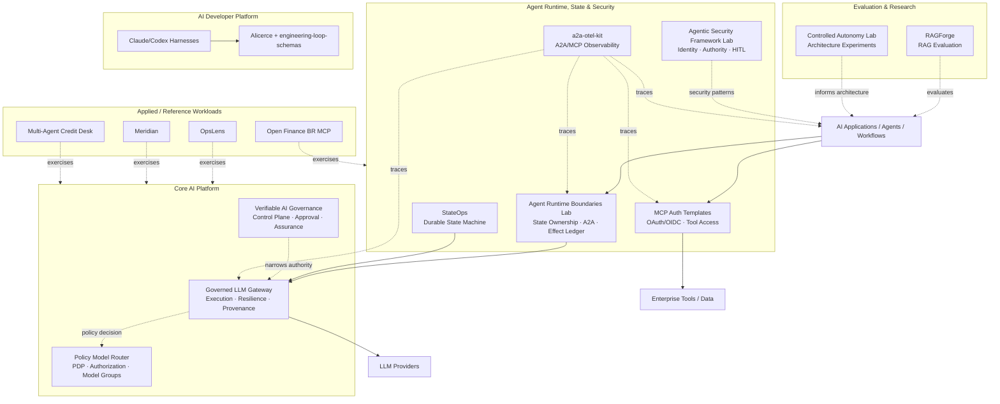
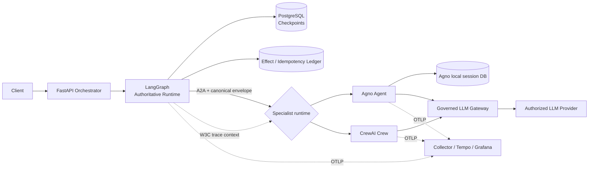
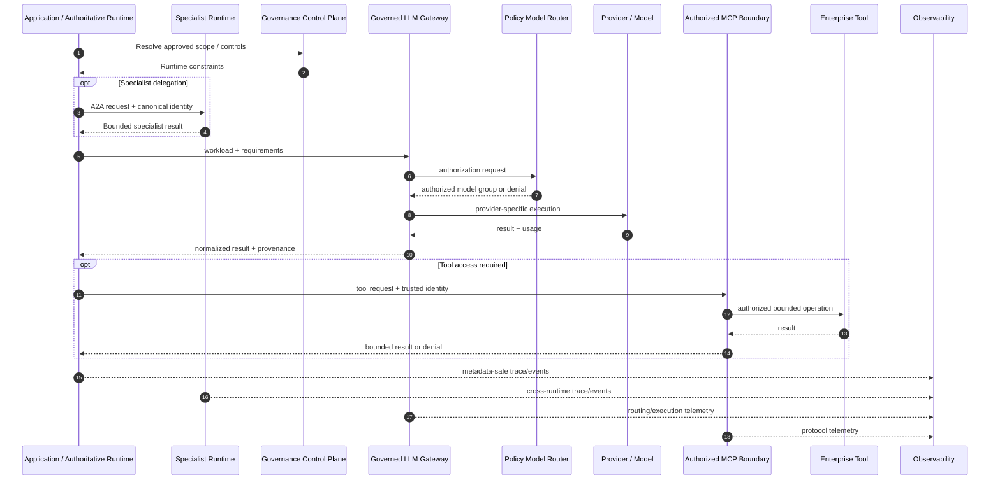

# AI Platform Engineering Ecosystem

> 🇧🇷 [Leia em Português](./PORTFOLIO_ARCHITECTURE.pt-BR.md)

This portfolio is organized as an **AI Platform Engineering ecosystem**, not as a collection of isolated AI demos.

The projects explore how to build, operate, secure, observe, evaluate, and govern AI systems across multiple products and teams. Reusable platform capabilities are separated from architecture labs and reference workloads so that contracts, authority boundaries, failure modes, and evidence can be inspected independently.

The recurring architecture principle is:

> **Models may reason and propose. Trusted software authorizes, constrains, executes, and produces evidence.**

Across the ecosystem, this means:

- high-impact authority remains outside LLM reasoning;
- one runtime owns global workflow state;
- applications depend on provider-neutral and policy-aware contracts instead of embedding provider logic everywhere;
- identity, model access, tools, retrieved data, runtime boundaries, and telemetry are explicit trust boundaries;
- checkpoints and external side-effect evidence are treated as different concerns;
- important runtime claims should resolve to independently inspectable evidence;
- autonomy is introduced only where it creates enough value to justify additional failure modes.

---

## Portfolio map



This is a conceptual capability map, not a claim that every repository is deployed together or that every workload requires every platform component.

---

# 1. Core AI Platform

## [Governed LLM Gateway](https://github.com/brunovicco/governed-llm-gateway)

**Role:** flagship provider-neutral LLM execution layer.

The Gateway keeps provider credentials, model/provider selection, retry and fallback behavior, budgets, runtime provenance, and observability outside application code.

```text
Application / Agent
        │
        │ workload + requirements + Gateway credential
        ▼
Policy Model Router (PDP)
        │
        │ authorized logical model groups
        ▼
Governed LLM Gateway (PEP)
        ├─ eligibility
        ├─ deterministic ranking
        ├─ health / circuit breaker
        ├─ bounded retry
        ├─ safe fallback
        ├─ provider translation
        ├─ spend limits
        └─ provenance + OpenTelemetry
        ▼
Authorized provider / model
```

The key authority invariant is:

```text
Gateway allowed set ⊆ Policy Router authorized set
```

The Gateway may narrow what policy authorized. It may never widen it.

### Architectural boundary

The Gateway owns **model execution authority**. It does not own workflow state, business-tool authorization, domain side effects, or business decisions.

---

## [Policy Model Router](https://github.com/brunovicco/policy-model-router)

**Role:** Policy Decision Point (PDP) for model access.

The Router evaluates a workload against deterministic, versioned constraints such as data classification, workload risk, required capabilities, structured-output requirements, context limits, cost ceilings, latency ceilings, availability, and approved logical model groups.

The result is an explainable authorization decision or a fail-closed denial. The Router does not call a language model.

```text
Policy Model Router = what may be used
Governed LLM Gateway = what actually executes
```

Keeping PDP and PEP responsibilities separate makes authorization independently testable and prevents runtime availability from silently becoming permission.

---

## [Verifiable AI Governance](https://github.com/brunovicco/verifiable-ai-governance)

**Role:** AI governance and runtime-assurance control plane.

The project explores how governance requirements can become enforceable system behavior instead of remaining only in documents or approval tickets.

```text
Policy
  → Risk & controls
  → Independent approval
  → Runtime authorization
  → Enforcement
  → Runtime assurance
  → Incident / governed response
  → Evidence
```

The portfolio treats authorization as **monotonic narrowing of authority** across layers: governance and runtime policy may further restrict what is allowed, but must not silently expand authority.

---

# 2. Agent Runtime, State & Interoperability

## [Agent Runtime Boundaries Lab](https://github.com/brunovicco/agent-runtime-boundaries-lab)

**Role:** reference architecture for composing multiple agent runtimes without creating multiple owners of the same execution state.

The lab addresses a common multi-framework failure mode: teams try to “take the best of each framework,” but each runtime brings its own concepts of session, run, persistence, retry, memory, streaming, and recovery.

The repository uses one rule:

> **One runtime coordinates. Other runtimes provide capabilities behind explicit contracts.**

In the current experiments:

- **LangGraph** owns global workflow state, checkpoints, resumption, and workflow phase;
- **Agno** may own specialist-local session context;
- **CrewAI** may coordinate bounded specialist roles/tasks inside a Crew;
- **A2A** is the explicit remote-agent message boundary;
- **PostgreSQL** stores LangGraph checkpoints and a separate effect/idempotency ledger;
- **a2a-otel-kit** propagates W3C Trace Context across runtimes;
- **Governed LLM Gateway** owns provider/model execution policy by default.



### Important invariants

- `conversation_id` is application-owned;
- `execution_id` identifies one orchestrator execution;
- `delegation_id` identifies one orchestrator-to-specialist call;
- framework-specific IDs never become the global workflow identity;
- specialist contracts cannot mutate the global workflow phase;
- cross-runtime payloads use framework-neutral typed contracts;
- delegations use stable idempotency keys;
- completed remote results are stored separately from LangGraph checkpoints;
- W3C trace context crosses the A2A boundary without becoming a business identifier.

### Checkpoint versus effect ledger

A workflow checkpoint can tell the orchestrator where execution was. It cannot prove whether a remote side effect already happened before a process failure.

The lab therefore separates:

```text
Checkpoint
→ workflow position / state

Effect ledger
→ what external delegation/effect was attempted or completed
```

The current ledger reserves an idempotency key before delegation and records completed results afterward. A crash after completion can reuse the stored result. A crash while the outcome is still unknown remains an **at-least-once** case rather than an exactly-once claim.

This explicit non-claim is intentional: distributed execution guarantees should be stated according to what the system can actually prove.

### Evidence

The repository includes deterministic anti-pattern demonstrations, real PostgreSQL integration tests, injected crash/retry scenarios, real LangGraph → A2A → Agno → Governed LLM Gateway inference, and Tempo/Grafana trace evidence across runtime boundaries.

---

## [StateOps](https://github.com/brunovicco/stateops)

**Role:** reference implementation of a durable, replayable LangGraph state machine integrated with the Governed LLM Gateway.

StateOps focuses on durability and lifecycle **inside one authoritative runtime**:

- explicit typed state;
- lifecycle transitions;
- dynamic fan-out with `Send`;
- deterministic reducers;
- `Command`-based routing;
- nested graphs;
- human interrupts;
- Redis checkpointing;
- restart/resume;
- replay and controlled forks;
- idempotent side effects;
- streaming and execution history;
- provider-neutral reasoning through the Gateway.

### StateOps vs Agent Runtime Boundaries Lab

```text
StateOps
→ How should one authoritative runtime manage durable workflow state?

Agent Runtime Boundaries Lab
→ How should multiple runtimes/frameworks compose without splitting global state ownership?
```

Together they cover two different production concerns rather than duplicating each other.

---

# 3. Agent Security, Identity & Tool Access

## [Agentic Security Framework Lab](https://github.com/brunovicco/agentic-security-framework-lab)

**Role:** framework-neutral security and authority lab for agentic systems.

The same controlled workload is implemented through LangGraph, CrewAI, LlamaIndex, and Agno while authorization and enforcement remain outside the framework.

A key distinction is:

```text
tool availability != tool authorization != tool execution
```

The project also treats prompt injection conservatively: it does not claim that injection can always be prevented. Instead, it asks what authority a compromised reasoning path actually receives.

### Runtime Boundaries Lab vs Security Framework Lab

```text
Agent Runtime Boundaries Lab
→ Who owns execution state and replay across runtimes?

Agentic Security Framework Lab
→ Which security authorities must remain outside the model/framework?
```

---

## [MCP Server Auth Template](https://github.com/brunovicco/mcp-server-auth-template)
## [MCP Client Auth Template](https://github.com/brunovicco/mcp-client-auth-template)

**Role:** executable identity and authorization references for protected remote MCP.

The pair covers OAuth 2.1/OIDC, delegated and machine identities, authorization code + PKCE, machine-to-machine flows, resource/audience binding, scopes/application roles, protected resource metadata, step-up authorization, protected tool discovery, trace-context continuity, and privacy-aware telemetry.

The platform rule is simple:

> The model may request a tool. Authorization remains a deterministic security decision outside the model.

---

# 4. Distributed Agent Observability

## [a2a-otel-kit](https://github.com/brunovicco/a2a-otel-kit)

**Role:** vendor-neutral observability layer for A2A and MCP interactions.

`a2a-otel-kit` keeps distributed agent hops in one OpenTelemetry trace using W3C Trace Context.

```text
Business request
   ↓
Orchestrator
   ↓ A2A
Agent
   ↓ MCP
Tool / Service
```

Key properties include A2A and MCP client/server instrumentation, OTLP export, explicit telemetry lifecycle, metadata-only built-in protocol telemetry, and deny-by-default handling for prompts, model responses, MCP arguments/results, credentials, and business payloads.

The Agent Runtime Boundaries Lab is now a concrete consumer of this capability across LangGraph and specialist runtimes.

---

# 5. Evaluation & AI Quality Engineering

## [RAGForge](https://github.com/brunovicco/ragforge)

**Role:** RAG experimentation, benchmarking, and evaluation platform.

RAGForge treats retrieval architecture as an empirical engineering problem. Its scope includes a 230-question RegRAG-BR golden dataset, 10 retrieval configurations, retrieval metrics, generated-answer evaluation, citation support, evidence-aware abstention, and auditable experiment artifacts.

The platform-level questions are:

- Did retrieval regress?
- Did answer quality regress?
- Is the answer supported by retrieved evidence?
- Did a more expensive strategy improve quality enough to justify its cost?
- Is the failure in retrieval, generation, or evaluation?

---

## [Controlled Autonomy Lab](https://github.com/brunovicco/controlled-autonomy-lab)

**Role:** architecture research lab for model autonomy and control.

The project asks:

> Who owns the next step: deterministic application code or the model?

It compares augmented LLM, prompt chaining, routing, parallelization, evaluator-optimizer, and bounded tool-using agents across multiple provider/model bundles.

### Relationship with the other runtime labs

```text
Controlled Autonomy Lab
→ How much trajectory control should the model receive?

Agent Runtime Boundaries Lab
→ How should multiple runtimes share a system without sharing global state ownership?

Agentic Security Framework Lab
→ Which authorities must remain outside the model/framework?
```

---

# 6. AI Developer Platform

Coding agents create a platform problem beyond code generation: how to improve engineering productivity while keeping execution, validation, and promotion controlled.

| Project | Role |
| --- | --- |
| [**Claude Python Engineering Harness**](https://github.com/brunovicco/claude-python-engineering-harness) | Repository-owned engineering rules, hooks, architecture boundaries, and quality gates for Claude Code |
| [**Codex Python Engineering Harness**](https://github.com/brunovicco/codex-python-engineering-harness) | Equivalent deterministic baseline for Codex workflows |
| [**engineering-loop-schemas**](https://github.com/brunovicco/engineering-loop-schemas) | Canonical typed contracts for evidence, execution results, and verdicts |
| [**Alicerce**](https://github.com/brunovicco/alicerce) | Trusted deterministic execution and evidence-gated engineering loops |

Shared principles include repository-owned policy, deterministic validation around generative behavior, architecture and dependency boundaries, explicit evidence before promotion, bounded execution, and human authority over high-impact actions.

---

# 7. Applied & Reference Workloads

## [OpsLens](https://github.com/brunovicco/opslens)

**Role:** AWS-native architecture lab for software-supply-chain intelligence.

OpsLens separates probabilistic reasoning from deterministic security authority and demonstrates Amazon Bedrock, RAG/hybrid retrieval, IAM, Terraform, GitHub Actions OIDC, CloudWatch, CI/CD security gates, deterministic evidence, and cost/observability concerns.

---

## [Meridian](https://github.com/brunovicco/meridian)

**Role:** enterprise knowledge application reference.

Meridian demonstrates semantic routing, ambiguity thresholds, retrieval-time ACL enforcement, structured-data query paths, Pydantic contracts, DSPy, Redis Stack, grounded answers, and citations.

Its key security property is that unauthorized knowledge is filtered **inside retrieval**, not retrieved first and removed later.

---

## [Open Finance BR MCP](https://github.com/brunovicco/openfinance-br-mcp)

**Role:** regulated-domain MCP and Open Finance reference.

The project explores Open Finance Brasil concepts, FAPI-BR-oriented security patterns, MCP tools, typed contracts, consent flows, mTLS/PAR/JAR/PKCE-related boundaries, mock-first development, shared state, security, and observability.

Mock and experimental integrations remain distinct from production claims.

---

## [Multi-Agent Credit Desk](https://github.com/brunovicco/multi-agent-credit-desk)

**Role:** auditable financial multi-agent reference workload.

The project exercises deterministic credit policy, agent collaboration, MCP boundaries, A2A communication, governed model access, structured contracts, telemetry, and auditable decision evidence.

---

# 8. Cross-cutting concerns

## Security

Security appears across every layer rather than as a final gate: fail-closed policy evaluation, least privilege, identity separate from model input, resource/audience binding, tool-scope enforcement, bounded side effects, privacy-aware telemetry, architecture guards, and CI/CD identity without long-lived cloud credentials.

## Governance

Governance is modeled as executable state and policy: policy versions, approved scopes, runtime authorization, human approval, segregation of duties, evidence lineage, denial/violation records, containment, and restoration paths.

## Observability

Operational visibility includes conventional distributed-system telemetry and AI-specific runtime information: latency, errors, distributed traces, model-routing decisions, retry/fallback behavior, tool calls, checkpoint transitions, token/cost signals, and evaluation evidence.

## Evaluation

Evaluation is part of architecture. Depending on the system, it may cover retrieval quality, answer quality, grounding, citation support, routing, tool selection, structured-output validity, workflow outcomes, regressions, latency, and cost.

## Evidence

Important claims should resolve to independently inspectable evidence when practical: tests, CI gates, deterministic fixtures, benchmark artifacts, traces, decision IDs, policy/registry digests, release provenance, audit records, and explicit limitations/non-claims.

---

# 9. Authority and ownership model

| Concern | Model / specialist framework | Authoritative software |
| --- | --- | --- |
| Interpret natural language | Yes | May validate |
| Generate hypotheses | Yes | Bounds collection/execution |
| Summarize evidence | Yes | Controls admitted evidence |
| Propose an action | Yes | Validates and authorizes |
| Choose any provider/model | No | Policy + Gateway |
| Own global workflow phase | No for specialists | Authoritative runtime |
| Establish caller identity | No | Identity layer |
| Grant tool permission | No | Authorization layer |
| Approve high-impact action | No | Human/policy authority |
| Execute external side effect | No direct authority | Controlled runtime |
| Declare evidence valid | No | Deterministic/evaluation logic |
| Override missing evidence | No | Fail-closed system behavior |

This is not an argument against capable models or frameworks. It is an architecture for using them without making them implicit roots of trust or competing sources of runtime truth.

---

# 10. Conceptual runtime flow



---

# 11. Repository roles

| Category | Purpose |
| --- | --- |
| **Platform / product** | Reusable capability with a clear consumer contract |
| **Reference implementation** | Concrete implementation of an architectural pattern |
| **Research / architecture lab** | Controlled experiment or comparative engineering investigation |
| **Reference workload** | Domain workload used to exercise horizontal platform capabilities |
| **Engineering foundation** | Shared contracts, harnesses, or execution primitives |
| **Educational / challenge** | Learning material or work created under a constrained exercise |

This distinction keeps claims proportional to what each repository actually proves.

---

# 12. Recommended review paths

## 5-minute hiring-manager path

1. [**Governed LLM Gateway**](https://github.com/brunovicco/governed-llm-gateway) — flagship platform component.
2. [**Agent Runtime Boundaries Lab**](https://github.com/brunovicco/agent-runtime-boundaries-lab) — multi-runtime composition, state ownership, A2A, replay, and real trace evidence.
3. [**StateOps**](https://github.com/brunovicco/stateops) — durable workflow state and LangGraph engineering.
4. [**Agentic Security Framework Lab**](https://github.com/brunovicco/agentic-security-framework-lab) — security and authority boundaries.
5. [**a2a-otel-kit**](https://github.com/brunovicco/a2a-otel-kit) — focused reusable OSS capability.
6. [**RAGForge**](https://github.com/brunovicco/ragforge) — evaluation rigor.

## 15-minute AI/platform architect path

1. Inspect the **Gateway ↔ Policy Model Router** PDP/PEP boundary.
2. Review **Agent Runtime Boundaries Lab** for global state ownership, identity mapping, effect-ledger semantics, A2A boundaries, and at-least-once failure analysis.
3. Review **StateOps** for checkpointing, replay, forks, idempotency, and human interrupts inside one authoritative runtime.
4. Review **Verifiable AI Governance** for control-plane and runtime-assurance concepts.
5. Review **Agentic Security Framework Lab** for identity, authorization, approval, and side-effect boundaries.
6. Inspect **a2a-otel-kit** for A2A/MCP trace propagation and privacy design.
7. Review **RAGForge** methodology and evidence lineage.

## AI developer-platform path

1. Review the **Claude/Codex Engineering Harnesses**.
2. Inspect **engineering-loop-schemas**.
3. Review **Alicerce**.
4. Connect those components to the same principles: deterministic authority, evidence, bounded execution, and human-controlled promotion.

## AWS / applied architecture path

1. Review **OpsLens**.
2. Inspect its deterministic authority model and AWS foundation.
3. Compare those boundaries with the Governed LLM Gateway and the broader platform architecture.

---

# Final architecture thesis

The portfolio is intentionally moving away from application-specific AI integration toward reusable AI platform capabilities.

```text
Applications declare intent and requirements.

One runtime owns global execution state.
Specialist runtimes provide bounded capabilities.
Policy determines authority.
The Gateway controls model execution.
Identity controls tool access.
Effect evidence is separate from workflow checkpoints.
Deterministic software protects consequential decisions.
Observability explains runtime behavior.
Evaluation measures quality.
Governance constrains the system.
Evidence proves what happened.
```

The goal is not to remove model or framework autonomy.

It is to make autonomy **bounded, observable, replaceable, testable, replay-aware, and compatible with enterprise authority models**.
