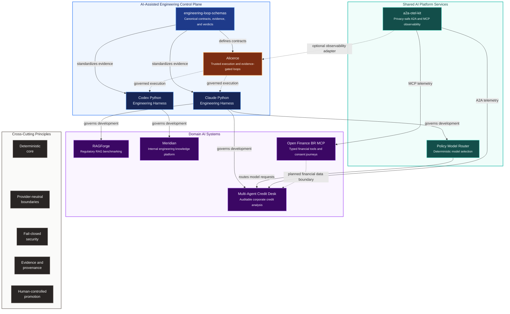
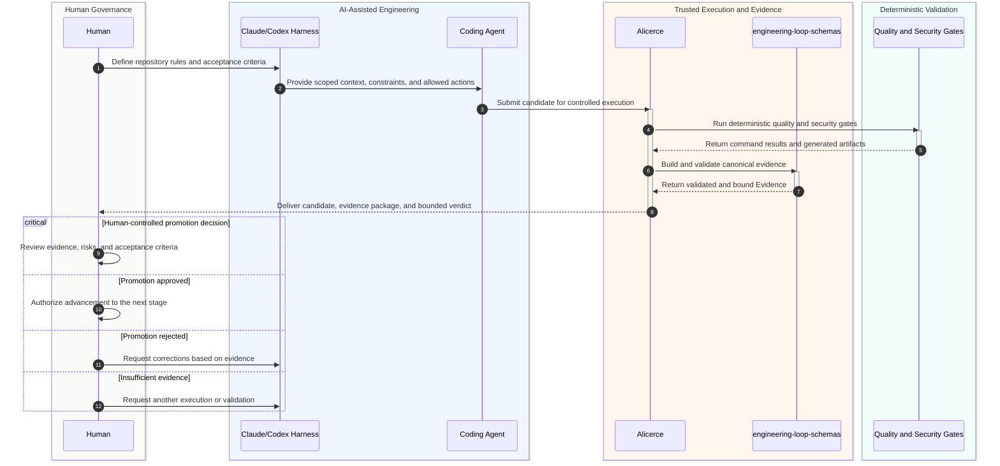
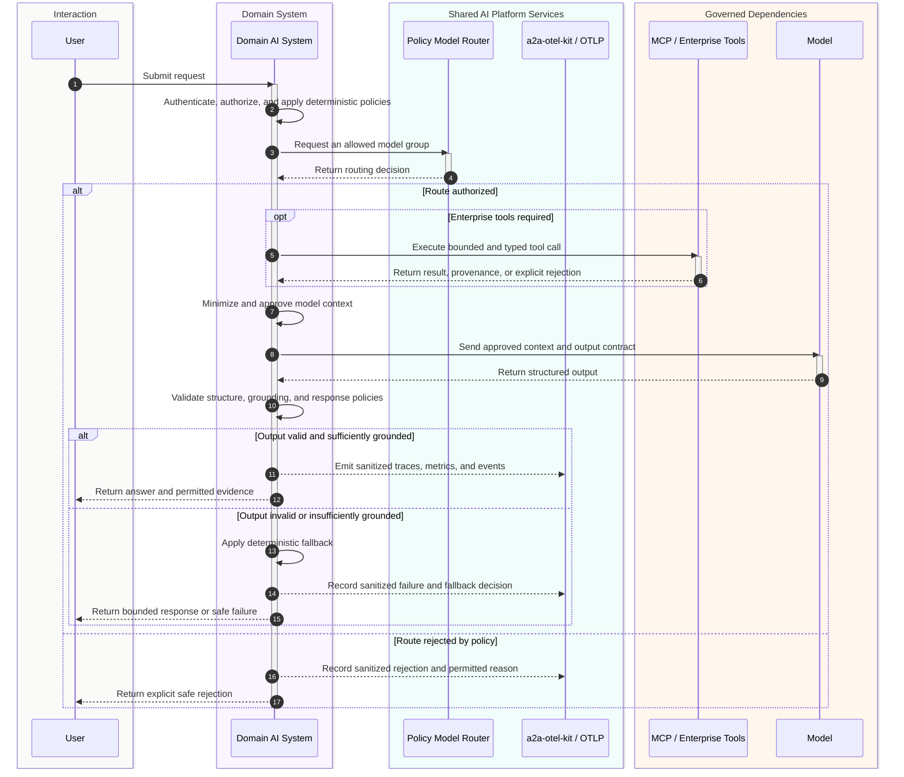

# Portfolio Architecture Map

> 🇧🇷 [Leia em Português](./PORTFOLIO_ARCHITECTURE.pt-BR.md)

This portfolio is organized as an ecosystem rather than a collection of isolated demos.

The projects explore how to build, operate, evaluate, observe, and govern AI systems in regulated environments. They share the same architectural direction:

- keep business-critical decisions deterministic;
- place LLMs behind explicit contracts and bounded responsibilities;
- treat agents, MCP servers, model providers, and telemetry as trust boundaries;
- make security, evaluation, provenance, and auditability part of the architecture;
- use coding agents under repository-owned engineering controls.

## Ecosystem map



## Architectural layers

### 1. Domain AI systems

These projects demonstrate how AI capabilities are applied to concrete business and engineering problems.

| Project | Role in the portfolio | Current emphasis |
|---|---|---|
| [RAGForge](https://github.com/brunovicco/ragforge) | Experimental platform for comparing retrieval strategies over Brazilian financial and regulatory documents | Legal-structure-aware ingestion, sparse/dense/hybrid retrieval, relevance judgments, reproducible evaluation |
| [Meridian](https://github.com/brunovicco/meridian) | Reference architecture for an internal engineering knowledge platform | Semantic routing, retrieval-time access control, structured queries, grounded answers and citations |
| [Open Finance BR MCP](https://github.com/brunovicco/openfinance-br-mcp) | Experimental MCP boundary for Open Finance Brasil | Typed tools, consent flows, FAPI-BR security patterns, mock-first execution and explicit validation limits |
| [Multi-Agent Credit Desk](https://github.com/brunovicco/multi-agent-credit-desk) | Incremental multi-agent platform for auditable corporate credit analysis | Deterministic credit policy, synthetic bureau data, MCP/A2A boundaries and optional LLM-generated narratives |

### 2. Shared AI platform services

These repositories extract reusable capabilities that should not be reimplemented inside every AI application.

#### [Policy Model Router](https://github.com/brunovicco/policy-model-router)

A deterministic routing service that selects an allowed model group only after applying policy and workload constraints.

Its role is to keep model choice outside individual agents and provide one place to enforce rules such as:

- permitted providers and model groups;
- data-sensitivity restrictions;
- latency and cost classes;
- workload-specific capabilities;
- explicit rejection reasons.

#### [a2a-otel-kit](https://github.com/brunovicco/a2a-otel-kit)

A reusable observability library for A2A agents and MCP services.

It standardizes:

- OpenTelemetry initialization;
- W3C trace-context propagation;
- structured event schemas;
- allowlist-based telemetry attributes;
- privacy-safe failure reporting;
- lifecycle handling for streaming operations.

It intentionally avoids making Datadog, Langfuse, or another observability vendor part of the application core.

### 3. AI-assisted engineering control plane

These projects address a different problem: how to use coding agents without delegating engineering authority to them.

#### [Claude Python Engineering Harness](https://github.com/brunovicco/claude-python-engineering-harness)

Reusable project scaffold and Claude Code plugin with repository-owned instructions, skills, hooks, quality gates, architecture boundaries, MCP policy, and optional governance overlays.

#### [Codex Python Engineering Harness](https://github.com/brunovicco/codex-python-engineering-harness)

The corresponding engineering baseline for Codex-based workflows, aligned around deterministic validation rather than model self-assessment.

#### [engineering-loop-schemas](https://github.com/brunovicco/engineering-loop-schemas)

Canonical, provider-neutral contracts for evidence-gated engineering loops.

It defines the shared language for:

- contracts;
- builder results;
- execution evidence;
- verdicts;
- final states;
- commit and environment bindings;
- exact-byte hashes.

The central rule is simple: a builder may report what it did, but it cannot certify its own result.

#### [Alicerce](https://github.com/brunovicco/alicerce)

The trusted local core for deterministic and auditable engineering loops.

Its incremental architecture includes:

- immutable run identity;
- durable state and compare-and-swap updates;
- opaque workspace capabilities;
- controlled Git materialization;
- pre-spawn command authorization;
- Linux process isolation;
- canonical command evidence;
- explicit human authority over promotion, merge, and deployment.

## How the projects connect

### Engineering workflow



### Runtime AI workflow



## Shared design principles

### Deterministic decisions before generative behavior

Credit outcomes, access control, command authorization, policy evaluation, and promotion decisions are kept outside the LLM.

The model may classify, summarize, route within a bounded contract, or draft a narrative. It does not become the source of truth for high-impact decisions.

### Provider-neutral core, provider-specific adapters

Business rules and domain models should not depend directly on OpenAI, Anthropic, Google, LangChain, LangGraph, MCP, A2A, or an observability vendor.

Those integrations belong at the edges and can be replaced without rewriting the deterministic core.

### Security at the boundary

The projects treat every external integration as a trust boundary:

- MCP tools;
- model providers;
- agent-to-agent calls;
- retrieved documents;
- telemetry exporters;
- candidate code execution;
- Git and filesystem access.

Controls are designed to fail closed when identity, policy, provenance, or runtime guarantees cannot be verified.

### Evidence over self-reported success

A model saying that tests passed is not evidence.

The engineering-loop projects bind results to exact commands, outputs, policies, commits, environments, and hashes. Runtime AI projects use citations, structural identifiers, access filters, traces, and evaluation datasets for the same reason: important claims should be independently verifiable.

### Human authority remains explicit

Agents can prepare candidates, collect evidence, propose decisions, and explain trade-offs.

Promotion, merge, deployment, policy exceptions, and high-impact business actions remain under explicit human or organizational authority.

## Maturity map

The portfolio intentionally contains projects at different maturity levels.

| Project | Maturity | What is proven today | Next major proof point |
|---|---|---|---|
| RAGForge | Active development | Regulatory ingestion, structural chunking, retrieval strategies and relevance metrics | Complete benchmark matrix and publish reproducible results |
| Meridian | Reference implementation | Zero-setup demo, routing, ACL-aware retrieval and structured query path | Public walkthrough and end-to-end deployment profile |
| Open Finance BR MCP | Experimental release | Mock environment, typed MCP surface, consent and security foundations | Validation against official sandboxes and real participant configurations |
| Multi-Agent Credit Desk | Incremental build | Deterministic core, MCP services, initial A2A agent and synthetic KYC flow | Orchestration, end-to-end decision package and observability wiring |
| Policy Model Router | Early service | Deterministic routing core and container publication | Broader policy catalog, operational metrics and consumer examples |
| a2a-otel-kit | Reusable library | A2A/MCP trace propagation, sanitized events and integration tests | Wider adoption across portfolio services |
| engineering-loop-schemas | Versioned foundation | Canonical contracts and evidence models | Completion-level evaluator and operational health contracts |
| Alicerce | Phase 2A | Trusted workspace, sandbox, state, command authorization and evidence primitives | Complete evidence assembly, persistence and resumable orchestration |
| Claude/Codex Harnesses | Reusable engineering baseline | Scaffolding, quality gates, hooks, policies and governance profiles | Integration with the completed Alicerce execution loop |

## Portfolio narrative

Together, these projects support one professional thesis:

> Production AI systems require more than model integration. They need deterministic boundaries, explicit authority, measurable quality, privacy-safe observability, reproducible evidence, and engineering workflows that remain trustworthy even when agents write part of the code.

The portfolio therefore covers the full path:

```text
Domain problem
    → deterministic business core
    → bounded AI capability
    → model and tool policy
    → observability and evaluation
    → secure AI-assisted engineering
    → canonical evidence
    → human-controlled promotion
```

## Suggested reading paths

### For AI platform and architecture roles

1. [Alicerce](https://github.com/brunovicco/alicerce)
2. [engineering-loop-schemas](https://github.com/brunovicco/engineering-loop-schemas)
3. [a2a-otel-kit](https://github.com/brunovicco/a2a-otel-kit)
4. [Policy Model Router](https://github.com/brunovicco/policy-model-router)

### For RAG and LLM engineering roles

1. [RAGForge](https://github.com/brunovicco/ragforge)
2. [Meridian](https://github.com/brunovicco/meridian)
3. [Open Finance BR MCP](https://github.com/brunovicco/openfinance-br-mcp)

### For financial-services AI roles

1. [Multi-Agent Credit Desk](https://github.com/brunovicco/multi-agent-credit-desk)
2. [Open Finance BR MCP](https://github.com/brunovicco/openfinance-br-mcp)
3. [RAGForge](https://github.com/brunovicco/ragforge)

### For AI enablement and developer-productivity roles

1. [Claude Python Engineering Harness](https://github.com/brunovicco/claude-python-engineering-harness)
2. [Codex Python Engineering Harness](https://github.com/brunovicco/codex-python-engineering-harness)
3. [Alicerce](https://github.com/brunovicco/alicerce)
4. [engineering-loop-schemas](https://github.com/brunovicco/engineering-loop-schemas)
