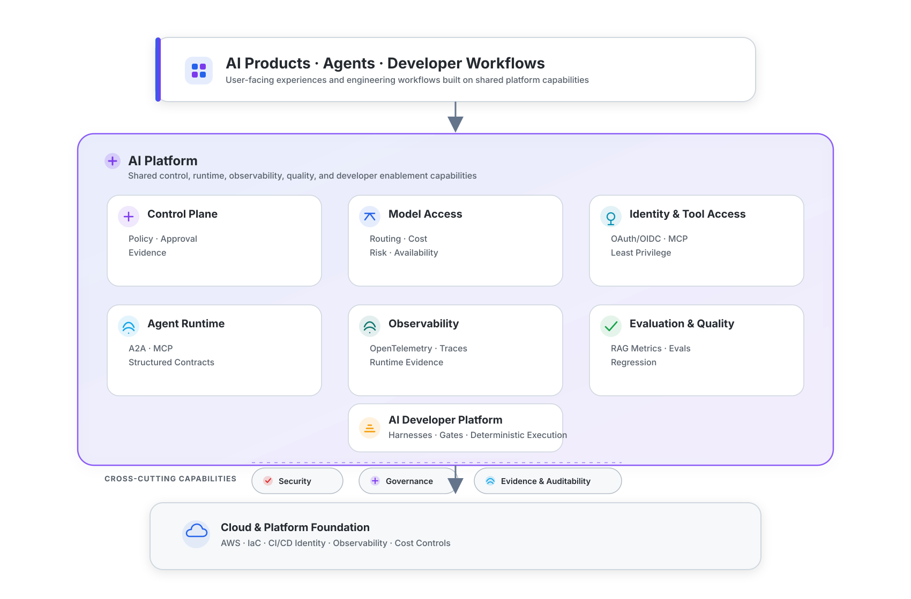
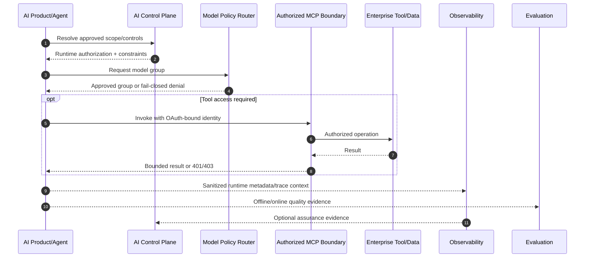

# AI Platform Engineering Ecosystem

> 🇧🇷 [Leia em Português](./PORTFOLIO_ARCHITECTURE.pt-BR.md)

This portfolio is organized as an **AI Platform Engineering ecosystem**, not as a collection of isolated demos.

The projects explore the horizontal capabilities required to build, operate, secure, observe, evaluate, and govern AI systems across multiple products and teams. Domain applications are used as **reference workloads** that exercise those capabilities in realistic scenarios.

The architectural direction is consistent across the portfolio:

- keep high-impact authority outside LLM reasoning;
- place model and agent behavior behind explicit contracts;
- treat identity, tools, model providers, retrieved data, telemetry, and execution environments as trust boundaries;
- make important claims independently verifiable through code, tests, traces, policies, hashes, and evidence artifacts.

---

## Capability map

<p align="center">
  
</p>

The goal is not to build one monolithic platform repository. Each project isolates a capability so its contracts, security boundaries, failure modes, and evidence can be inspected independently.

---

# 1. AI Control Plane & Runtime Policy

## [Verifiable AI Governance](https://github.com/brunovicco/verifiable-ai-governance)

**Role:** governance and assurance control plane.

It turns governance requirements into executable controls and independently inspectable runtime evidence.

```text
Policy
  → Risk & controls
  → Independent approval
  → Signed runtime authorization
  → Runtime enforcement
  → Violation/assurance
  → Governed response
  → Evidence
```

Key platform signals:

- deterministic policy and risk evaluation;
- segregation of duties and immutable review rounds;
- scope-bound model/agent approvals;
- signed runtime authorization;
- runtime enforcement and trusted denial evidence;
- sanitized runtime telemetry;
- incidents, containment, restoration, and audit history;
- release evidence, provenance, SBOM/security checks, and clean-install verification.

This repository is the clearest expression of the portfolio's **control-plane** concept: governance is not a document layer around AI; it becomes runtime state and enforceable software behavior.

---

## [Policy Model Router](https://github.com/brunovicco/policy-model-router)

**Role:** deterministic policy decision point for model access.

The router deliberately keeps model selection out of agent prompts and application code. A workload is evaluated against versioned constraints such as:

- data classification;
- workflow risk;
- structured-output and tool requirements;
- context-window limits;
- cost ceilings;
- latency ceilings;
- availability;
- agent allowlists.

The output is an explainable model-group decision or a fail-closed rejection. The service does **not** call an LLM.

### Why this belongs in a platform

Without a shared policy layer, each application tends to embed its own provider selection, cost rules, data permissions, and fallback behavior. The router centralizes that policy boundary while keeping downstream inference/provider gateways replaceable.

---

# 2. Identity & Tool Access

## [mcp-server-auth-template](https://github.com/brunovicco/mcp-server-auth-template)
## [mcp-client-auth-template](https://github.com/brunovicco/mcp-client-auth-template)

**Role:** executable identity and authorization reference for remote MCP.

The pair answers a platform-level question:

> How can agents and developer tools access enterprise capabilities without turning MCP into an IAM bypass?

The combined reference covers:

- OAuth 2.1/OIDC;
- Microsoft Entra ID and generic OIDC boundaries;
- Authorization Code + PKCE and machine-to-machine flows;
- Protected Resource Metadata and exact resource/audience binding;
- delegated scopes versus application roles;
- bounded step-up authorization;
- wrong-audience rejection;
- protected tool discovery;
- stateless MCP;
- W3C trace-context continuity;
- privacy-safe telemetry;
- executable cross-repository E2E evidence.

### Platform principle

The LLM or agent may request a tool. **Authorization remains a deterministic security decision outside the model.**

---

# 3. Agent Runtime & Observability

## [a2a-otel-kit](https://github.com/brunovicco/a2a-otel-kit)

**Role:** vendor-neutral distributed observability for A2A and MCP boundaries.

Agentic systems frequently cross process and protocol boundaries:

```text
Business request
    ↓
Orchestrator
    ↓ A2A
Agent
    ↓ MCP
Tool/Service
```

`a2a-otel-kit` keeps those hops in one OpenTelemetry trace using W3C Trace Context.

Key design properties:

- A2A client/server tracing;
- MCP Streamable HTTP client/server tracing;
- OTLP export without coupling applications to an observability vendor SDK;
- explicit lifecycle and shutdown;
- privacy-safe metadata-only protocol telemetry;
- no prompts, responses, business payloads, MCP arguments/results, credentials, or arbitrary headers in built-in protocol instrumentation;
- executable demo proving A2A and MCP spans share a trace ID.

### Why this belongs in a platform

Each application should not invent its own protocol instrumentation, correlation vocabulary, privacy rules, and trace propagation. Observability is a reusable runtime capability.

---

# 4. AI Evaluation & Quality Engineering

## [RAGForge](https://github.com/brunovicco/ragforge)

**Role:** evaluation and experimentation layer for retrieval-augmented systems.

RAGForge treats architecture choices as experiments rather than intuition. Its current scope includes:

- **230-question** RegRAG-BR golden dataset;
- 10 retrieval configurations, from dense/BM25/hybrid to reranking, contextual retrieval, parent-child, SAC, RAPTOR, and GraphRAG;
- retrieval metrics such as Recall@K, Precision@K, MRR, and nDCG;
- generated-answer evaluation including Citation Accuracy, Faithfulness, and Answer Relevancy;
- explicit abstention/evidence handling;
- auditable experiment artifacts and lineage;
- architectural separation between retrieval quality and generation quality.

### Why this is a platform capability

AI platforms need more than runtime metrics. They need a way to answer:

- Did quality regress after changing a model, prompt, chunker, or retriever?
- Is the failure in retrieval or generation?
- Is the answer supported by evidence?
- Is a more expensive strategy actually better enough to justify its cost?

RAGForge is therefore positioned as an **AI evaluation lab**, with the regulatory corpus acting as a demanding reference domain rather than defining the capability itself.

---

# 5. AI Developer Platform & Enablement

Coding agents create a new platform problem: how to improve developer productivity without making code generation, execution, and promotion an uncontrolled trust boundary.

The portfolio separates that problem into reusable foundations.

| Project | Platform role |
| --- | --- |
| [**engineering-loop-schemas**](https://github.com/brunovicco/engineering-loop-schemas) | Canonical contracts for evidence, verdicts, and execution results |
| [**Alicerce**](https://github.com/brunovicco/alicerce) | Trusted deterministic execution and evidence-gated engineering loops |
| [**Claude Python Engineering Harness**](https://github.com/brunovicco/claude-python-engineering-harness) | Repository-owned rules, hooks, architecture boundaries, and quality gates for Claude Code |
| [**Codex Python Engineering Harness**](https://github.com/brunovicco/codex-python-engineering-harness) | Equivalent deterministic engineering baseline for Codex workflows |

Shared principles include:

- repository-owned policy instead of user-local convention;
- deterministic validation around generative coding behavior;
- architecture and dependency boundaries;
- explicit evidence before promotion;
- human authority over merge/deploy/high-impact actions;
- repeatable quality gates rather than model self-evaluation.

This capability connects directly to enterprise AI enablement: the difficult part of scaling coding agents is not distributing licenses, but defining safe, observable, repeatable engineering behavior across many developers and repositories.

---

# 6. Reference Workloads

Reference workloads are intentionally separated from platform capabilities. They exist to prove that the horizontal components can be applied to different domains.

## [Multi-Agent Credit Desk](https://github.com/brunovicco/multi-agent-credit-desk)

**Role:** in-progress auditable multi-agent reference workload.

Current implemented pieces include deterministic credit evaluation, MCP services, an A2A decision agent, a cadastral screening agent, model-routing integration, and local observability infrastructure. The complete orchestrator is not presented as finished.

Its purpose in the ecosystem is to exercise:

- deterministic authority versus generative assistance;
- MCP tool boundaries;
- A2A communication;
- governed model routing;
- structured contracts;
- runtime telemetry;
- auditable domain evidence.

---

## [Open Finance BR MCP](https://github.com/brunovicco/openfinance-br-mcp)

**Role:** regulated-domain MCP reference.

The project uses a mock-first environment to explore typed tools, consent journeys, OAuth/FAPI-BR security patterns, mTLS-related boundaries, Redis-backed shared state, and remote MCP deployment patterns.

Real banking integrations remain experimental/unvalidated; the project explicitly separates mock evidence from production claims.

---

## [Meridian](https://github.com/brunovicco/meridian)

**Role:** enterprise knowledge reference workload.

It demonstrates how a knowledge application can combine semantic routing, access control during retrieval, structured-data queries, grounded answers, and enterprise integration concerns.

---

## [OpsLens](https://github.com/brunovicco/opslens)

**Role:** AWS-native platform/reference workload for software supply-chain intelligence.

OpsLens is designed around a different problem domain so cloud and platform decisions are not hidden behind another chatbot/RAG demo.

Its completed AWS foundation demonstrates:

- AWS IAM Identity Center for human bootstrap access;
- GitHub Actions OIDC without persistent AWS access keys;
- constrained IAM trust and least-privilege deployment permissions;
- Terraform remote state and environment infrastructure;
- CloudWatch logging foundation;
- CI gates with Terraform validation/security tooling;
- CloudTrail correlation for federation events;
- cost-governance and observability as architectural requirements.

The next data-path milestones add event-driven ingestion and structured analytics. The repository intentionally evolves AWS services only when they solve a concrete OpsLens problem.

---

# Cross-cutting architecture concerns

## Security

Security is not a separate final gate. It appears in model access, tool access, identity, CI/CD, telemetry, evidence, and runtime control.

Examples across the ecosystem include:

- fail-closed policy evaluation;
- least-privilege authorization;
- exact token resource/audience binding;
- tool scope enforcement;
- privacy-safe telemetry;
- CI/CD OIDC instead of long-lived cloud keys;
- architecture tests and dependency boundaries;
- controlled runtime actions and kill-switch paths.

## Governance

Governance is treated as executable system state rather than documentation alone:

- approved scope;
- policy version;
- runtime authorization;
- evidence lineage;
- denial/violation records;
- human approval for high-impact actions;
- incident and restoration paths.

## Observability

Operational visibility spans both deterministic systems and AI-specific behavior:

- latency and error rates;
- distributed traces;
- model/routing decisions;
- retrieval behavior;
- token/cost signals;
- tool calls and failures;
- privacy-aware metadata;
- evaluation/regression evidence.

## Evidence

Important portfolio claims aim to be verifiable through one or more of:

- executable demos;
- tests and CI gates;
- deterministic seeds;
- benchmark artifacts;
- traces;
- policy digests;
- release provenance;
- SBOM/security evidence;
- audit/event chains;
- explicit limitations and maturity statements.

---

# Runtime relationship

The following sequence is a conceptual integration path across the platform capabilities. Not every reference workload requires every step.



---

# Platform design principles

### 1. Deterministic authority

LLMs may classify, summarize, draft, route within bounded choices, and recommend actions. They do not own authorization, policy truth, financial decisions, deployment authority, or security enforcement.

### 2. Prefer workflows before autonomy

When the process is known, deterministic workflows are easier to test, observe, and govern. Agent autonomy is introduced where dynamic planning or tool selection creates enough value to justify the additional failure modes.

### 3. Explicit trust boundaries

Agents, MCP servers, identity providers, model gateways, retrieved documents, telemetry exporters, Git, filesystems, CI/CD, and cloud environments are treated as distinct trust boundaries.

### 4. Evaluation is part of architecture

Quality is not inferred from demos. Retrieval, generation, routing, structured outputs, and business outcomes require task-appropriate metrics and regression datasets.

### 5. Evidence over self-report

A model saying that an action succeeded, a policy was followed, or an answer is grounded is not sufficient proof. Critical claims must resolve to independently inspectable evidence.

### 6. Privacy-aware observability

Observability should preserve enough metadata to debug distributed systems without turning telemetry into a secondary store for prompts, credentials, or sensitive business payloads.

### 7. Cloud services must solve a concrete problem

Platform complexity is added deliberately. A managed service, queue, workflow engine, vector store, or Kubernetes cluster is justified by reliability, scale, security, operability, or cost requirements - not by architecture-diagram completeness.

---

# Recommended review paths

## 5-minute hiring-manager path

1. Read the profile README and this capability map.
2. Open **Verifiable AI Governance** for the control-plane story.
3. Open **a2a-otel-kit** or the MCP Auth pair for a focused runtime capability.
4. Open **RAGForge** for measurable AI quality.
5. Open **OpsLens** for AWS/platform-engineering evidence.

## 15-minute architect path

1. Review **Policy Model Router** constraints and decision provenance.
2. Inspect **MCP Auth** authorization boundaries and E2E proof.
3. Inspect the **a2a-otel-kit** distributed trace and privacy model.
4. Review **RAGForge** methodology and experiment evidence.
5. Use **Multi-Agent Credit Desk** as a reference workload showing how multiple pieces can converge.

## AI developer-platform path

1. Review the **Claude/Codex Engineering Harnesses**.
2. Inspect **engineering-loop-schemas** contracts.
3. Review **Alicerce** deterministic execution/evidence model.
4. Connect those repositories to the broader platform principles of authorization, evidence, quality gates, and human-controlled promotion.
