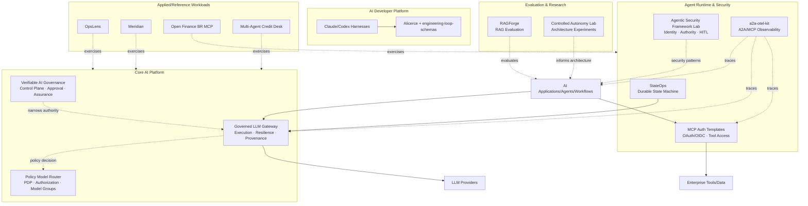
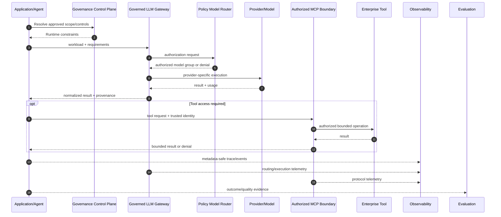

# AI Platform Engineering Ecosystem

> 🇧🇷 [Leia em Português](./PORTFOLIO_ARCHITECTURE.pt-BR.md)

This portfolio is organized as an **AI Platform Engineering ecosystem**, not as a collection of isolated AI demos.

The projects explore how to build, operate, secure, observe, evaluate, and govern AI systems across multiple products and teams. The portfolio deliberately separates reusable platform capabilities from reference workloads and research labs so that security boundaries, contracts, failure behavior, and evidence can be inspected independently.

The recurring architecture principle is:

> **Models may reason and propose. Trusted software authorizes, constrains, executes, and produces evidence.**

Across the ecosystem, this means:

- high-impact authority remains outside LLM reasoning;
- applications depend on provider-neutral and policy-aware contracts instead of embedding provider logic everywhere;
- identity, model access, tools, retrieved data, execution environments, and telemetry are explicit trust boundaries;
- important runtime claims should resolve to independently inspectable evidence;
- autonomy is introduced only where it creates enough value to justify the additional failure modes.

---

## Portfolio map



This is a conceptual capability map, not a claim that every repository is deployed together or that every workload requires every platform component.

---

# 1. Core AI Platform

## [Governed LLM Gateway](https://github.com/brunovicco/governed-llm-gateway)

**Role:** flagship provider-neutral LLM execution layer.

The Gateway keeps provider credentials, model/provider selection, retry and fallback behavior, budgets, runtime provenance, and observability outside application code.

A consumer declares a workload and requirements. It does not need to choose a provider-specific SDK or embed provider-routing logic throughout the application.

```text
Application/Agent
        │
        │ workload + requirements + Gateway credential
        ▼
Policy Model Router (PDP)
        │
        │ authorized logical model groups
        ▼
Governed LLM Gateway (PEP)
        ├─ eligibility
        ├─ deterministic ranking
        ├─ health/circuit breaker
        ├─ bounded retry
        ├─ safe fallback
        ├─ provider translation
        ├─ spend limits
        └─ provenance + OpenTelemetry
        ▼
Authorized provider/model
```

The key authority invariant is:

```text
Gateway allowed set ⊆ Policy Router authorized set
```

The Gateway may narrow what policy authorized. It may never widen it.

### Platform signals

- provider-neutral consumer contract;
- centralized provider credentials;
- native and compatibility adapters;
- deterministic selection inside an authorized set;
- bounded retry and fallback;
- health and circuit-breaking behavior;
- per-client/workload budget controls;
- execution provenance;
- metadata-safe OpenTelemetry;
- fail-closed startup and policy behavior;
- operational console and trace correlation.

### Architectural boundary

The Gateway is not an agent framework, RAG framework, prompt-management platform, or business-tool executor.

It owns **model execution authority**. Application runtimes still own workflow state, business-tool authorization, side effects, and domain decisions.

---

## [Policy Model Router](https://github.com/brunovicco/policy-model-router)

**Role:** Policy Decision Point (PDP) for model access.

The Router is a supporting platform component behind the Gateway rather than a second application-facing execution layer.

It evaluates a workload against deterministic, versioned constraints such as:

- data classification;
- workload risk;
- required capabilities;
- structured-output requirements;
- context limits;
- cost ceilings;
- latency ceilings;
- availability;
- approved logical model groups.

The result is an explainable authorization decision or a fail-closed denial.

The Router does not call a language model.

### Why this separation matters

```text
Policy Model Router = what may be used
Governed LLM Gateway = what actually executes
```

Keeping PDP and PEP responsibilities separate makes authorization independently testable and prevents runtime availability from silently becoming permission.

---

## [Verifiable AI Governance](https://github.com/brunovicco/verifiable-ai-governance)

**Role:** AI governance and runtime-assurance control plane.

The project explores how governance requirements can become enforceable system behavior instead of remaining only in documents or approval tickets.

```text
Policy
  → Risk & controls
  → Independent approval
  → Runtime authorization
  → Enforcement
  → Runtime assurance
  → Incident/governed response
  → Evidence
```

Key concerns include:

- deterministic policy and risk evaluation;
- segregation of duties;
- scope-bound approvals;
- runtime authorization;
- trusted denial and violation evidence;
- runtime assurance;
- containment and restoration workflows;
- audit history and evidence lineage;
- release/security provenance.

### Relationship with the Gateway

Governance may further restrict what a workload is allowed to do, but must not silently expand the authority already granted by model-access policy.

The portfolio therefore treats authorization as **monotonic narrowing of authority** across layers.

---

# 2. Stateful Agent Runtime

## [StateOps](https://github.com/brunovicco/stateops)

**Role:** reference implementation of a durable, replayable LangGraph state machine integrated with the Governed LLM Gateway.

StateOps demonstrates that production agentic workflows require more than conversational memory.

Its core concerns are:

- explicit typed state;
- lifecycle transitions;
- dynamic fan-out with `Send`;
- deterministic reducers;
- `Command`-based routing;
- nested graphs;
- human interrupts;
- Redis checkpointing;
- restart/resume;
- replay and controlled forks;
- idempotent side effects;
- streaming and execution history;
- provider-neutral reasoning through the Gateway.

```text
Incident
   ↓
Enrichment
   ↓
Classification
   ↓
Parallel Investigation
   ↓
Proposed Remediation
   ↓
Human Approval
   ↓
Idempotent Execution
   ↓
Verification
   ├─ resolved
   ├─ replan
   └─ escalate
```

### Authority boundary

StateOps owns workflow and business-side-effect semantics.

The Governed LLM Gateway owns model/provider execution policy.

```text
StateOps
  ├─ state
  ├─ transitions
  ├─ human approval
  ├─ remediation authorization
  └─ side effects

Governed LLM Gateway
  ├─ model authorization
  ├─ provider selection
  ├─ retry/fallback
  └─ execution provenance
```

This separation is a central portfolio theme: **agent orchestration should not implicitly acquire infrastructure authority.**

---

# 3. Agent Security, Identity & Tool Access

## [Agentic Security Framework Lab](https://github.com/brunovicco/agentic-security-framework-lab)

**Role:** framework-neutral security and authority lab for agentic systems.

The same controlled workload is implemented through multiple orchestration frameworks while keeping authorization and enforcement outside the framework:

- LangGraph;
- CrewAI;
- LlamaIndex;
- Agno.

The design separates:

```text
the model proposes
trusted context establishes identity
policy authorizes
human approval validates high-impact actions
runtime executes
evidence records the result
```

A key distinction is:

```text
tool availability != tool authorization != tool execution
```

The project also treats prompt injection conservatively: it does not claim that injection can always be prevented. Instead, it asks what authority a compromised reasoning path actually receives.

### Why this belongs in the ecosystem

Frameworks may own orchestration.

They should not automatically own:

- caller identity;
- authorization;
- approval authority;
- policy truth;
- execution authority;
- evidence truth.

---

## [MCP Server Auth Template](https://github.com/brunovicco/mcp-server-auth-template)

## [MCP Client Auth Template](https://github.com/brunovicco/mcp-client-auth-template)

**Role:** executable identity and authorization references for protected remote MCP.

These repositories explore how agents and developer tools can access enterprise capabilities without turning MCP into an IAM bypass.

The pair covers patterns around:

- OAuth 2.1/OIDC;
- delegated and machine identities;
- authorization code + PKCE;
- machine-to-machine flows;
- resource/audience binding;
- scopes and application roles;
- protected resource metadata;
- step-up authorization;
- wrong-audience rejection;
- protected tool discovery;
- trace-context continuity;
- privacy-aware telemetry.

The platform rule is simple:

> The model may request a tool. Authorization remains a deterministic security decision outside the model.

---

# 4. Distributed Agent Observability

## [a2a-otel-kit](https://github.com/brunovicco/a2a-otel-kit)

**Role:** vendor-neutral observability layer for A2A and MCP interactions.

Distributed agentic systems can cross orchestrators, agents, MCP services, and downstream APIs in a single business request.

`a2a-otel-kit` keeps those hops in one OpenTelemetry trace using W3C Trace Context.

```text
Business request
   ↓
Orchestrator
   ↓ A2A
Agent
   ↓ MCP
Tool/Service
```

Key design properties:

- A2A client/server instrumentation;
- MCP Streamable HTTP client/server instrumentation;
- OTLP export;
- structured trace-correlated events;
- explicit telemetry lifecycle;
- deny-by-default attribute handling;
- metadata-only built-in protocol telemetry;
- no default capture of prompts, model responses, MCP arguments/results, credentials, or business payloads.

### Platform rationale

Applications should not each invent their own propagation rules, protocol spans, privacy policy, and telemetry vocabulary.

Observability is a shared runtime capability.

---

# 5. Evaluation & AI Quality Engineering

## [RAGForge](https://github.com/brunovicco/ragforge)

**Role:** RAG experimentation, benchmarking, and evaluation platform.

RAGForge treats retrieval architecture as an empirical engineering problem.

Its current scope includes:

- a 230-question RegRAG-BR golden dataset;
- dense retrieval;
- BM25;
- hybrid retrieval;
- reranking;
- contextual retrieval;
- parent-child retrieval;
- summary-augmented chunking;
- RAPTOR;
- GraphRAG;
- retrieval and answer-quality metrics;
- citation support evaluation;
- evidence-aware abstention;
- experiment lineage and auditable run artifacts.

The platform-level questions are:

- Did retrieval regress?
- Did answer quality regress?
- Is the answer actually supported by retrieved evidence?
- Did a more expensive strategy improve quality enough to justify its cost?
- Is a failure caused by retrieval, generation, or evaluation?

The regulatory corpus provides a demanding reference domain, but the capability itself is **evaluation engineering**.

---

## [Controlled Autonomy Lab](https://github.com/brunovicco/controlled-autonomy-lab)

**Role:** architecture research lab for model autonomy and control.

The project asks:

> Who owns the next step: deterministic application code or the model?

It compares bounded implementations of:

- augmented LLM;
- prompt chaining;
- routing;
- parallelization;
- evaluator-optimizer;
- bounded tool-using agent.

The same workload is evaluated across multiple provider/model bundles using frozen experiment evidence.

The goal is not to prove that agents are universally better than workflows. It is to make the trade-off between deterministic control and model-owned trajectory measurable.

### Difference from the security lab

```text
Controlled Autonomy Lab
→ How much control should the model receive?

Agentic Security Framework Lab
→ Which authorities must remain outside the model/framework?
```

---

# 6. AI Developer Platform

Coding agents create a platform problem beyond code generation: how to improve engineering productivity while keeping execution, validation, and promotion controlled.

The portfolio splits this into reusable components.

| Project | Role |
| --- | --- |
| [**Claude Python Engineering Harness**](https://github.com/brunovicco/claude-python-engineering-harness) | Repository-owned engineering rules, hooks, architecture boundaries, and quality gates for Claude Code |
| [**Codex Python Engineering Harness**](https://github.com/brunovicco/codex-python-engineering-harness) | Equivalent deterministic baseline for Codex workflows |
| [**engineering-loop-schemas**](https://github.com/brunovicco/engineering-loop-schemas) | Canonical typed contracts for evidence, execution results, and verdicts |
| [**Alicerce**](https://github.com/brunovicco/alicerce) | Trusted deterministic execution and evidence-gated engineering loops |

Shared principles include:

- repository-owned policy rather than developer-local convention;
- deterministic validation around generative coding behavior;
- architecture and dependency boundaries;
- explicit evidence before promotion;
- bounded execution;
- human authority over merge, deployment, and other high-impact actions.

This reflects a practical enterprise AI problem: scaling coding agents safely is not just a licensing problem. It is a **developer-platform and governance problem**.

---

# 7. Applied & Reference Workloads

Reference workloads prove that platform principles can be applied to different domains without turning the portfolio into a single monolithic architecture.

## [OpsLens](https://github.com/brunovicco/opslens)

**Role:** AWS-native architecture lab for software-supply-chain intelligence.

OpsLens separates probabilistic reasoning from deterministic security authority.

The model may explain, classify, or propose bounded structured intent. Deterministic code owns:

- repository/package identity;
- version applicability;
- vulnerability-source correlation;
- risk policy;
- structured query admission;
- typed SQL compilation;
- evidence admission;
- tool authorization;
- missing-evidence behavior.

The project also demonstrates:

- Amazon Bedrock;
- RAG and hybrid retrieval;
- IAM and least privilege;
- Terraform;
- GitHub Actions OIDC;
- CloudWatch;
- CI/CD security gates;
- deterministic local reviewer scenarios;
- cost and observability concerns.

---

## [Meridian](https://github.com/brunovicco/meridian)

**Role:** enterprise knowledge application reference.

Meridian demonstrates:

- semantic routing with positive/negative examples;
- ambiguity thresholds;
- retrieval-time ACL enforcement;
- structured-data query paths;
- Pydantic output contracts;
- DSPy-based reasoning paths;
- Redis Stack;
- grounded answers and citations.

Its key security property is that unauthorized knowledge is filtered **inside retrieval**, not retrieved first and removed later.

---

## [Open Finance BR MCP](https://github.com/brunovicco/openfinance-br-mcp)

**Role:** regulated-domain MCP and Open Finance reference.

The project explores:

- Open Finance Brasil concepts;
- FAPI-BR-oriented security patterns;
- MCP tools;
- typed contracts;
- consent-oriented flows;
- mTLS/PAR/JAR/PKCE-related boundaries;
- mock-first development;
- shared state;
- security and observability.

Mock and experimental integrations are kept distinct from production claims.

---

## [Multi-Agent Credit Desk](https://github.com/brunovicco/multi-agent-credit-desk)

**Role:** auditable financial multi-agent reference workload.

The project is used to exercise combinations of:

- deterministic credit policy;
- agent collaboration;
- MCP boundaries;
- A2A communication;
- governed model access;
- structured contracts;
- telemetry;
- auditable decision evidence.

It is a workload for exercising platform ideas rather than the platform itself.

---

# 8. Cross-cutting concerns

## Security

Security appears across every layer rather than as a final gate.

Common patterns include:

- fail-closed policy evaluation;
- exact authority boundaries;
- least privilege;
- identity separate from model input;
- resource/audience binding;
- tool-scope enforcement;
- bounded side effects;
- privacy-aware telemetry;
- architecture guards;
- CI/CD identity without long-lived cloud credentials.

---

## Governance

Governance is modeled as executable state and policy.

Examples include:

- policy versions;
- approved scopes;
- runtime authorization;
- human approval;
- segregation of duties;
- evidence lineage;
- denial and violation records;
- containment and restoration paths.

---

## Observability

Operational visibility includes both conventional distributed-system telemetry and AI-specific runtime information:

- latency;
- error rates;
- distributed traces;
- model-routing decisions;
- retry/fallback behavior;
- token and cost signals;
- tool calls;
- checkpoint transitions;
- evaluation evidence.

Telemetry is intentionally minimized to avoid turning observability systems into secondary stores for sensitive prompts and business payloads.

---

## Evaluation

Evaluation is part of architecture, not a final demo score.

Depending on the system, evaluation may cover:

- retrieval quality;
- answer quality;
- grounding;
- citation support;
- routing;
- tool selection;
- structured-output validity;
- workflow outcomes;
- regressions across model/provider changes;
- latency and cost.

---

## Evidence

Important claims should resolve to independently inspectable evidence when practical:

- tests;
- CI gates;
- deterministic fixtures;
- benchmark artifacts;
- traces;
- decision IDs;
- policy and registry digests;
- release provenance;
- audit/event records;
- screenshots of real execution;
- explicit limitations and non-claims.

---

# 9. Authority model

A recurring pattern across the portfolio is separating **reasoning** from **authority**.

| Concern | Model/Agent | Trusted software |
| --- | --- | --- |
| Interpret natural language | Yes | May validate |
| Generate hypotheses | Yes | Bounds collection/execution |
| Summarize evidence | Yes | Controls admitted evidence |
| Propose an action | Yes | Validates and authorizes |
| Choose any provider/model | No | Policy + Gateway |
| Establish caller identity | No | Identity layer |
| Grant tool permission | No | Authorization layer |
| Approve high-impact action | No | Human/policy authority |
| Execute external side effect | No direct authority | Controlled runtime |
| Declare evidence valid | No | Deterministic/evaluation logic |
| Override missing evidence | No | Fail-closed system behavior |

This is not an argument against capable models. It is an architecture for using capable models without making them implicit roots of trust.

---

# 10. Conceptual runtime flow

Not every workload uses every component, but the following sequence illustrates how the platform pieces fit together.



---

# 11. Maturity and repository roles

Not every repository is intended to have the same maturity or product surface.

| Category | Purpose |
| --- | --- |
| **Platform/product** | Reusable capability intended to have a clear consumer contract |
| **Reference implementation** | Concrete implementation of an architectural pattern |
| **Research/architecture lab** | Controlled experiment or comparative engineering investigation |
| **Reference workload** | Domain workload used to exercise horizontal platform capabilities |
| **Engineering foundation** | Shared contracts, harnesses, or execution primitives |
| **Educational/challenge** | Learning material or work created under a constrained exercise |

This distinction matters because the portfolio prioritizes **clear claims over architectural breadth**.

---

# 12. Recommended review paths

## 5-minute hiring-manager path

1. [**Governed LLM Gateway**](https://github.com/brunovicco/governed-llm-gateway) — flagship platform component.
2. [**StateOps**](https://github.com/brunovicco/stateops) — stateful agent runtime and LangGraph engineering.
3. [**Agentic Security Framework Lab**](https://github.com/brunovicco/agentic-security-framework-lab) — security and authority boundaries.
4. [**a2a-otel-kit**](https://github.com/brunovicco/a2a-otel-kit) — focused reusable OSS capability.
5. [**RAGForge**](https://github.com/brunovicco/ragforge) — evaluation rigor.

## 15-minute AI/platform architect path

1. Inspect the **Gateway ↔ Policy Model Router** PDP/PEP boundary.
2. Review **Verifiable AI Governance** for control-plane and runtime-assurance concepts.
3. Inspect **StateOps** checkpointing, replay, idempotency, and human-interrupt semantics.
4. Review **Agentic Security Framework Lab** for identity, authorization, approval, and side-effect boundaries.
5. Inspect **a2a-otel-kit** for A2A/MCP trace propagation and privacy design.
6. Review **RAGForge** methodology and evidence lineage.

## AI developer-platform path

1. Review the **Claude/Codex Engineering Harnesses**.
2. Inspect **engineering-loop-schemas**.
3. Review **Alicerce**.
4. Connect those components to the same portfolio principles: deterministic authority, evidence, bounded execution, and human-controlled promotion.

## AWS/applied architecture path

1. Review **OpsLens**.
2. Inspect its deterministic authority model and AWS foundation.
3. Compare those boundaries with the Governed LLM Gateway and the broader platform architecture.

---

# Final architecture thesis

The portfolio is intentionally moving away from application-specific AI integration toward reusable AI platform capabilities.

The direction can be summarized as:

```text
Applications declare intent and requirements.

Policy determines authority.
The Gateway controls model execution.
Agent runtimes control workflow state.
Identity controls tool access.
Deterministic software protects consequential decisions.
Observability explains runtime behavior.
Evaluation measures quality.
Governance constrains the system.
Evidence proves what happened.
```

The goal is not to remove model autonomy.

It is to make autonomy **bounded, observable, replaceable, testable, and compatible with enterprise authority models**.
