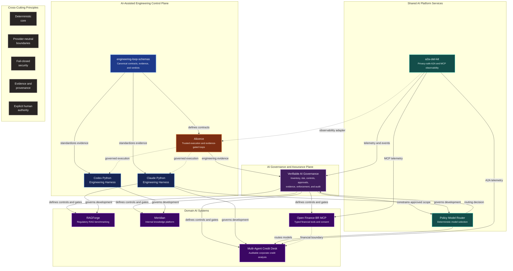
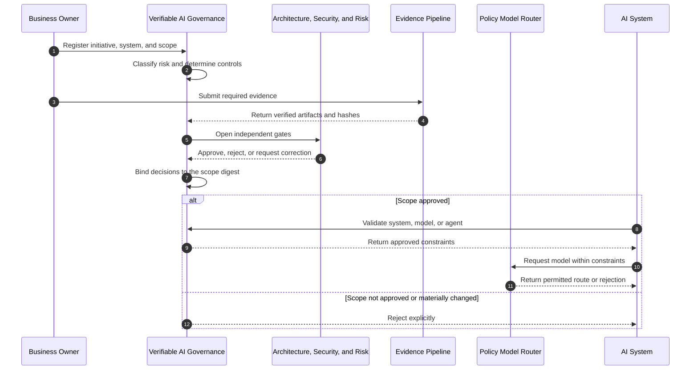
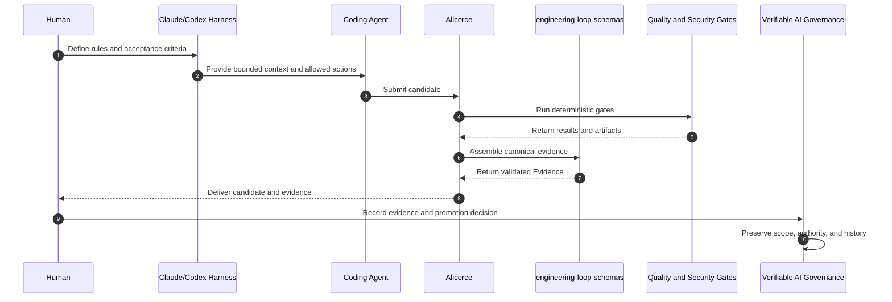
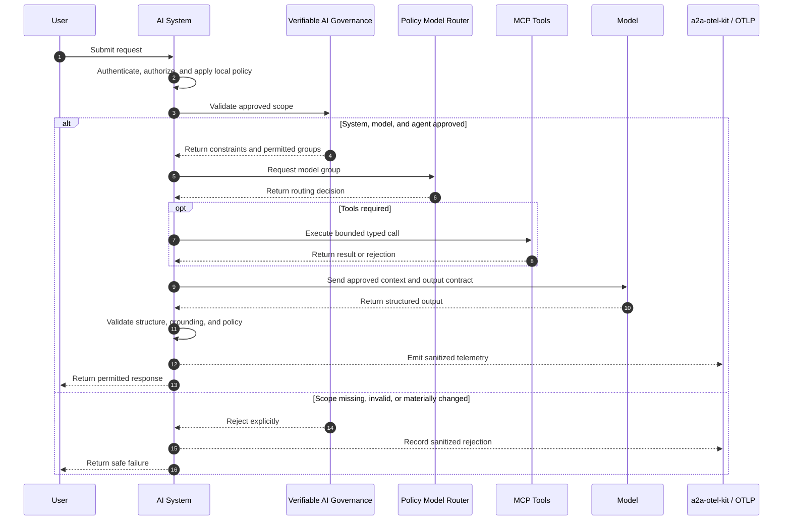

# Portfolio Architecture Map

> 🇧🇷 [Leia em Português](./PORTFOLIO_ARCHITECTURE.pt-BR.md)

This portfolio is organized as an ecosystem rather than a collection of isolated demos.

The projects explore how to build, operate, evaluate, observe, and govern AI systems in regulated environments. They share the same architectural direction:

- keep business-critical decisions deterministic;
- place LLMs behind explicit contracts and bounded responsibilities;
- treat agents, MCP servers, model providers, and telemetry as trust boundaries;
- make security, evaluation, provenance, and auditability part of the architecture;
- bind approvals to the exact reviewed scope;
- use coding agents under repository-owned engineering controls.

## Ecosystem map



## Architectural layers

### 1. AI Governance and Assurance Plane

#### [Verifiable AI Governance](https://github.com/brunovicco/verifiable-ai-governance)

A vendor-neutral reference platform that turns governance requirements into executable controls and independently verifiable evidence.

Its role in the portfolio is to connect:

```text
Business context
    → initiative and system inventory
    → risk and impact classification
    → applicable controls
    → assessments and independent approvals
    → verified evidence
    → model and agent assurance
    → runtime enforcement
    → monitoring, incidents, and review
```

Demonstrated capabilities include:

- inventory of initiatives, systems, models, and agents;
- deterministic and versioned preliminary risk classification;
- AI impact, privacy, and international-processing assessments;
- declarative, versioned controls with explainable applicability;
- segregation of duties, conditional gates, and immutable review rounds;
- evidence validation, SHA-256 hashing, malware scanning, and private storage;
- approvals bound to the digest of the reviewed scope;
- independent architecture review for models and security review for agents;
- approved-scope validation before external model routing;
- incidents, kill switch, temporary exceptions, and remediation;
- hash-chained audit records and fail-closed behavior.

The project provides a functional, production-oriented reference implementation and a [public read-only demo](https://vaigov-app.duckdns.org). Selected enterprise integrations still require validation in real organizational environments.

### 2. Domain AI systems

| Project | Role in the portfolio | Current emphasis |
|---|---|---|
| [RAGForge](https://github.com/brunovicco/ragforge) | Experimental platform for comparing retrieval strategies over Brazilian financial and regulatory documents | Legal-structure-aware ingestion, sparse/dense/hybrid retrieval, relevance judgments, and reproducible evaluation |
| [Meridian](https://github.com/brunovicco/meridian) | Reference architecture for an internal engineering knowledge platform | Semantic routing, retrieval-time access control, structured queries, grounded answers, and citations |
| [Open Finance BR MCP](https://github.com/brunovicco/openfinance-br-mcp) | Experimental MCP boundary for Brazilian Open Finance | Typed tools, consent flows, FAPI-BR security patterns, mock-first execution, and explicit validation limits |
| [Multi-Agent Credit Desk](https://github.com/brunovicco/multi-agent-credit-desk) | Incremental multi-agent platform for auditable corporate credit analysis | Deterministic credit policy, synthetic bureau data, MCP/A2A boundaries, and optional LLM narratives |

### 3. Shared AI platform services

#### [Policy Model Router](https://github.com/brunovicco/policy-model-router)

A deterministic routing service that selects an allowed model group only after applying policy and workload constraints. Verifiable AI Governance can bind an approval to permitted model groups; the router performs the technical runtime decision without granting itself authority to expand the approved scope.

#### [a2a-otel-kit](https://github.com/brunovicco/a2a-otel-kit)

A reusable observability library for A2A agents and MCP services. It standardizes trace propagation, structured events, allowlisted attributes, privacy-safe failure reporting, and streaming lifecycle handling while preserving vendor neutrality.

### 4. AI-assisted engineering control plane

#### [Claude Python Engineering Harness](https://github.com/brunovicco/claude-python-engineering-harness)

Reusable scaffold and Claude Code plugin with repository-owned instructions, skills, hooks, quality gates, architecture boundaries, MCP policy, and optional governance overlays.

#### [Codex Python Engineering Harness](https://github.com/brunovicco/codex-python-engineering-harness)

The corresponding baseline for Codex workflows, aligned around deterministic validation rather than model self-assessment.

#### [engineering-loop-schemas](https://github.com/brunovicco/engineering-loop-schemas)

Canonical, provider-neutral contracts for evidence-gated engineering loops. A builder may report what it did, but it cannot certify its own result.

#### [Alicerce](https://github.com/brunovicco/alicerce)

A trusted local core for deterministic and auditable engineering loops, including immutable run identity, durable state, controlled workspaces, command authorization, isolation, canonical evidence, and explicit human authority over promotion.

## How the projects connect

### Governance lifecycle



### Engineering workflow



### Runtime AI workflow



## Shared design principles

### Deterministic decisions before generative behavior

Credit outcomes, access control, command authorization, policy evaluation, preliminary risk classification, and promotion remain outside the LLM.

### Provider-neutral core, provider-specific adapters

Business rules and domain models do not directly depend on a model provider, agent framework, or observability vendor.

### Security at the boundary

MCP tools, model providers, agent calls, retrieved documents, telemetry exporters, code execution, Git, and filesystem access are treated as trust boundaries.

### Evidence over self-reported success

Important claims are bound to commands, outputs, policies, commits, environments, hashes, scopes, and independently verifiable decisions.

### Approval bound to scope

An approval does not authorize every future version. Material changes to data, models, agents, tools, region, or purpose require reassessment.

### Explicit human authority

Agents may prepare candidates, collect evidence, and propose decisions. Approvals, exceptions, promotion, merge, deployment, and high-impact actions remain under explicit human or organizational authority.

## Maturity map

| Project | Maturity | What is proven today | Next major proof point |
|---|---|---|---|
| Verifiable AI Governance | Functional v0.1.0 release | Inventory, deterministic risk, assessments, controls, approvals, evidence, model/agent assurance, runtime enforcement, incidents, and hash-chained audit | Validate real Entra ID and enterprise integrations; add telemetry and control-effectiveness measurement |
| RAGForge | Active development | Regulatory ingestion, structural chunking, retrieval strategies, and relevance metrics | Complete benchmark matrix and publish reproducible results |
| Meridian | Reference implementation | Zero-setup demo, routing, ACL-aware retrieval, and structured query path | Public walkthrough and complete deployment profile |
| Open Finance BR MCP | Experimental release | Mock environment, typed MCP surface, consent, and security foundations | Validate against official sandboxes and real participant configurations |
| Multi-Agent Credit Desk | Incremental build | Deterministic core, MCP services, initial A2A agent, and synthetic KYC | Orchestration, end-to-end decision package, and observability |
| Policy Model Router | Early service | Deterministic routing core and container publication | Broader policy catalog, metrics, and consumer examples |
| a2a-otel-kit | Reusable library | A2A/MCP propagation, sanitized events, and integration tests | Wider adoption across portfolio services |
| engineering-loop-schemas | Versioned foundation | Canonical contracts and evidence models | Completion-level evaluator and operational contracts |
| Alicerce | Phase 2A | Trusted workspace, sandbox, state, authorization, and evidence primitives | Complete evidence assembly, persistence, and resumable orchestration |
| Claude/Codex Harnesses | Reusable baseline | Scaffolding, gates, hooks, policies, and governance profiles | Integration with the completed Alicerce execution loop |

## Portfolio narrative

Together, these projects support one professional thesis:

> Production AI systems require more than model integration. They need deterministic boundaries, explicit authority, measurable quality, privacy-safe observability, reproducible evidence, and governance that binds decisions to the actual runtime scope.

```text
Context and purpose
    → inventory and risk classification
    → controls, assessments, evidence, and approvals
    → deterministic business core
    → bounded AI capability
    → model and tool policy
    → observability and evaluation
    → secure AI-assisted engineering
    → incidents, review, and continuous improvement
```

## Suggested reading paths

### AI governance, risk, and assurance

1. [Verifiable AI Governance](https://github.com/brunovicco/verifiable-ai-governance)
2. [Policy Model Router](https://github.com/brunovicco/policy-model-router)
3. [a2a-otel-kit](https://github.com/brunovicco/a2a-otel-kit)
4. [engineering-loop-schemas](https://github.com/brunovicco/engineering-loop-schemas)

### AI platform and architecture

1. [Alicerce](https://github.com/brunovicco/alicerce)
2. [engineering-loop-schemas](https://github.com/brunovicco/engineering-loop-schemas)
3. [a2a-otel-kit](https://github.com/brunovicco/a2a-otel-kit)
4. [Policy Model Router](https://github.com/brunovicco/policy-model-router)

### RAG and LLM engineering

1. [RAGForge](https://github.com/brunovicco/ragforge)
2. [Meridian](https://github.com/brunovicco/meridian)
3. [Open Finance BR MCP](https://github.com/brunovicco/openfinance-br-mcp)

### Financial-services AI

1. [Multi-Agent Credit Desk](https://github.com/brunovicco/multi-agent-credit-desk)
2. [Open Finance BR MCP](https://github.com/brunovicco/openfinance-br-mcp)
3. [RAGForge](https://github.com/brunovicco/ragforge)
4. [Verifiable AI Governance](https://github.com/brunovicco/verifiable-ai-governance)

### AI enablement and developer productivity

1. [Claude Python Engineering Harness](https://github.com/brunovicco/claude-python-engineering-harness)
2. [Codex Python Engineering Harness](https://github.com/brunovicco/codex-python-engineering-harness)
3. [Alicerce](https://github.com/brunovicco/alicerce)
4. [engineering-loop-schemas](https://github.com/brunovicco/engineering-loop-schemas)
