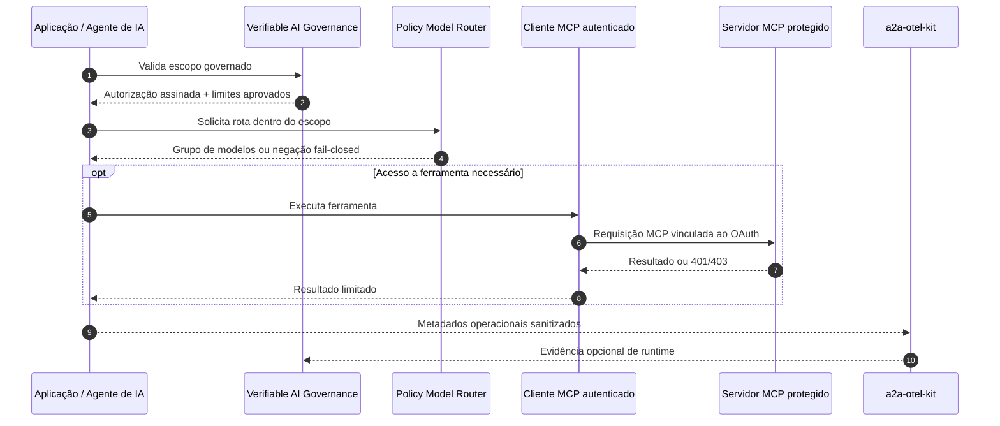

# Mapa de Arquitetura do Portfólio

> 🇺🇸 [Read in English](./PORTFOLIO_ARCHITECTURE.md)

Este portfólio foi organizado como um ecossistema de engenharia, e não como uma coleção de demonstrações isoladas.

Os projetos exploram como construir, proteger, operar, observar, avaliar e governar sistemas de IA. A direção arquitetural comum é manter decisões de alto impacto em componentes determinísticos, colocar o comportamento de modelos atrás de contratos explícitos e tratar identidade, agentes, ferramentas, provedores de modelos, dados recuperados e telemetria como fronteiras de confiança.

## Mapa do ecossistema

<p align="center">
  
</p>

## 1. Governança e Assurance de IA

### [Verifiable AI Governance](https://github.com/brunovicco/verifiable-ai-governance)

O plano de governança transforma requisitos de política em controles executáveis e inspecionáveis de forma independente.

A cadeia central é:

```text
Política
  → Risco e controles
  → Aprovação independente
  → Autorização assinada em runtime
  → Enforcement
  → Violação / assurance em runtime
  → Resposta governada
  → Evidência
```

O projeto cobre inventário, classificação determinística de risco, aplicabilidade de controles, segregação de funções, validação de evidências, aprovações vinculadas ao escopo, autorização em runtime, integração com o Policy Model Router, telemetria sanitizada, resposta a incidentes, atuação governada, histórico de auditoria e evidências de release.

O projeto possui uma implementação funcional orientada à produção e uma [demo pública somente para leitura](https://vaigov-app.duckdns.org), a qual pode estar em uma versão anterior à `main`; o README do projeto informa explicitamente a versão implantada.

## 2. Confiança em Runtime e Serviços de Plataforma

Esses projetos fornecem fronteiras reutilizáveis de segurança, política e observabilidade que não deveriam ser reimplementadas de forma independente em cada aplicação de IA.

### [Policy Model Router](https://github.com/brunovicco/policy-model-router)

Serviço fail-closed de enforcement de políticas em runtime.

Seleciona um grupo lógico de modelos somente depois da avaliação determinística das políticas e pode exigir autorização emitida pela governança, preservar evidência de negações e consumir estado de controle em runtime, como kill switch. A autorização nunca é delegada ao LLM.

### [mcp-server-auth-template](https://github.com/brunovicco/mcp-server-auth-template)

Referência orientada à produção de um OAuth 2.1 resource server para MCP remoto.

Cobre Microsoft Entra ID e OIDC genérico, Protected Resource Metadata, validação exata de resource/audience, distinção entre scopes delegados e application roles, autorização progressiva, MCP stateless, proteção no discovery/JWKS, telemetria segura, provenance de release e publicação no Official MCP Registry.

### [mcp-client-auth-template](https://github.com/brunovicco/mcp-client-auth-template)

Cliente MCP complementar.

Demonstra Authorization Code + PKCE, Client Credentials, discovery CIMD-first, resource binding exato, step-up limitado de scopes, rejeição de audience incorreta, MCP stateless e continuidade de trace distribuído com o servidor companion.

Juntos, os dois repositórios fornecem uma referência executável de autorização cliente/servidor, e não exemplos independentes de configuração.

### [a2a-otel-kit](https://github.com/brunovicco/a2a-otel-kit)

Biblioteca OpenTelemetry neutra de fornecedor para agentes A2A e serviços MCP.

Continua W3C Trace Context através das fronteiras de protocolo e mantém a telemetria dos adaptadores de protocolo baseada somente em metadados por construção. A mesma biblioteca é utilizada em diferentes partes do portfólio para continuidade de traces e telemetria governada em runtime.

## 3. Sistemas de IA de Domínio

| Projeto | Papel | Principal sinal |
| --- | --- | --- |
| [RAGForge](https://github.com/brunovicco/ragforge) | Plataforma de avaliação de recuperação | Experimentos reproduzíveis de RAG sobre documentos regulatórios e financeiros |
| [Multi-Agent Credit Desk](https://github.com/brunovicco/multi-agent-credit-desk) | Sistema multiagente auditável de crédito | Política determinística, fronteiras MCP/A2A, roteamento governado e telemetria em runtime |
| [Open Finance BR MCP](https://github.com/brunovicco/openfinance-br-mcp) | Referência MCP financeira | Ferramentas tipadas, jornadas de consentimento, padrões FAPI-BR e execução mock-first |
| [Meridian](https://github.com/brunovicco/meridian) | Referência de conhecimento interno | Roteamento semântico, controle de acesso durante a recuperação, consultas estruturadas e respostas fundamentadas |

## 4. Controles da Engenharia Assistida por IA

| Projeto | Papel |
| --- | --- |
| [engineering-loop-schemas](https://github.com/brunovicco/engineering-loop-schemas) | Contratos canônicos para evidências, veredictos e resultados de execução |
| [Alicerce](https://github.com/brunovicco/alicerce) | Execução determinística confiável e loops de engenharia baseados em evidências |
| [Claude Python Engineering Harness](https://github.com/brunovicco/claude-python-engineering-harness) | Regras, hooks, limites arquiteturais e quality gates pertencentes ao repositório para Claude Code |
| [Codex Python Engineering Harness](https://github.com/brunovicco/codex-python-engineering-harness) | Linha-base determinística equivalente para fluxos com Codex |

## Como as peças atuais se conectam em runtime



## Princípios compartilhados

### Autoridade determinística

Decisões de crédito, avaliação de políticas, controle de acesso, autorização, estados de aprovação, autorização de comandos e promoção permanecem fora do raciocínio do LLM.

### Fronteiras de confiança explícitas

Agentes, servidores MCP, provedores OAuth/OIDC, gateways de modelos, documentos recuperados, exportadores de telemetria, Git, filesystem e ambientes de execução são tratados como fronteiras independentes.

### Evidência em vez de autorrelato

Afirmações importantes são vinculadas a verificações executáveis, políticas versionadas, commits, hashes, escopos, traces e artefatos inspecionáveis de forma independente.

### Observabilidade com minimização de dados

A instrumentação de protocolo é deliberadamente orientada a metadados. Prompts, respostas, credenciais, material de autorização, payloads arbitrários de negócio e textos de exceção ficam fora dos caminhos padrão de telemetria A2A/MCP.

### Autoridade humana sobre ações de alto impacto

Modelos podem apoiar análise, redação e implementação, mas aprovação, deploy, overrides, contenção, restauração e promoção permanecem explicitamente governados.

## Caminho recomendado para revisão

Para uma revisão técnica de cinco a dez minutos:

1. Comece pelo **Verifiable AI Governance** para entender o modelo geral de governança e assurance em runtime.
2. Analise o par **MCP Server + Client Auth** para identidade, autorização e segurança de protocolo.
3. Execute ou inspecione a demo E2E do **a2a-otel-kit**.
4. Revise o **Policy Model Router** para enforcement determinístico de políticas em runtime.
5. Use **RAGForge** ou **Multi-Agent Credit Desk** para observar a aplicação dessas ideias em sistemas de IA.
