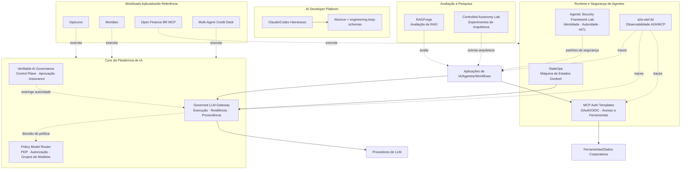
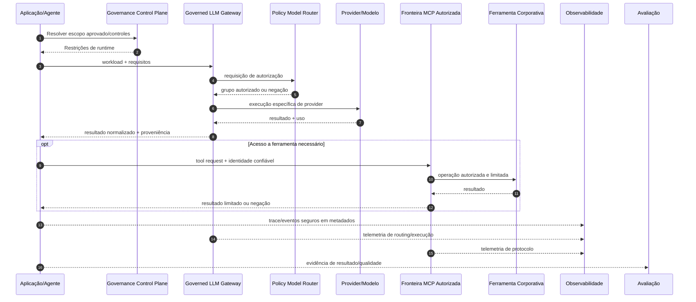

# Ecossistema de Engenharia de Plataformas de IA

> 🇺🇸 [Read in English](./PORTFOLIO_ARCHITECTURE.md)

Este portfólio é organizado como um **ecossistema de Engenharia de Plataformas de IA**, e não como uma coleção de demos isoladas.

Os projetos exploram como construir, operar, proteger, observar, avaliar e governar sistemas de IA utilizados por diferentes produtos e times. O portfólio separa intencionalmente capacidades reutilizáveis de plataforma, workloads de referência e laboratórios de arquitetura para que contratos, fronteiras de segurança, comportamento de falha e evidências possam ser inspecionados de forma independente.

O princípio arquitetural recorrente é:

> **Modelos podem raciocinar e propor. Software confiável autoriza, restringe, executa e produz evidências.**

Na prática, isso significa:

- autoridade de alto impacto permanece fora do raciocínio do LLM;
- aplicações dependem de contratos neutros de provedor e conscientes de política, em vez de espalhar lógica de provider pelo código;
- identidade, acesso a modelos, ferramentas, dados recuperados, ambientes de execução e telemetria são fronteiras explícitas de confiança;
- afirmações importantes de runtime devem poder ser verificadas por evidências independentes;
- autonomia é introduzida quando cria valor suficiente para justificar novos modos de falha.

---

## Mapa do portfólio



Este é um mapa conceitual de capacidades. Não significa que todos os repositórios sejam implantados juntos nem que todos os workloads precisem de todos os componentes.

---

# 1. Core da Plataforma de IA

## [Governed LLM Gateway](https://github.com/brunovicco/governed-llm-gateway)

**Papel:** camada principal e neutra de provedor para execução de LLMs.

O Gateway mantém credenciais dos provedores, seleção de modelo/provider, retry e fallback, budgets, proveniência de execução e observabilidade fora do código das aplicações.

O consumidor declara um workload e seus requisitos. Ele não precisa escolher um SDK específico de provedor nem espalhar regras de roteamento entre diferentes serviços.

```text
Aplicação/Agente
        │
        │ workload + requisitos + credencial do Gateway
        ▼
Policy Model Router (PDP)
        │
        │ grupos lógicos de modelos autorizados
        ▼
Governed LLM Gateway (PEP)
        ├─ elegibilidade
        ├─ ranking determinístico
        ├─ health/circuit breaker
        ├─ retry limitado
        ├─ fallback seguro
        ├─ tradução de provider
        ├─ limites de gasto
        └─ proveniência + OpenTelemetry
        ▼
Provider/modelo autorizado
```

A propriedade central de autoridade é:

```text
Conjunto permitido pelo Gateway ⊆ conjunto autorizado pelo Policy Router
```

O Gateway pode restringir o que foi autorizado. Nunca pode ampliar essa autoridade.

### Sinais de plataforma

- contrato neutro de provedor para consumidores;
- credenciais centralizadas;
- adapters nativos e de compatibilidade;
- seleção determinística dentro do conjunto autorizado;
- retry e fallback limitados;
- health tracking e circuit breaker;
- budgets por cliente/workload;
- proveniência de execução;
- OpenTelemetry baseado em metadados;
- comportamento fail-closed para startup e política;
- console operacional e correlação com traces.

### Fronteira arquitetural

O Gateway não é framework de agentes, framework de RAG, plataforma de prompts ou executor de ferramentas de negócio.

Ele controla **autoridade de execução de modelos**. O runtime da aplicação continua responsável por estado do workflow, autorização de ferramentas, efeitos externos e decisões de domínio.

---

## [Policy Model Router](https://github.com/brunovicco/policy-model-router)

**Papel:** Policy Decision Point (PDP) para acesso a modelos.

O Router é um componente de apoio por trás do Gateway, e não uma segunda camada de execução voltada diretamente às aplicações.

Ele avalia workloads contra restrições determinísticas e versionadas, como:

- classificação de dados;
- risco do workload;
- capacidades necessárias;
- requisitos de structured output;
- limites de contexto;
- limites de custo;
- limites de latência;
- disponibilidade;
- grupos lógicos de modelos aprovados.

O resultado é uma decisão explicável de autorização ou uma negação fail-closed.

O Router não chama um LLM.

### Por que essa separação importa

```text
Policy Model Router = o que pode ser usado
Governed LLM Gateway = o que efetivamente executa
```

Separar PDP e PEP torna a autorização testável de forma independente e impede que disponibilidade operacional se transforme silenciosamente em permissão.

---

## [Verifiable AI Governance](https://github.com/brunovicco/verifiable-ai-governance)

**Papel:** control plane de governança e runtime assurance.

O projeto explora como requisitos de governança podem se transformar em comportamento executável do sistema em vez de permanecer apenas em documentos ou tickets de aprovação.

```text
Política
  → Risco e controles
  → Aprovação independente
  → Autorização em runtime
  → Enforcement
  → Runtime assurance
  → Incidente/resposta governada
  → Evidência
```

Principais preocupações:

- avaliação determinística de políticas e riscos;
- segregação de funções;
- aprovações vinculadas a escopo;
- autorização de runtime;
- evidências confiáveis de negação e violação;
- runtime assurance;
- fluxos de contenção e restauração;
- histórico de auditoria e lineage de evidências;
- proveniência de releases e segurança.

### Relação com o Gateway

A governança pode restringir ainda mais o que um workload está autorizado a fazer, mas não deve ampliar silenciosamente a autoridade já definida pela política de acesso a modelos.

O portfólio, portanto, trata autorização como **redução monotônica de autoridade** entre camadas.

---

# 2. Runtime Stateful de Agentes

## [StateOps](https://github.com/brunovicco/stateops)

**Papel:** implementação de referência de uma máquina de estados LangGraph durável e reproduzível, integrada ao Governed LLM Gateway.

StateOps demonstra que workflows agênticos próximos de produção exigem mais do que memória de conversação.

Seus principais temas são:

- estado explícito e tipado;
- transições de ciclo de vida;
- fan-out dinâmico com `Send`;
- reducers determinísticos;
- roteamento com `Command`;
- subgrafos;
- interrupts humanos;
- checkpointing em Redis;
- restart/resume;
- replay e forks controlados;
- efeitos idempotentes;
- streaming e histórico de execução;
- reasoning neutro de provedor via Gateway.

```text
Incidente
   ↓
Enriquecimento
   ↓
Classificação
   ↓
Investigação Paralela
   ↓
Remediação Proposta
   ↓
Aprovação Humana
   ↓
Execução Idempotente
   ↓
Verificação
   ├─ resolvido
   ├─ replanejar
   └─ escalar
```

### Fronteira de autoridade

StateOps controla workflow e semântica dos efeitos de negócio.

O Governed LLM Gateway controla política de execução de modelo/provider.

```text
StateOps
  ├─ estado
  ├─ transições
  ├─ aprovação humana
  ├─ autorização de remediação
  └─ efeitos externos

Governed LLM Gateway
  ├─ autorização de modelo
  ├─ seleção de provider
  ├─ retry/fallback
  └─ proveniência de execução
```

Essa separação é central no portfólio: **orquestração agêntica não deve adquirir implicitamente autoridade de infraestrutura.**

---

# 3. Segurança de Agentes, Identidade e Acesso a Ferramentas

## [Agentic Security Framework Lab](https://github.com/brunovicco/agentic-security-framework-lab)

**Papel:** laboratório de segurança e autoridade para sistemas agênticos, independente de framework.

O mesmo workload controlado é implementado em diferentes frameworks mantendo autorização e enforcement fora deles:

- LangGraph;
- CrewAI;
- LlamaIndex;
- Agno.

O desenho separa:

```text
o modelo propõe
contexto confiável estabelece identidade
política autoriza
aprovação humana valida ações de alto impacto
runtime executa
evidência registra o resultado
```

Uma distinção importante é:

```text
disponibilidade da ferramenta != autorização da ferramenta != execução da ferramenta
```

O projeto também trata prompt injection de forma conservadora: não afirma que toda injeção pode ser prevenida. Em vez disso, pergunta qual autoridade um fluxo de raciocínio comprometido realmente recebe.

### Por que faz parte do ecossistema

Frameworks podem controlar orquestração.

Eles não deveriam automaticamente controlar:

- identidade do chamador;
- autorização;
- autoridade de aprovação;
- verdade de política;
- autoridade de execução;
- verdade das evidências.

---

## [MCP Server Auth Template](https://github.com/brunovicco/mcp-server-auth-template)

## [MCP Client Auth Template](https://github.com/brunovicco/mcp-client-auth-template)

**Papel:** referências executáveis de identidade e autorização para MCP remoto protegido.

Esses repositórios exploram como agentes e ferramentas de desenvolvimento podem acessar capacidades corporativas sem transformar MCP em um bypass de IAM.

A dupla cobre padrões relacionados a:

- OAuth 2.1/OIDC;
- identidades delegadas e de máquina;
- Authorization Code + PKCE;
- machine-to-machine;
- binding de resource/audience;
- scopes e application roles;
- Protected Resource Metadata;
- step-up authorization;
- rejeição de audience incorreto;
- descoberta protegida de ferramentas;
- continuidade de trace context;
- telemetria orientada à privacidade.

A regra da plataforma é simples:

> O modelo pode solicitar uma ferramenta. A autorização permanece uma decisão determinística de segurança fora do modelo.

---

# 4. Observabilidade Distribuída de Agentes

## [a2a-otel-kit](https://github.com/brunovicco/a2a-otel-kit)

**Papel:** camada neutra de fornecedor para observabilidade de interações A2A e MCP.

Sistemas agênticos distribuídos podem atravessar orquestradores, agentes, serviços MCP e APIs downstream em uma única requisição de negócio.

`a2a-otel-kit` mantém esses saltos no mesmo trace OpenTelemetry usando W3C Trace Context.

```text
Requisição de negócio
   ↓
Orquestrador
   ↓ A2A
Agente
   ↓ MCP
Ferramenta/Serviço
```

Principais propriedades:

- instrumentação A2A client/server;
- instrumentação MCP Streamable HTTP client/server;
- exportação OTLP;
- eventos estruturados correlacionados ao trace;
- lifecycle explícito de telemetria;
- atributos deny-by-default;
- telemetria de protocolo baseada apenas em metadados;
- sem captura padrão de prompts, respostas do modelo, argumentos/resultados MCP, credenciais ou payloads de negócio.

### Justificativa de plataforma

As aplicações não deveriam reinventar regras de propagação, spans de protocolo, política de privacidade e vocabulário de telemetria.

Observabilidade é uma capacidade compartilhada de runtime.

---

# 5. Avaliação e Engenharia de Qualidade de IA

## [RAGForge](https://github.com/brunovicco/ragforge)

**Papel:** plataforma de experimentação, benchmark e avaliação de RAG.

RAGForge trata arquitetura de retrieval como um problema empírico de engenharia.

Seu escopo inclui:

- golden dataset RegRAG-BR com 230 perguntas;
- dense retrieval;
- BM25;
- retrieval híbrido;
- reranking;
- contextual retrieval;
- parent-child retrieval;
- summary-augmented chunking;
- RAPTOR;
- GraphRAG;
- métricas de retrieval e qualidade de resposta;
- avaliação de suporte por citações;
- abstention baseada em evidência;
- lineage experimental e artefatos auditáveis.

As perguntas de plataforma são:

- Retrieval piorou?
- Qualidade da resposta piorou?
- A resposta é realmente sustentada pela evidência recuperada?
- Uma estratégia mais cara melhorou o suficiente para justificar seu custo?
- A falha está em retrieval, geração ou avaliação?

O corpus regulatório fornece um domínio exigente de referência, mas a capacidade principal é **engenharia de avaliação**.

---

## [Controlled Autonomy Lab](https://github.com/brunovicco/controlled-autonomy-lab)

**Papel:** laboratório de pesquisa arquitetural sobre autonomia e controle.

O projeto pergunta:

> Quem controla o próximo passo: código determinístico da aplicação ou o modelo?

Ele compara implementações limitadas de:

- augmented LLM;
- prompt chaining;
- routing;
- parallelization;
- evaluator-optimizer;
- bounded tool-using agent.

O mesmo workload é avaliado em diferentes combinações de provider/model com evidências experimentais congeladas.

O objetivo não é provar que agentes são universalmente superiores a workflows. É tornar mensurável a troca entre controle determinístico e trajetória decidida pelo modelo.

### Diferença para o security lab

```text
Controlled Autonomy Lab
→ Quanto controle o modelo deve receber?

Agentic Security Framework Lab
→ Quais autoridades devem permanecer fora do modelo/framework?
```

---

# 6. AI Developer Platform

Coding agents criam um problema de plataforma que vai além de geração de código: como aumentar produtividade mantendo execução, validação e promoção sob controle.

O portfólio separa esse problema em componentes reutilizáveis.

| Projeto | Papel |
| --- | --- |
| [**Claude Python Engineering Harness**](https://github.com/brunovicco/claude-python-engineering-harness) | Regras do repositório, hooks, limites arquiteturais e quality gates para Claude Code |
| [**Codex Python Engineering Harness**](https://github.com/brunovicco/codex-python-engineering-harness) | Baseline determinístico equivalente para workflows com Codex |
| [**engineering-loop-schemas**](https://github.com/brunovicco/engineering-loop-schemas) | Contratos tipados canônicos para evidências, resultados de execução e veredictos |
| [**Alicerce**](https://github.com/brunovicco/alicerce) | Execução determinística confiável e loops de engenharia condicionados a evidências |

Princípios compartilhados:

- política pertencente ao repositório, não apenas convenção local do desenvolvedor;
- validação determinística ao redor do comportamento generativo;
- fronteiras arquiteturais e de dependência;
- evidência explícita antes de promoção;
- execução limitada;
- autoridade humana sobre merge, deploy e outras ações de alto impacto.

Isso reflete um problema prático de adoção corporativa: escalar coding agents com segurança não é apenas um problema de licenciamento. É um problema de **developer platform e governança**.

---

# 7. Workloads Aplicados e de Referência

Workloads de referência demonstram que os princípios de plataforma podem ser aplicados a diferentes domínios sem transformar o portfólio em uma única arquitetura monolítica.

## [OpsLens](https://github.com/brunovicco/opslens)

**Papel:** laboratório AWS para software-supply-chain intelligence.

OpsLens separa raciocínio probabilístico de autoridade determinística de segurança.

O modelo pode explicar, classificar ou propor intents estruturados e limitados. Código determinístico controla:

- identidade de repositório/pacote;
- aplicabilidade por versão;
- correlação de fontes de vulnerabilidade;
- política de risco;
- admissão de consultas estruturadas;
- compilação de SQL tipado;
- admissão de evidências;
- autorização de ferramentas;
- comportamento diante de evidência ausente.

O projeto também demonstra:

- Amazon Bedrock;
- RAG e retrieval híbrido;
- IAM e menor privilégio;
- Terraform;
- GitHub Actions OIDC;
- CloudWatch;
- security gates em CI/CD;
- cenários locais determinísticos para avaliação;
- preocupações com custo e observabilidade.

---

## [Meridian](https://github.com/brunovicco/meridian)

**Papel:** aplicação de referência para conhecimento corporativo.

Meridian demonstra:

- roteamento semântico com exemplos positivos/negativos;
- thresholds de ambiguidade;
- ACL durante o retrieval;
- consultas sobre dados estruturados;
- contratos Pydantic;
- caminhos de reasoning com DSPy;
- Redis Stack;
- respostas fundamentadas e citações.

Sua principal propriedade de segurança é que conhecimento não autorizado é filtrado **dentro da busca**, e não recuperado primeiro para ser removido depois.

---

## [Open Finance BR MCP](https://github.com/brunovicco/openfinance-br-mcp)

**Papel:** referência de MCP e Open Finance em domínio regulado.

O projeto explora:

- conceitos de Open Finance Brasil;
- padrões de segurança orientados a FAPI-BR;
- ferramentas MCP;
- contratos tipados;
- jornadas de consentimento;
- fronteiras relacionadas a mTLS/PAR/JAR/PKCE;
- desenvolvimento mock-first;
- estado compartilhado;
- segurança e observabilidade.

Integrações mock e experimentais são mantidas distintas de afirmações de produção.

---

## [Multi-Agent Credit Desk](https://github.com/brunovicco/multi-agent-credit-desk)

**Papel:** workload financeiro multiagente auditável de referência.

O projeto é usado para exercitar combinações de:

- política determinística de crédito;
- colaboração entre agentes;
- fronteiras MCP;
- comunicação A2A;
- acesso governado a modelos;
- contratos estruturados;
- telemetria;
- evidências auditáveis de decisão.

É um workload para exercitar ideias de plataforma, e não a própria plataforma.

---

# 8. Preocupações transversais

## Segurança

Segurança aparece em todas as camadas e não apenas como gate final.

Padrões recorrentes:

- avaliação fail-closed;
- fronteiras explícitas de autoridade;
- menor privilégio;
- identidade separada de input do modelo;
- resource/audience binding;
- enforcement de escopo de ferramentas;
- side effects limitados;
- telemetria orientada à privacidade;
- architecture guards;
- identidade de CI/CD sem credenciais cloud de longa duração.

---

## Governança

Governança é modelada como estado e política executáveis.

Exemplos:

- versões de política;
- escopos aprovados;
- autorização em runtime;
- aprovação humana;
- segregação de funções;
- lineage de evidências;
- registros de negação e violação;
- caminhos de contenção e restauração.

---

## Observabilidade

Visibilidade operacional inclui telemetria tradicional de sistemas distribuídos e informação específica de runtime de IA:

- latência;
- taxas de erro;
- traces distribuídos;
- decisões de roteamento de modelos;
- retry/fallback;
- tokens e custo;
- chamadas de ferramentas;
- transições de checkpoints;
- evidências de avaliação.

A telemetria é minimizada intencionalmente para evitar transformar observabilidade em um repositório secundário de prompts sensíveis e payloads de negócio.

---

## Avaliação

Avaliação faz parte da arquitetura e não é apenas um score final da demo.

Dependendo do sistema, pode incluir:

- qualidade de retrieval;
- qualidade da resposta;
- grounding;
- suporte de citações;
- roteamento;
- seleção de ferramentas;
- validade de structured output;
- resultados do workflow;
- regressões entre mudanças de modelo/provider;
- latência e custo.

---

## Evidência

Afirmações importantes devem, quando possível, resolver para evidências inspecionáveis de forma independente:

- testes;
- gates de CI;
- fixtures determinísticas;
- artefatos de benchmark;
- traces;
- IDs de decisão;
- digests de política e registry;
- proveniência de release;
- registros de auditoria/eventos;
- screenshots de execução real;
- limitações e não-afirmações explícitas.

---

# 9. Modelo de autoridade

Um padrão recorrente no portfólio é separar **raciocínio** de **autoridade**.

| Preocupação | Modelo/Agente | Software confiável |
| --- | --- | --- |
| Interpretar linguagem natural | Sim | Pode validar |
| Gerar hipóteses | Sim | Limita coleção/execução |
| Resumir evidências | Sim | Controla evidência admitida |
| Propor uma ação | Sim | Valida e autoriza |
| Escolher qualquer provider/modelo | Não | Política + Gateway |
| Estabelecer identidade | Não | Camada de identidade |
| Conceder permissão de ferramenta | Não | Camada de autorização |
| Aprovar ação de alto impacto | Não | Autoridade humana/política |
| Executar side effect externo | Sem autoridade direta | Runtime controlado |
| Declarar evidência válida | Não | Lógica determinística/avaliação |
| Ignorar ausência de evidência | Não | Comportamento fail-closed |

Isso não é um argumento contra modelos mais capazes. É uma arquitetura para utilizar modelos capazes sem transformá-los em raízes implícitas de confiança.

---

# 10. Fluxo conceitual de runtime

Nem todo workload utiliza todos os componentes, mas a sequência abaixo mostra como as principais peças podem se relacionar.



---

# 11. Maturidade e papel dos repositórios

Nem todo repositório foi criado para ter a mesma maturidade ou a mesma superfície de produto.

| Categoria | Objetivo |
| --- | --- |
| **Plataforma/produto** | Capacidade reutilizável com contrato claro para consumidores |
| **Implementação de referência** | Implementação concreta de um padrão arquitetural |
| **Laboratório de pesquisa/arquitetura** | Experimento controlado ou investigação comparativa |
| **Workload de referência** | Workload de domínio usado para exercitar capacidades horizontais |
| **Fundação de engenharia** | Contratos, harnesses ou primitivas de execução compartilhadas |
| **Educacional/desafio** | Material de aprendizado ou trabalho criado sob restrições específicas |

Essa distinção importa porque o portfólio prioriza **clareza das afirmações em vez de amplitude arquitetural**.

---

# 12. Caminhos recomendados de avaliação

## Caminho de 5 minutos para hiring manager

1. [**Governed LLM Gateway**](https://github.com/brunovicco/governed-llm-gateway) — componente principal de plataforma.
2. [**StateOps**](https://github.com/brunovicco/stateops) — runtime stateful e engenharia com LangGraph.
3. [**Agentic Security Framework Lab**](https://github.com/brunovicco/agentic-security-framework-lab) — segurança e fronteiras de autoridade.
4. [**a2a-otel-kit**](https://github.com/brunovicco/a2a-otel-kit) — capacidade OSS pequena, reutilizável e focada.
5. [**RAGForge**](https://github.com/brunovicco/ragforge) — rigor de avaliação.

## Caminho de 15 minutos para AI/platform architect

1. Avaliar a fronteira **Gateway ↔ Policy Model Router** como PDP/PEP.
2. Revisar **Verifiable AI Governance** para control plane e runtime assurance.
3. Inspecionar **StateOps** em checkpointing, replay, idempotência e interrupts humanos.
4. Revisar **Agentic Security Framework Lab** para identidade, autorização, aprovação e side effects.
5. Inspecionar **a2a-otel-kit** para propagação de traces A2A/MCP e privacidade.
6. Revisar metodologia e lineage de evidências do **RAGForge**.

## Caminho de AI developer platform

1. Revisar os **Claude/Codex Engineering Harnesses**.
2. Inspecionar **engineering-loop-schemas**.
3. Revisar **Alicerce**.
4. Relacionar esses componentes aos mesmos princípios: autoridade determinística, evidência, execução limitada e promoção controlada por humanos.

## Caminho AWS/arquitetura aplicada

1. Revisar **OpsLens**.
2. Inspecionar seu modelo de autoridade determinística e fundação AWS.
3. Comparar essas fronteiras com o Governed LLM Gateway e a arquitetura mais ampla da plataforma.

---

# Tese arquitetural

O portfólio está evoluindo intencionalmente de integrações de IA específicas de aplicações para capacidades reutilizáveis de plataforma.

A direção pode ser resumida assim:

```text
Aplicações declaram intenção e requisitos.

Política determina autoridade.
O Gateway controla execução de modelos.
Runtimes de agentes controlam estado do workflow.
Identidade controla acesso a ferramentas.
Software determinístico protege decisões consequenciais.
Observabilidade explica o comportamento de runtime.
Avaliação mede qualidade.
Governança restringe o sistema.
Evidência prova o que aconteceu.
```

O objetivo não é remover autonomia dos modelos.

É tornar essa autonomia **limitada, observável, substituível, testável e compatível com modelos corporativos de autoridade**.
