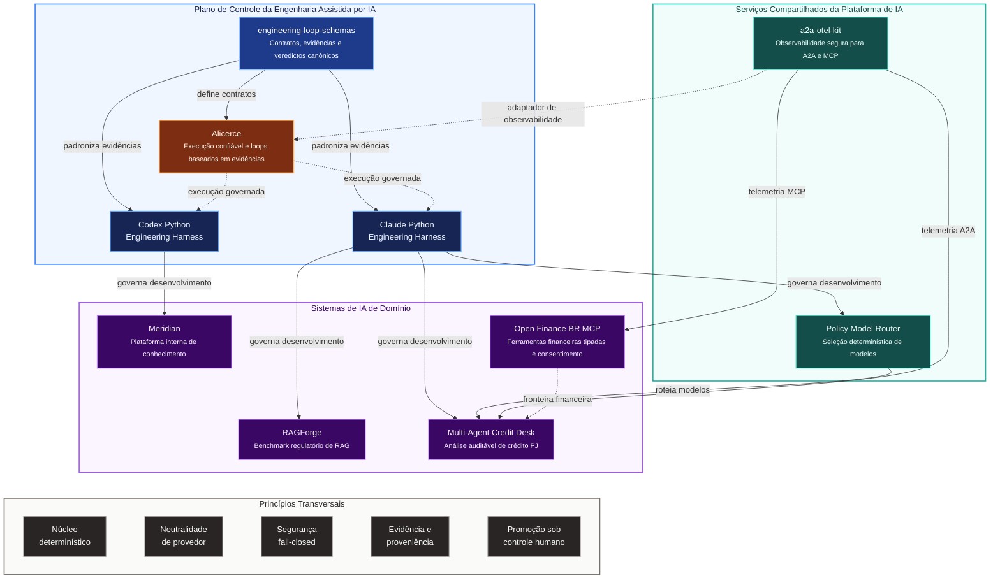
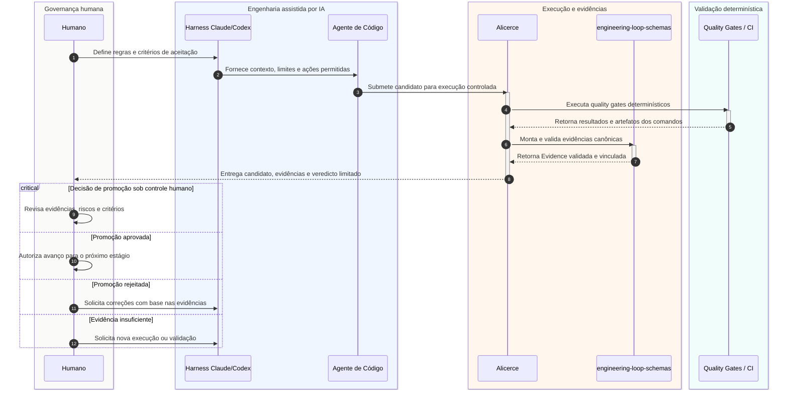
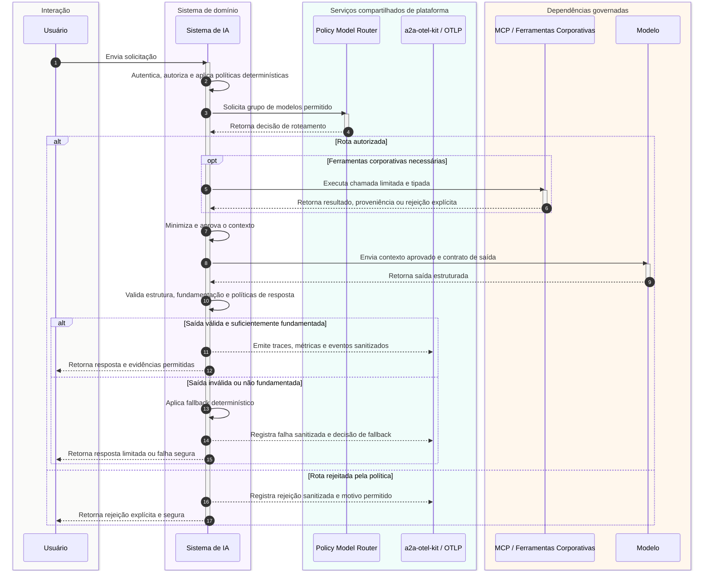

# Mapa de Arquitetura do Portfólio

> 🇺🇸 [Read in English](./PORTFOLIO_ARCHITECTURE.md)

Este portfólio foi organizado como um ecossistema, e não como uma coleção de demonstrações isoladas.

Os projetos exploram como construir, operar, avaliar, observar e governar sistemas de IA em ambientes regulados. Todos seguem a mesma direção arquitetural:

- manter decisões críticas de negócio em componentes determinísticos;
- colocar LLMs atrás de contratos explícitos e responsabilidades limitadas;
- tratar agentes, servidores MCP, provedores de modelos e telemetria como fronteiras de confiança;
- incorporar segurança, avaliação, proveniência e auditabilidade à arquitetura;
- usar agentes de código sob controles pertencentes ao repositório.

## Mapa do ecossistema



## Camadas arquiteturais

### 1. Sistemas de IA de domínio

Estes projetos demonstram como capacidades de IA são aplicadas a problemas concretos de negócio e engenharia.

| Projeto | Papel no portfólio | Ênfase atual |
|---|---|---|
| [RAGForge](https://github.com/brunovicco/ragforge) | Plataforma experimental para comparar estratégias de recuperação sobre normas financeiras e regulatórias brasileiras | Ingestão consciente da estrutura legal, recuperação esparsa/densa/híbrida, julgamentos de relevância e avaliação reproduzível |
| [Meridian](https://github.com/brunovicco/meridian) | Arquitetura de referência para uma plataforma interna de conhecimento de engenharia | Roteamento semântico, controle de acesso durante a recuperação, consultas estruturadas e respostas fundamentadas com citações |
| [Open Finance BR MCP](https://github.com/brunovicco/openfinance-br-mcp) | Fronteira MCP experimental para o Open Finance Brasil | Ferramentas tipadas, jornadas de consentimento, padrões de segurança FAPI-BR, execução mock-first e limites explícitos de validação |
| [Multi-Agent Credit Desk](https://github.com/brunovicco/multi-agent-credit-desk) | Plataforma multiagente incremental para análise auditável de crédito corporativo | Política de crédito determinística, dados sintéticos de bureau, fronteiras MCP/A2A e narrativas opcionais geradas por LLM |

### 2. Serviços compartilhados de plataforma de IA

Estes repositórios extraem capacidades reutilizáveis que não deveriam ser implementadas novamente dentro de cada aplicação.

#### [Policy Model Router](https://github.com/brunovicco/policy-model-router)

Serviço determinístico de roteamento que seleciona um grupo de modelos permitido somente após aplicar restrições de política e de workload.

Seu papel é manter a escolha de modelos fora dos agentes individuais e oferecer um ponto único para regras como:

- provedores e grupos de modelos permitidos;
- restrições por sensibilidade dos dados;
- classes de latência e custo;
- capacidades exigidas por tipo de workload;
- justificativas explícitas para rejeições.

#### [a2a-otel-kit](https://github.com/brunovicco/a2a-otel-kit)

Biblioteca reutilizável de observabilidade para agentes A2A e serviços MCP.

Ela padroniza:

- inicialização do OpenTelemetry;
- propagação de contexto W3C;
- schemas de eventos estruturados;
- atributos de telemetria baseados em allowlist;
- reporte seguro de falhas;
- ciclo de vida de operações em streaming.

A biblioteca evita tornar Datadog, Langfuse ou outro fornecedor de observabilidade parte do núcleo da aplicação.

### 3. Plano de controle da engenharia assistida por IA

Estes projetos tratam de outro problema: como usar agentes de código sem delegar a eles a autoridade sobre a engenharia.

#### [Claude Python Engineering Harness](https://github.com/brunovicco/claude-python-engineering-harness)

Scaffold reutilizável e plugin para Claude Code com instruções pertencentes ao repositório, skills, hooks, quality gates, fronteiras arquiteturais, políticas MCP e overlays opcionais de governança.

#### [Codex Python Engineering Harness](https://github.com/brunovicco/codex-python-engineering-harness)

A linha-base correspondente para fluxos com Codex, também orientada a validação determinística em vez de autoavaliação pelo modelo.

#### [engineering-loop-schemas](https://github.com/brunovicco/engineering-loop-schemas)

Contratos canônicos e neutros de provedor para loops de engenharia baseados em evidências.

Ele define a linguagem compartilhada para:

- contratos;
- resultados produzidos pelo builder;
- evidências de execução;
- veredictos;
- estados finais;
- vínculos com commits e ambiente;
- hashes dos bytes exatos.

A regra central é simples: o builder pode relatar o que fez, mas não pode certificar o próprio resultado.

#### [Alicerce](https://github.com/brunovicco/alicerce)

Núcleo local confiável para loops determinísticos e auditáveis de engenharia.

Sua arquitetura incremental inclui:

- identidade imutável da execução;
- estado durável e atualizações compare-and-swap;
- capabilities opacas de workspace;
- materialização controlada do Git;
- autorização de comandos imediatamente antes do spawn;
- isolamento de processos no Linux;
- evidência canônica de comandos;
- autoridade humana explícita sobre promoção, merge e deploy.

## Como os projetos se conectam

### Fluxo de engenharia



### Fluxo de execução de IA



## Princípios compartilhados

### Decisões determinísticas antes do comportamento generativo

Resultado de crédito, controle de acesso, autorização de comandos, avaliação de políticas e promoção de candidatos permanecem fora do LLM.

O modelo pode classificar, resumir, rotear dentro de um contrato limitado ou redigir uma narrativa. Ele não se torna a fonte de verdade para decisões de alto impacto.

### Núcleo neutro de provedor, integrações nas bordas

Regras de negócio e modelos de domínio não devem depender diretamente de OpenAI, Anthropic, Google, LangChain, LangGraph, MCP, A2A ou de um fornecedor de observabilidade.

Essas integrações pertencem às bordas e podem ser substituídas sem reescrever o núcleo determinístico.

### Segurança aplicada na fronteira

Os projetos tratam toda integração externa como uma fronteira de confiança:

- ferramentas MCP;
- provedores de modelos;
- chamadas entre agentes;
- documentos recuperados;
- exportadores de telemetria;
- execução de código candidato;
- acesso a Git e filesystem.

Os controles falham de forma fechada quando identidade, política, proveniência ou garantias de execução não podem ser verificadas.

### Evidência em vez de sucesso autorrelatado

Um modelo afirmar que os testes passaram não é evidência.

Os projetos de engineering loop vinculam resultados a comandos, outputs, políticas, commits, ambientes e hashes exatos. Os projetos de runtime usam citações, identificadores estruturais, filtros de acesso, traces e datasets de avaliação pela mesma razão: afirmações importantes devem ser verificáveis de forma independente.

### Autoridade humana explícita

Agentes podem preparar candidatos, coletar evidências, propor decisões e explicar trade-offs.

Promoção, merge, deploy, exceções de política e ações de alto impacto permanecem sob autoridade humana ou organizacional explícita.

## Mapa de maturidade

O portfólio contém deliberadamente projetos em estágios diferentes.

| Projeto | Maturidade | O que está comprovado hoje | Próxima prova principal |
|---|---|---|---|
| RAGForge | Desenvolvimento ativo | Ingestão regulatória, chunking estrutural, estratégias de recuperação e métricas de relevância | Completar a matriz de benchmarks e publicar resultados reproduzíveis |
| Meridian | Implementação de referência | Demo sem setup, roteamento, recuperação com ACL e caminho de consultas estruturadas | Walkthrough público e perfil completo de deploy |
| Open Finance BR MCP | Release experimental | Ambiente mock, superfície MCP tipada, consentimento e fundamentos de segurança | Validação em sandboxes oficiais e configurações reais de participantes |
| Multi-Agent Credit Desk | Construção incremental | Núcleo determinístico, serviços MCP, primeiro agente A2A e fluxo sintético de KYC | Orquestração, pacote decisório ponta a ponta e observabilidade conectada |
| Policy Model Router | Serviço inicial | Núcleo determinístico de roteamento e publicação de imagem | Catálogo mais amplo de políticas, métricas operacionais e exemplos de consumo |
| a2a-otel-kit | Biblioteca reutilizável | Propagação A2A/MCP, eventos sanitizados e testes de integração | Adoção mais ampla pelos serviços do portfólio |
| engineering-loop-schemas | Fundação versionada | Contratos e modelos canônicos de evidência | Avaliador no nível de completion e contratos de saúde operacional |
| Alicerce | Phase 2A | Workspace confiável, sandbox, estado, autorização e primitivas de evidência | Evidência completa, persistência e orquestração retomável |
| Harnesses Claude/Codex | Linha-base reutilizável | Scaffolding, quality gates, hooks, políticas e perfis de governança | Integração com o loop completo de execução do Alicerce |

## Narrativa do portfólio

Juntos, os projetos sustentam uma única tese profissional:

> Sistemas de IA em produção exigem mais do que integração com modelos. Precisam de fronteiras determinísticas, autoridade explícita, qualidade mensurável, observabilidade segura, evidências reproduzíveis e fluxos de engenharia que continuem confiáveis mesmo quando agentes escrevem parte do código.

O portfólio cobre todo o caminho:

```text
Problema de domínio
    → núcleo determinístico de negócio
    → capacidade de IA limitada
    → política de modelos e ferramentas
    → observabilidade e avaliação
    → engenharia assistida por IA com segurança
    → evidência canônica
    → promoção sob controle humano
```

## Trilhas sugeridas de leitura

### Arquitetura e plataforma de IA

1. [Alicerce](https://github.com/brunovicco/alicerce)
2. [engineering-loop-schemas](https://github.com/brunovicco/engineering-loop-schemas)
3. [a2a-otel-kit](https://github.com/brunovicco/a2a-otel-kit)
4. [Policy Model Router](https://github.com/brunovicco/policy-model-router)

### RAG e LLM Engineering

1. [RAGForge](https://github.com/brunovicco/ragforge)
2. [Meridian](https://github.com/brunovicco/meridian)
3. [Open Finance BR MCP](https://github.com/brunovicco/openfinance-br-mcp)

### IA em serviços financeiros

1. [Multi-Agent Credit Desk](https://github.com/brunovicco/multi-agent-credit-desk)
2. [Open Finance BR MCP](https://github.com/brunovicco/openfinance-br-mcp)
3. [RAGForge](https://github.com/brunovicco/ragforge)

### AI Enablement e produtividade de desenvolvimento

1. [Claude Python Engineering Harness](https://github.com/brunovicco/claude-python-engineering-harness)
2. [Codex Python Engineering Harness](https://github.com/brunovicco/codex-python-engineering-harness)
3. [Alicerce](https://github.com/brunovicco/alicerce)
4. [engineering-loop-schemas](https://github.com/brunovicco/engineering-loop-schemas)
