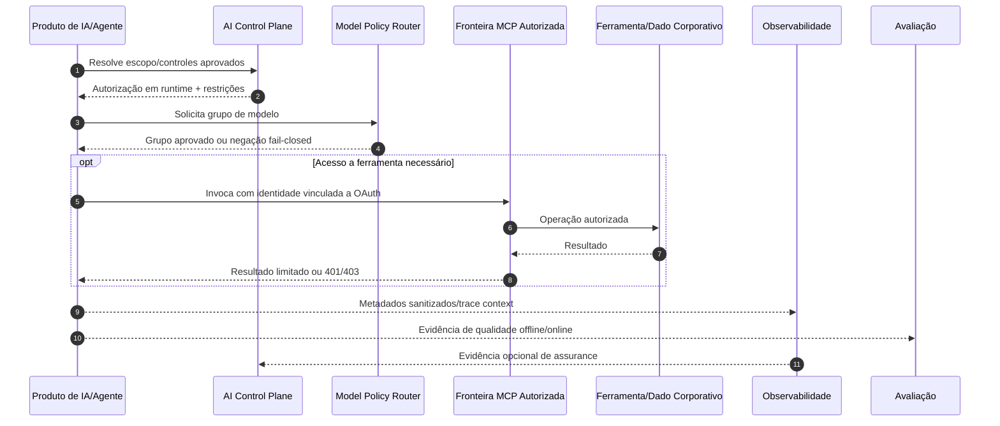

# Ecossistema de Engenharia de Plataformas de IA

> 🇺🇸 [Read in English](./PORTFOLIO_ARCHITECTURE.md)

Este portfólio é organizado como um **ecossistema de Engenharia de Plataformas de IA**, e não como uma coleção de demos isoladas.

Os projetos exploram capacidades horizontais necessárias para construir, operar, proteger, observar, avaliar e governar sistemas de IA utilizados por diferentes produtos e times. As aplicações de domínio funcionam como **workloads de referência** que exercitam essas capacidades em cenários realistas.

A direção arquitetural é consistente em todo o portfólio:

- manter autoridade de alto impacto fora do raciocínio do LLM;
- colocar comportamento de modelos e agentes atrás de contratos explícitos;
- tratar identidade, ferramentas, provedores de modelos, dados recuperados, telemetria e ambientes de execução como fronteiras de confiança;
- tornar afirmações importantes verificáveis de forma independente por código, testes, traces, políticas, hashes e artefatos de evidência.

---

## Mapa de capacidades

<p align="center">
  
</p>

A proposta não é construir um único repositório monolítico de plataforma. Cada projeto isola uma capacidade para que seus contratos, limites de segurança, modos de falha e evidências possam ser avaliados de forma independente.

---

# 1. AI Control Plane e Políticas de Runtime

## [Verifiable AI Governance](https://github.com/brunovicco/verifiable-ai-governance)

**Papel:** control plane de governança e assurance.

Transforma requisitos de governança em controles executáveis e evidências de runtime inspecionáveis de forma independente.

```text
Política
  → Risco e controles
  → Aprovação independente
  → Autorização assinada em runtime
  → Enforcement
  → Violação/assurance
  → Resposta governada
  → Evidência
```

Principais sinais de plataforma:

- avaliação determinística de políticas e risco;
- segregação de funções e rodadas imutáveis de revisão;
- aprovações de modelos/agentes vinculadas a escopo;
- autorização assinada em runtime;
- enforcement e evidência confiável de negações;
- telemetria sanitizada de runtime;
- incidentes, contenção, restauração e histórico de auditoria;
- evidências de release, provenance, SBOM/segurança e verificação de instalação limpa.

Esse repositório é a expressão mais clara do conceito de **control plane** no portfólio: governança não é uma camada documental ao redor da IA; ela se torna estado de runtime e comportamento executável.

---

## [Policy Model Router](https://github.com/brunovicco/policy-model-router)

**Papel:** policy decision point determinístico para acesso a modelos.

O router mantém a escolha do modelo fora de prompts de agentes e do código de cada aplicação. Um workload é avaliado contra restrições versionadas como:

- classificação de dados;
- risco do workflow;
- requisitos de structured output e tool calling;
- limite de contexto;
- teto de custo;
- teto de latência;
- disponibilidade;
- allowlists de agentes.

A saída é uma decisão explicável sobre um grupo lógico de modelos ou uma rejeição fail-closed. O serviço **não chama um LLM**.

### Por que isso pertence a uma plataforma

Sem uma camada compartilhada de políticas, cada aplicação tende a embutir sua própria seleção de provider, regras de custo, permissões de dados e fallback. O router centraliza essa fronteira sem acoplar a decisão ao gateway de inferência/provedor downstream.

---

# 2. Identidade e Acesso a Ferramentas

## [mcp-server-auth-template](https://github.com/brunovicco/mcp-server-auth-template)
## [mcp-client-auth-template](https://github.com/brunovicco/mcp-client-auth-template)

**Papel:** referência executável de identidade e autorização para MCP remoto.

O par responde a uma pergunta de plataforma:

> Como permitir que agentes e ferramentas de desenvolvimento acessem capacidades corporativas sem transformar MCP em um bypass do IAM?

A referência combinada cobre:

- OAuth 2.1/OIDC;
- Microsoft Entra ID e OIDC genérico;
- Authorization Code + PKCE e fluxos machine-to-machine;
- Protected Resource Metadata e resource/audience binding exato;
- scopes delegados versus application roles;
- step-up limitado de autorização;
- rejeição de audience incorreta;
- descoberta protegida de ferramentas;
- MCP stateless;
- continuidade de W3C trace context;
- telemetria com minimização de dados;
- evidência E2E executável entre repositórios.

### Princípio de plataforma

O LLM ou agente pode solicitar uma ferramenta. **A autorização continua sendo uma decisão determinística de segurança fora do modelo.**

---

# 3. Runtime e Observabilidade de Agentes

## [a2a-otel-kit](https://github.com/brunovicco/a2a-otel-kit)

**Papel:** observabilidade distribuída neutra de fornecedor para fronteiras A2A e MCP.

Sistemas agênticos frequentemente atravessam processos e protocolos:

```text
Requisição de negócio
    ↓
Orquestrador
    ↓ A2A
Agente
    ↓ MCP
Ferramenta/Serviço
```

O `a2a-otel-kit` mantém esses hops no mesmo trace OpenTelemetry usando W3C Trace Context.

Principais decisões:

- tracing de cliente/servidor A2A;
- tracing de cliente/servidor MCP Streamable HTTP;
- exportação OTLP sem acoplamento ao SDK de um vendor de observabilidade;
- lifecycle e shutdown explícitos;
- telemetria de protocolo baseada apenas em metadados;
- ausência de prompts, respostas, payloads de negócio, argumentos/resultados MCP, credenciais e headers arbitrários na instrumentação padrão;
- demo executável comprovando que spans A2A e MCP compartilham o mesmo trace ID.

### Por que isso pertence a uma plataforma

Cada aplicação não deveria reinventar instrumentação de protocolo, vocabulário de correlação, regras de privacidade e propagação de trace. Observabilidade é uma capacidade reutilizável de runtime.

---

# 4. Avaliação de IA e Engenharia de Qualidade

## [RAGForge](https://github.com/brunovicco/ragforge)

**Papel:** camada de avaliação e experimentação para sistemas com retrieval.

RAGForge trata decisões de arquitetura como experimentos, não como intuição. O escopo atual inclui:

- golden dataset RegRAG-BR com **230 perguntas**;
- 10 configurações de retrieval, de dense/BM25/hybrid a reranking, contextual retrieval, parent-child, SAC, RAPTOR e GraphRAG;
- métricas como Recall@K, Precision@K, MRR e nDCG;
- avaliação da resposta gerada com Citation Accuracy, Faithfulness e Answer Relevancy;
- tratamento explícito de abstention/evidência;
- artefatos auditáveis e lineage por experimento;
- separação arquitetural entre qualidade de retrieval e qualidade de geração.

### Por que isso é uma capacidade de plataforma

Uma plataforma de IA precisa responder mais do que métricas de runtime:

- A qualidade piorou depois de trocar modelo, prompt, chunker ou retriever?
- O problema está em retrieval ou geração?
- A resposta está sustentada pelas evidências?
- Uma estratégia mais cara é melhor o suficiente para justificar o custo?

Por isso, RAGForge é posicionado como um **laboratório de avaliação de IA**, usando o domínio regulatório como corpus exigente de referência, e não como definição da capacidade.

---

# 5. AI Developer Platform e Enablement

Coding agents criam um novo problema de plataforma: como aumentar produtividade sem transformar geração, execução e promoção de código em uma fronteira de confiança sem controle.

O portfólio separa esse problema em fundações reutilizáveis.

| Projeto | Papel na plataforma |
| --- | --- |
| [**engineering-loop-schemas**](https://github.com/brunovicco/engineering-loop-schemas) | Contratos canônicos para evidências, veredictos e resultados de execução |
| [**Alicerce**](https://github.com/brunovicco/alicerce) | Execução determinística confiável e loops de engenharia condicionados a evidências |
| [**Claude Python Engineering Harness**](https://github.com/brunovicco/claude-python-engineering-harness) | Regras, hooks, limites arquiteturais e quality gates pertencentes ao repositório para Claude Code |
| [**Codex Python Engineering Harness**](https://github.com/brunovicco/codex-python-engineering-harness) | Linha-base determinística equivalente para workflows com Codex |

Princípios compartilhados:

- política pertencente ao repositório, em vez de convenção local de usuário;
- validação determinística ao redor de comportamento generativo de código;
- limites de arquitetura e dependências;
- evidência explícita antes de promoção;
- autoridade humana sobre merge/deploy/ações de alto impacto;
- quality gates repetíveis em vez de autoavaliação do modelo.

Essa capacidade se conecta diretamente a enterprise AI enablement: o desafio de escalar coding agents não é distribuir licenças, mas definir comportamento de engenharia seguro, observável e repetível entre muitos desenvolvedores e repositórios.

---

# 6. Workloads de Referência

Workloads de referência são separados intencionalmente das capacidades de plataforma. Eles existem para provar que os componentes horizontais podem ser aplicados a domínios diferentes.

## [Multi-Agent Credit Desk](https://github.com/brunovicco/multi-agent-credit-desk)

**Papel:** workload multiagente auditável em evolução.

As partes atualmente implementadas incluem avaliação determinística de crédito, serviços MCP, agente de decisão A2A, agente de análise cadastral, integração de model routing e infraestrutura local de observabilidade. O orquestrador completo não é apresentado como concluído.

Seu papel no ecossistema é exercitar:

- autoridade determinística versus assistência generativa;
- fronteiras de ferramentas MCP;
- comunicação A2A;
- roteamento governado de modelos;
- contratos estruturados;
- telemetria de runtime;
- evidências auditáveis de domínio.

---

## [Open Finance BR MCP](https://github.com/brunovicco/openfinance-br-mcp)

**Papel:** referência MCP em domínio regulado.

O projeto usa um ambiente mock-first para explorar ferramentas tipadas, jornadas de consentimento, padrões OAuth/FAPI-BR, fronteiras relacionadas a mTLS, estado compartilhado com Redis e padrões de deployment remoto MCP.

Integrações reais com instituições continuam experimentais/não validadas; o projeto separa explicitamente evidência de mock de claims de produção.

---

## [Meridian](https://github.com/brunovicco/meridian)

**Papel:** workload de referência para conhecimento corporativo.

Demonstra como uma aplicação de conhecimento pode combinar roteamento semântico, controle de acesso durante retrieval, consultas estruturadas, respostas fundamentadas e preocupações de integração corporativa.

---

## [OpsLens](https://github.com/brunovicco/opslens)

**Papel:** plataforma/workload AWS de referência para inteligência de software supply chain.

OpsLens parte de um domínio diferente para que decisões de cloud e plataforma não fiquem escondidas atrás de mais uma demo de chatbot/RAG.

Sua fundação AWS concluída demonstra:

- AWS IAM Identity Center para acesso humano de bootstrap;
- GitHub Actions OIDC sem chaves AWS persistentes;
- trust IAM restrito e permissões de deploy com menor privilégio;
- remote state Terraform e infraestrutura por ambiente;
- fundação de logging no CloudWatch;
- gates de CI com validação e ferramentas de segurança Terraform;
- correlação via CloudTrail para eventos de federação;
- governança de custos e observabilidade como requisitos arquiteturais.

Os próximos milestones adicionam ingestion event-driven e analytics estruturado. O repositório adiciona serviços AWS somente quando resolvem um problema concreto do OpsLens.

---

# Preocupações arquiteturais transversais

## Segurança

Segurança não aparece apenas como gate final. Ela atravessa acesso a modelos, ferramentas, identidade, CI/CD, telemetria, evidências e controles de runtime.

Exemplos no ecossistema:

- avaliação de políticas fail-closed;
- autorização por menor privilégio;
- resource/audience binding exato de tokens;
- enforcement de scopes de ferramentas;
- telemetria com minimização de dados;
- OIDC em CI/CD em vez de chaves cloud de longa duração;
- testes de arquitetura e limites de dependência;
- ações de runtime controladas e caminhos de kill switch.

## Governança

Governança é tratada como estado executável do sistema, e não apenas documentação:

- escopo aprovado;
- versão de política;
- autorização em runtime;
- lineage de evidências;
- registros de negação/violação;
- aprovação humana para ações de alto impacto;
- caminhos de incidente e restauração.

## Observabilidade

Visibilidade operacional inclui sistemas determinísticos e comportamento específico de IA:

- latência e taxa de erros;
- traces distribuídos;
- decisões de modelos/roteamento;
- comportamento de retrieval;
- sinais de tokens/custo;
- tool calls e falhas;
- metadados com minimização de dados;
- evidências de avaliação/regressão.

## Evidência

Claims importantes do portfólio procuram ser verificáveis por um ou mais mecanismos:

- demos executáveis;
- testes e gates de CI;
- seeds determinísticos;
- artefatos de benchmark;
- traces;
- digests de políticas;
- provenance de release;
- SBOM/evidências de segurança;
- cadeias de auditoria/eventos;
- limitações e maturidade declaradas explicitamente.

---

# Relação em runtime

A sequência abaixo representa um caminho conceitual de integração entre capacidades da plataforma. Nem todo workload precisa utilizar todas as etapas.



---

# Princípios de design da plataforma

### 1. Autoridade determinística

LLMs podem classificar, resumir, redigir, rotear dentro de escolhas limitadas e recomendar ações. Eles não são autoridade de autorização, verdade de políticas, decisões financeiras, deployment ou enforcement de segurança.

### 2. Workflows antes de autonomia

Quando o processo é conhecido, workflows determinísticos são mais fáceis de testar, observar e governar. Autonomia de agentes é introduzida quando planejamento dinâmico ou seleção de ferramentas cria valor suficiente para justificar modos de falha adicionais.

### 3. Fronteiras de confiança explícitas

Agentes, servidores MCP, provedores de identidade, gateways de modelos, documentos recuperados, exportadores de telemetria, Git, filesystem, CI/CD e ambientes cloud são tratados como fronteiras distintas.

### 4. Avaliação faz parte da arquitetura

Qualidade não é inferida de uma demo. Retrieval, geração, roteamento, structured outputs e outcomes de negócio precisam de métricas adequadas à tarefa e datasets de regressão.

### 5. Evidência acima de autorrelato

O modelo afirmar que uma ação funcionou, uma política foi seguida ou uma resposta está grounded não é prova suficiente. Claims críticos precisam apontar para evidência inspecionável de forma independente.

### 6. Observabilidade com minimização de dados

Observabilidade deve preservar metadados suficientes para depurar sistemas distribuídos sem transformar telemetria em um segundo armazenamento de prompts, credenciais ou payloads sensíveis de negócio.

### 7. Serviços cloud precisam resolver um problema concreto

Complexidade de plataforma é adicionada deliberadamente. Serviço gerenciado, fila, workflow engine, vector store ou cluster Kubernetes precisa ser justificado por requisitos de confiabilidade, escala, segurança, operação ou custo - não por completude de diagrama arquitetural.

---

# Caminhos recomendados de revisão

## Hiring manager - 5 minutos

1. Leia o README do perfil e este mapa de capacidades.
2. Abra **Verifiable AI Governance** para entender o control plane.
3. Abra **a2a-otel-kit** ou o par MCP Auth para uma capacidade focada de runtime.
4. Abra **RAGForge** para evidência de qualidade mensurável de IA.
5. Abra **OpsLens** para evidência de AWS e platform engineering.

## Arquiteto - 15 minutos

1. Revise as restrições e provenance das decisões do **Policy Model Router**.
2. Analise as fronteiras de autorização e a prova E2E do **MCP Auth**.
3. Inspecione o trace distribuído e o modelo de privacidade do **a2a-otel-kit**.
4. Revise metodologia e evidências de experimento do **RAGForge**.
5. Use o **Multi-Agent Credit Desk** como workload de referência mostrando como diferentes componentes podem convergir.

## AI developer platform

1. Revise os **Claude/Codex Engineering Harnesses**.
2. Inspecione os contratos do **engineering-loop-schemas**.
3. Revise o modelo de execução determinística/evidência do **Alicerce**.
4. Conecte esses repositórios aos princípios de autorização, evidência, quality gates e promoção controlada por humanos da plataforma maior.
