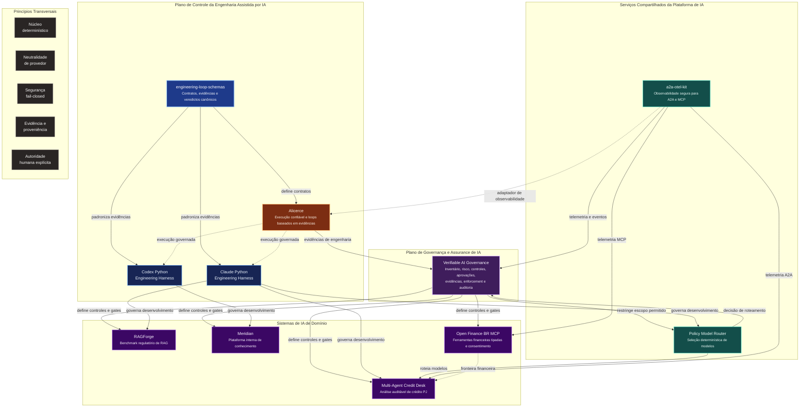
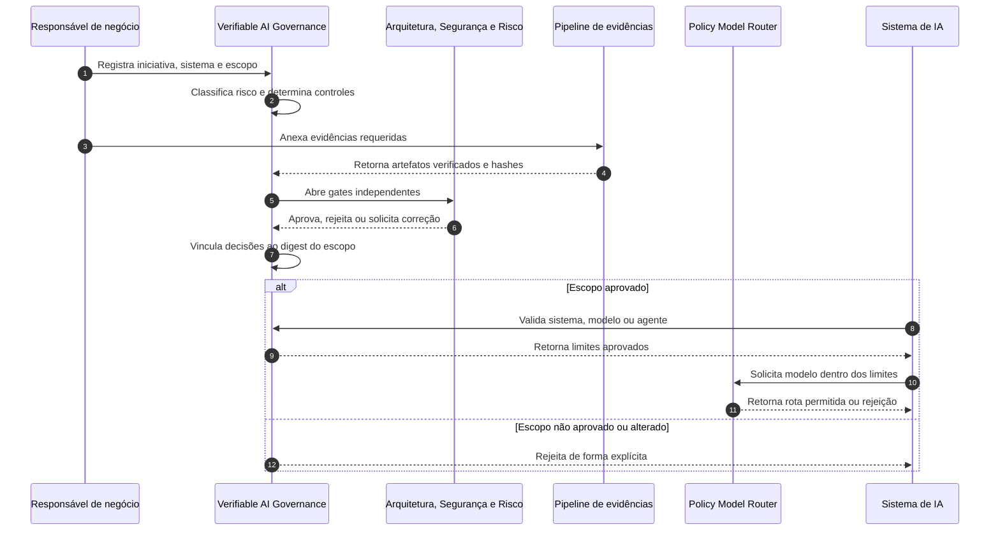
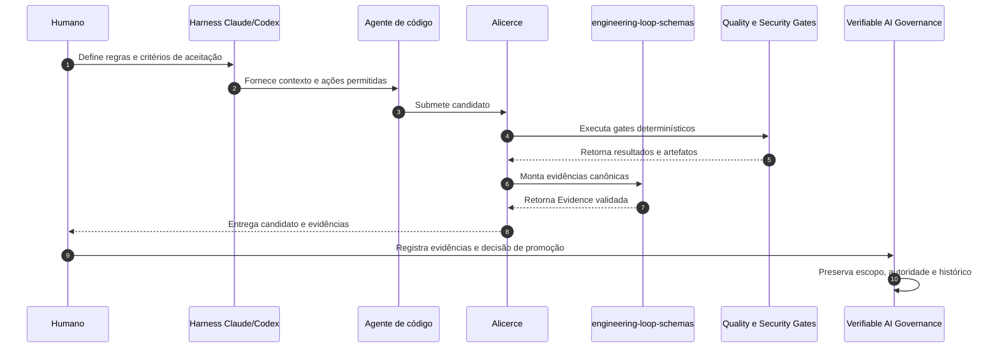
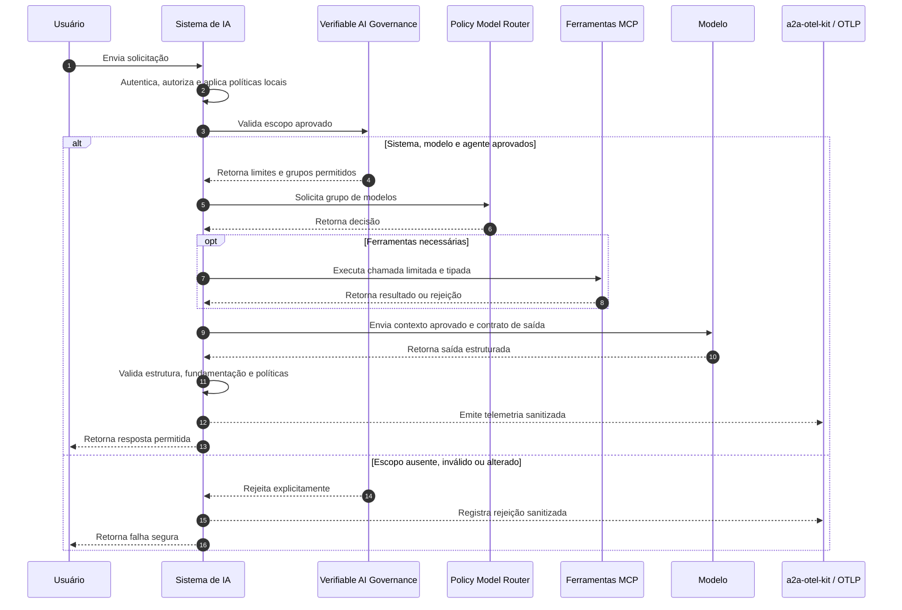

# Mapa de Arquitetura do Portfólio

> 🇺🇸 [Read in English](./PORTFOLIO_ARCHITECTURE.md)

Este portfólio foi organizado como um ecossistema, e não como uma coleção de demonstrações isoladas.

Os projetos exploram como construir, operar, avaliar, observar e governar sistemas de IA em ambientes regulados. Todos seguem a mesma direção arquitetural:

- manter decisões críticas de negócio em componentes determinísticos;
- colocar LLMs atrás de contratos explícitos e responsabilidades limitadas;
- tratar agentes, servidores MCP, provedores de modelos e telemetria como fronteiras de confiança;
- incorporar segurança, avaliação, proveniência e auditabilidade à arquitetura;
- vincular aprovações ao escopo exato revisado;
- usar agentes de código sob controles pertencentes ao repositório.

## Mapa do ecossistema



## Camadas arquiteturais

### 1. Plano de Governança e Assurance de IA

#### [Verifiable AI Governance](https://github.com/brunovicco/verifiable-ai-governance)

Plataforma de referência neutra de fornecedor que transforma requisitos de governança em controles executáveis e evidências verificáveis.

Seu papel no portfólio é conectar:

```text
Contexto de negócio
    → inventário de iniciativas e sistemas
    → classificação de risco e impacto
    → controles aplicáveis
    → avaliações e aprovações independentes
    → evidências verificadas
    → assurance de modelos e agentes
    → enforcement em runtime
    → monitoramento, incidentes e revisão
```

As capacidades demonstradas incluem:

- inventário de iniciativas, sistemas, modelos e agentes;
- classificação preliminar de risco por motor determinístico e versionado;
- avaliações de impacto de IA, privacidade e processamento internacional;
- controles declarativos, versionados e com aplicabilidade explicável;
- segregação de funções, gates condicionais e rodadas de revisão imutáveis;
- evidências com validação de tipo, hash SHA-256, análise antimalware e armazenamento privado;
- aprovações vinculadas ao digest do escopo revisado;
- assurance independente de arquitetura para modelos e de segurança para agentes;
- validação do escopo aprovado antes do roteamento externo de modelos;
- incidentes, kill switch, exceções temporárias e remediação;
- trilha de auditoria encadeada por hash e comportamento fail-closed.

O projeto possui uma implementação funcional orientada à produção e uma [demo pública somente para leitura](https://vaigov-app.duckdns.org). Integrações corporativas selecionadas ainda dependem de validação em ambientes reais.

### 2. Sistemas de IA de domínio

Estes projetos demonstram como capacidades de IA são aplicadas a problemas concretos de negócio e engenharia.

| Projeto | Papel no portfólio | Ênfase atual |
|---|---|---|
| [RAGForge](https://github.com/brunovicco/ragforge) | Plataforma experimental para comparar estratégias de recuperação sobre normas financeiras e regulatórias brasileiras | Ingestão consciente da estrutura legal, recuperação esparsa/densa/híbrida, julgamentos de relevância e avaliação reproduzível |
| [Meridian](https://github.com/brunovicco/meridian) | Arquitetura de referência para uma plataforma interna de conhecimento de engenharia | Roteamento semântico, controle de acesso durante a recuperação, consultas estruturadas e respostas fundamentadas com citações |
| [Open Finance BR MCP](https://github.com/brunovicco/openfinance-br-mcp) | Fronteira MCP experimental para o Open Finance Brasil | Ferramentas tipadas, jornadas de consentimento, padrões de segurança FAPI-BR, execução mock-first e limites explícitos de validação |
| [Multi-Agent Credit Desk](https://github.com/brunovicco/multi-agent-credit-desk) | Plataforma multiagente incremental para análise auditável de crédito corporativo | Política de crédito determinística, dados sintéticos de bureau, fronteiras MCP/A2A e narrativas opcionais geradas por LLM |

### 3. Serviços compartilhados de plataforma de IA

Estes repositórios extraem capacidades reutilizáveis que não deveriam ser implementadas novamente dentro de cada aplicação.

#### [Policy Model Router](https://github.com/brunovicco/policy-model-router)

Serviço determinístico de roteamento que seleciona um grupo de modelos permitido somente após aplicar restrições de política e workload.

O Verifiable AI Governance pode vincular uma aprovação a grupos de modelos permitidos; o router continua responsável pela decisão técnica em runtime, sem conceder a si próprio autoridade para ampliar o escopo aprovado.

#### [a2a-otel-kit](https://github.com/brunovicco/a2a-otel-kit)

Biblioteca reutilizável de observabilidade para agentes A2A e serviços MCP.

Ela padroniza propagação de contexto, eventos estruturados, atributos baseados em allowlist, reporte seguro de falhas e operações em streaming, preservando a neutralidade em relação ao fornecedor de observabilidade.

### 4. Plano de controle da engenharia assistida por IA

Estes projetos tratam de como usar agentes de código sem delegar a eles autoridade sobre a engenharia.

#### [Claude Python Engineering Harness](https://github.com/brunovicco/claude-python-engineering-harness)

Scaffold reutilizável e plugin para Claude Code com instruções pertencentes ao repositório, skills, hooks, quality gates, fronteiras arquiteturais, políticas MCP e overlays opcionais de governança.

#### [Codex Python Engineering Harness](https://github.com/brunovicco/codex-python-engineering-harness)

Linha-base correspondente para fluxos com Codex, orientada a validação determinística em vez de autoavaliação pelo modelo.

#### [engineering-loop-schemas](https://github.com/brunovicco/engineering-loop-schemas)

Contratos canônicos e neutros de provedor para loops de engenharia baseados em evidências. O builder pode relatar o que fez, mas não pode certificar o próprio resultado.

#### [Alicerce](https://github.com/brunovicco/alicerce)

Núcleo local confiável para loops determinísticos e auditáveis de engenharia, com identidade imutável da execução, estado durável, workspaces controlados, autorização de comandos, isolamento, evidência canônica e autoridade humana sobre promoção.

## Como os projetos se conectam

### Ciclo de governança



### Fluxo de engenharia



### Fluxo de execução de IA



## Princípios compartilhados

### Decisões determinísticas antes do comportamento generativo

Resultado de crédito, controle de acesso, autorização de comandos, avaliação de políticas, classificação preliminar de risco e promoção permanecem fora do LLM.

### Núcleo neutro de provedor, integrações nas bordas

Regras de negócio e modelos de domínio não dependem diretamente de um provedor de modelo, framework de agentes ou fornecedor de observabilidade.

### Segurança aplicada na fronteira

Ferramentas MCP, provedores, chamadas entre agentes, documentos recuperados, exportadores de telemetria, execução de código, Git e filesystem são tratados como fronteiras de confiança.

### Evidência em vez de sucesso autorrelatado

Afirmações importantes são vinculadas a comandos, outputs, políticas, commits, ambientes, hashes, escopos e decisões verificáveis.

### Aprovação vinculada ao escopo

Uma aprovação não autoriza qualquer versão futura do sistema. Mudanças materiais em dados, modelos, agentes, ferramentas, região ou finalidade exigem nova análise.

### Autoridade humana explícita

Agentes podem preparar candidatos, coletar evidências e propor decisões. Aprovações, exceções, promoção, merge, deploy e ações de alto impacto permanecem sob autoridade humana ou organizacional explícita.

## Mapa de maturidade

| Projeto | Maturidade | O que está comprovado hoje | Próxima prova principal |
|---|---|---|---|
| Verifiable AI Governance | Release funcional v0.1.0 | Inventário, risco determinístico, avaliações, controles, aprovações, evidências, assurance de modelos/agentes, enforcement em runtime, incidentes e auditoria encadeada por hash | Validar Entra ID e integrações corporativas reais; incorporar telemetria e efetividade de controles |
| RAGForge | Desenvolvimento ativo | Ingestão regulatória, chunking estrutural, estratégias de recuperação e métricas de relevância | Completar a matriz de benchmarks e publicar resultados reproduzíveis |
| Meridian | Implementação de referência | Demo sem setup, roteamento, recuperação com ACL e consultas estruturadas | Walkthrough público e perfil completo de deploy |
| Open Finance BR MCP | Release experimental | Ambiente mock, superfície MCP tipada, consentimento e fundamentos de segurança | Validação em sandboxes oficiais e configurações reais |
| Multi-Agent Credit Desk | Construção incremental | Núcleo determinístico, serviços MCP, primeiro agente A2A e fluxo sintético de KYC | Orquestração, pacote decisório ponta a ponta e observabilidade |
| Policy Model Router | Serviço inicial | Núcleo determinístico de roteamento e publicação de imagem | Catálogo de políticas, métricas e exemplos de consumo |
| a2a-otel-kit | Biblioteca reutilizável | Propagação A2A/MCP, eventos sanitizados e testes de integração | Adoção mais ampla pelos serviços do portfólio |
| engineering-loop-schemas | Fundação versionada | Contratos e modelos canônicos de evidência | Avaliador no nível de completion e contratos operacionais |
| Alicerce | Phase 2A | Workspace confiável, sandbox, estado, autorização e primitivas de evidência | Evidência completa, persistência e orquestração retomável |
| Harnesses Claude/Codex | Linha-base reutilizável | Scaffolding, quality gates, hooks, políticas e perfis de governança | Integração com o loop completo do Alicerce |

## Narrativa do portfólio

Juntos, os projetos sustentam uma única tese profissional:

> Sistemas de IA em produção exigem mais do que integração com modelos. Precisam de fronteiras determinísticas, autoridade explícita, qualidade mensurável, observabilidade segura, evidências reproduzíveis e governança capaz de vincular decisões ao escopo real do runtime.

```text
Contexto e finalidade
    → inventário e classificação de risco
    → controles, avaliações, evidências e aprovações
    → núcleo determinístico de negócio
    → capacidade de IA limitada
    → política de modelos e ferramentas
    → observabilidade e avaliação
    → engenharia assistida por IA com segurança
    → incidentes, revisão e melhoria contínua
```

## Trilhas sugeridas de leitura

### Governança, risco e assurance de IA

1. [Verifiable AI Governance](https://github.com/brunovicco/verifiable-ai-governance)
2. [Policy Model Router](https://github.com/brunovicco/policy-model-router)
3. [a2a-otel-kit](https://github.com/brunovicco/a2a-otel-kit)
4. [engineering-loop-schemas](https://github.com/brunovicco/engineering-loop-schemas)

### Arquitetura e plataforma de IA

1. [Alicerce](https://github.com/brunovicco/alicerce)
2. [engineering-loop-schemas](https://github.com/brunovicco/engineering-loop-schemas)
3. [a2a-otel-kit](https://github.com/brunovicco/a2a-otel-kit)
4. [Policy Model Router](https://github.com/brunovicco/policy-model-router)

### RAG e LLM Engineering

1. [RAGForge](https://github.com/brunovicco/ragforge)
2. [Meridian](https://github.com/brunovicco/meridian)
3. [Open Finance BR MCP](https://github.com/brunovicco/openfinance-br-mcp)

### IA em serviços financeiros

1. [Multi-Agent Credit Desk](https://github.com/brunovicco/multi-agent-credit-desk)
2. [Open Finance BR MCP](https://github.com/brunovicco/openfinance-br-mcp)
3. [RAGForge](https://github.com/brunovicco/ragforge)
4. [Verifiable AI Governance](https://github.com/brunovicco/verifiable-ai-governance)

### AI Enablement e produtividade de desenvolvimento

1. [Claude Python Engineering Harness](https://github.com/brunovicco/claude-python-engineering-harness)
2. [Codex Python Engineering Harness](https://github.com/brunovicco/codex-python-engineering-harness)
3. [Alicerce](https://github.com/brunovicco/alicerce)
4. [engineering-loop-schemas](https://github.com/brunovicco/engineering-loop-schemas)
