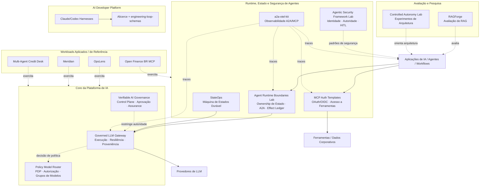
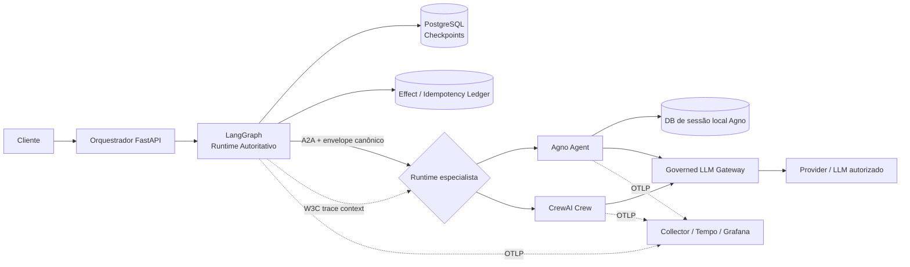
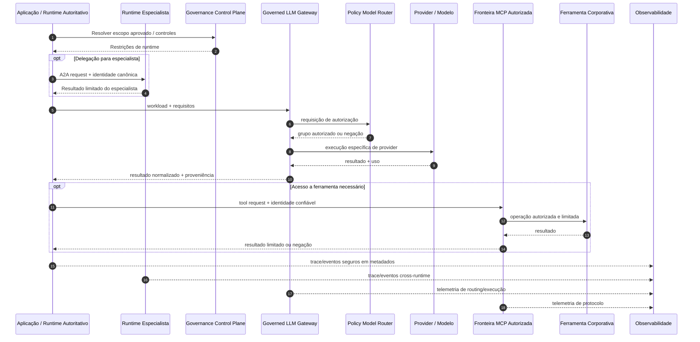

# Ecossistema de Engenharia de Plataformas de IA

> 🇺🇸 [Read in English](./PORTFOLIO_ARCHITECTURE.md)

Este portfólio é organizado como um **ecossistema de Engenharia de Plataformas de IA**, e não como uma coleção de demos isoladas.

Os projetos exploram como construir, operar, proteger, observar, avaliar e governar sistemas de IA utilizados por diferentes produtos e times. Capacidades reutilizáveis de plataforma são separadas de laboratórios de arquitetura e workloads de referência para que contratos, fronteiras de autoridade, modos de falha e evidências possam ser inspecionados de forma independente.

O princípio arquitetural recorrente é:

> **Modelos podem raciocinar e propor. Software confiável autoriza, restringe, executa e produz evidências.**

Na prática, isso significa:

- autoridade de alto impacto permanece fora do raciocínio do LLM;
- um runtime é o owner do estado global do workflow;
- aplicações dependem de contratos neutros de provedor e conscientes de política, em vez de espalhar lógica de provider pelo código;
- identidade, acesso a modelos, ferramentas, dados recuperados, fronteiras de runtime e telemetria são fronteiras explícitas de confiança;
- checkpoints e evidências de efeitos externos são tratados como preocupações diferentes;
- afirmações importantes de runtime devem poder ser verificadas por evidências independentes;
- autonomia é introduzida quando cria valor suficiente para justificar novos modos de falha.

---

## Mapa do portfólio



Este é um mapa conceitual de capacidades. Não significa que todos os repositórios sejam implantados juntos nem que todos os workloads precisem de todos os componentes.

---

# 1. Core da Plataforma de IA

## [Governed LLM Gateway](https://github.com/brunovicco/governed-llm-gateway)

**Papel:** camada principal e neutra de provedor para execução de LLMs.

O Gateway mantém credenciais dos provedores, seleção de modelo/provider, retry e fallback, budgets, proveniência de execução e observabilidade fora do código das aplicações.

```text
Aplicação / Agente
        │
        │ workload + requisitos + credencial do Gateway
        ▼
Policy Model Router (PDP)
        │
        │ grupos lógicos de modelos autorizados
        ▼
Governed LLM Gateway (PEP)
        ├─ elegibilidade
        ├─ ranking determinístico
        ├─ health / circuit breaker
        ├─ retry limitado
        ├─ fallback seguro
        ├─ tradução de provider
        ├─ limites de gasto
        └─ proveniência + OpenTelemetry
        ▼
Provider / modelo autorizado
```

A propriedade central de autoridade é:

```text
Conjunto permitido pelo Gateway ⊆ conjunto autorizado pelo Policy Router
```

O Gateway pode restringir o que foi autorizado. Nunca pode ampliar essa autoridade.

### Fronteira arquitetural

O Gateway controla **autoridade de execução de modelos**. Ele não controla estado do workflow, autorização de ferramentas de negócio, side effects de domínio ou decisões de negócio.

---

## [Policy Model Router](https://github.com/brunovicco/policy-model-router)

**Papel:** Policy Decision Point (PDP) para acesso a modelos.

O Router avalia workloads contra restrições determinísticas e versionadas, como classificação de dados, risco do workload, capacidades necessárias, requisitos de structured output, limites de contexto, custo, latência, disponibilidade e grupos lógicos aprovados.

O resultado é uma decisão explicável de autorização ou uma negação fail-closed. O Router não chama um LLM.

```text
Policy Model Router = o que pode ser usado
Governed LLM Gateway = o que efetivamente executa
```

Separar PDP e PEP torna a autorização testável de forma independente e impede que disponibilidade operacional se transforme silenciosamente em permissão.

---

## [Verifiable AI Governance](https://github.com/brunovicco/verifiable-ai-governance)

**Papel:** control plane de governança e runtime assurance.

O projeto explora como requisitos de governança podem se transformar em comportamento executável do sistema em vez de permanecer apenas em documentos ou tickets de aprovação.

```text
Política
  → Risco e controles
  → Aprovação independente
  → Autorização em runtime
  → Enforcement
  → Runtime assurance
  → Incidente / resposta governada
  → Evidência
```

O portfólio trata autorização como **redução monotônica de autoridade** entre camadas: governança e políticas de runtime podem restringir ainda mais o que é permitido, mas não devem ampliar silenciosamente a autoridade.

---

# 2. Runtime, Estado e Interoperabilidade de Agentes

## [Agent Runtime Boundaries Lab](https://github.com/brunovicco/agent-runtime-boundaries-lab)

**Papel:** arquitetura de referência para compor múltiplos runtimes de agentes sem criar múltiplos owners do mesmo estado de execução.

O laboratório trata um problema comum em arquiteturas multi-framework: tentar “pegar o melhor de cada framework” pode trazer uma segunda definição de sessão, run, persistência, retry, memória, streaming e recuperação.

O repositório usa uma regra:

> **Um runtime coordena. Outros runtimes fornecem capacidades atrás de contratos explícitos.**

Nos experimentos atuais:

- **LangGraph** controla estado global, checkpoints, retomada e fase do workflow;
- **Agno** pode controlar contexto local do especialista;
- **CrewAI** pode coordenar roles/tasks limitadas dentro de um Crew;
- **A2A** é a fronteira explícita de mensagem entre agentes remotos;
- **PostgreSQL** armazena checkpoints LangGraph e um effect/idempotency ledger separado;
- **a2a-otel-kit** propaga W3C Trace Context entre runtimes;
- **Governed LLM Gateway** controla política de execução de provider/modelo por padrão.



### Invariantes importantes

- `conversation_id` pertence à aplicação;
- `execution_id` identifica uma execução do orquestrador;
- `delegation_id` identifica uma chamada do orquestrador ao especialista;
- IDs específicos de framework nunca se tornam a identidade global do workflow;
- contratos de especialistas não podem alterar a fase global do workflow;
- payloads cross-runtime usam contratos tipados e neutros de framework;
- delegações usam chaves de idempotência estáveis;
- resultados remotos concluídos são armazenados separadamente dos checkpoints LangGraph;
- W3C trace context atravessa a fronteira A2A sem virar identificador de negócio.

### Checkpoint versus effect ledger

Um checkpoint de workflow pode dizer onde a execução estava. Ele não prova se um side effect remoto já aconteceu antes de uma falha do processo.

Por isso o laboratório separa:

```text
Checkpoint
→ posição / estado do workflow

Effect ledger
→ qual delegação ou efeito externo foi tentado ou concluído
```

O ledger atual reserva uma chave de idempotência antes da delegação e registra o resultado concluído depois. Uma falha após a conclusão pode reutilizar o resultado armazenado. Uma falha enquanto o resultado ainda é desconhecido continua sendo um caso **at-least-once**, e não uma promessa de exactly-once.

Essa não-afirmação é intencional: garantias de execução distribuída devem refletir apenas aquilo que o sistema consegue provar.

### Evidências

O repositório inclui demonstrações determinísticas de anti-pattern, testes de integração com PostgreSQL real, cenários de crash/retry injetados, inferência real LangGraph → A2A → Agno → Governed LLM Gateway e evidências de trace no Tempo/Grafana atravessando as fronteiras de runtime.

---

## [StateOps](https://github.com/brunovicco/stateops)

**Papel:** implementação de referência de uma máquina de estados LangGraph durável e reproduzível, integrada ao Governed LLM Gateway.

StateOps se concentra em durabilidade e lifecycle **dentro de um único runtime autoritativo**:

- estado explícito e tipado;
- transições de ciclo de vida;
- fan-out dinâmico com `Send`;
- reducers determinísticos;
- roteamento com `Command`;
- subgrafos;
- interrupts humanos;
- checkpointing em Redis;
- restart/resume;
- replay e forks controlados;
- efeitos idempotentes;
- streaming e histórico de execução;
- reasoning neutro de provedor via Gateway.

### StateOps vs Agent Runtime Boundaries Lab

```text
StateOps
→ Como um runtime autoritativo deve gerenciar estado durável do workflow?

Agent Runtime Boundaries Lab
→ Como múltiplos runtimes/frameworks devem se compor sem dividir ownership do estado global?
```

Juntos, os dois projetos cobrem problemas diferentes de produção, em vez de duplicarem a mesma demonstração.

---

# 3. Segurança de Agentes, Identidade e Acesso a Ferramentas

## [Agentic Security Framework Lab](https://github.com/brunovicco/agentic-security-framework-lab)

**Papel:** laboratório de segurança e autoridade para sistemas agênticos, independente de framework.

O mesmo workload controlado é implementado com LangGraph, CrewAI, LlamaIndex e Agno enquanto autorização e enforcement permanecem fora do framework.

Uma distinção importante é:

```text
disponibilidade da ferramenta != autorização da ferramenta != execução da ferramenta
```

O projeto também trata prompt injection de forma conservadora: não afirma que toda injeção pode ser prevenida. Em vez disso, pergunta qual autoridade um fluxo de raciocínio comprometido realmente recebe.

### Runtime Boundaries Lab vs Security Framework Lab

```text
Agent Runtime Boundaries Lab
→ Quem controla estado de execução e replay entre runtimes?

Agentic Security Framework Lab
→ Quais autoridades de segurança precisam permanecer fora do modelo/framework?
```

---

## [MCP Server Auth Template](https://github.com/brunovicco/mcp-server-auth-template)
## [MCP Client Auth Template](https://github.com/brunovicco/mcp-client-auth-template)

**Papel:** referências executáveis de identidade e autorização para MCP remoto protegido.

A dupla cobre OAuth 2.1/OIDC, identidades delegadas e de máquina, Authorization Code + PKCE, machine-to-machine, resource/audience binding, scopes/application roles, Protected Resource Metadata, step-up authorization, descoberta protegida de ferramentas, continuidade de trace context e telemetria orientada à privacidade.

A regra da plataforma é simples:

> O modelo pode solicitar uma ferramenta. A autorização permanece uma decisão determinística de segurança fora do modelo.

---

# 4. Observabilidade Distribuída de Agentes

## [a2a-otel-kit](https://github.com/brunovicco/a2a-otel-kit)

**Papel:** camada neutra de fornecedor para observabilidade de interações A2A e MCP.

`a2a-otel-kit` mantém diferentes saltos de sistemas agênticos distribuídos em um único trace OpenTelemetry usando W3C Trace Context.

```text
Requisição de negócio
   ↓
Orquestrador
   ↓ A2A
Agente
   ↓ MCP
Ferramenta / Serviço
```

As propriedades incluem instrumentação A2A e MCP client/server, exportação OTLP, lifecycle explícito de telemetria, telemetria de protocolo baseada em metadados e tratamento deny-by-default para prompts, respostas de modelo, argumentos/resultados MCP, credenciais e payloads de negócio.

O Agent Runtime Boundaries Lab passa a ser um consumidor concreto dessa capacidade entre LangGraph e runtimes especialistas.

---

# 5. Avaliação e Engenharia de Qualidade de IA

## [RAGForge](https://github.com/brunovicco/ragforge)

**Papel:** plataforma de experimentação, benchmark e avaliação de RAG.

RAGForge trata arquitetura de retrieval como um problema empírico de engenharia. Seu escopo inclui golden dataset RegRAG-BR com 230 perguntas, 10 configurações de retrieval, métricas de recuperação, avaliação de respostas, suporte por citações, abstention baseada em evidência e artefatos auditáveis de experimentos.

As perguntas de plataforma são:

- Retrieval piorou?
- Qualidade da resposta piorou?
- A resposta é realmente sustentada pela evidência recuperada?
- Uma estratégia mais cara melhorou o suficiente para justificar seu custo?
- A falha está em retrieval, geração ou avaliação?

---

## [Controlled Autonomy Lab](https://github.com/brunovicco/controlled-autonomy-lab)

**Papel:** laboratório de pesquisa arquitetural sobre autonomia e controle.

O projeto pergunta:

> Quem controla o próximo passo: código determinístico da aplicação ou o modelo?

Ele compara augmented LLM, prompt chaining, routing, parallelization, evaluator-optimizer e bounded tool-using agent em diferentes combinações de provider/modelo.

### Relação com os outros laboratórios de runtime

```text
Controlled Autonomy Lab
→ Quanto controle da trajetória o modelo deve receber?

Agent Runtime Boundaries Lab
→ Como múltiplos runtimes podem compartilhar um sistema sem compartilhar ownership do estado global?

Agentic Security Framework Lab
→ Quais autoridades devem permanecer fora do modelo/framework?
```

---

# 6. AI Developer Platform

Coding agents criam um problema de plataforma que vai além de geração de código: como aumentar produtividade mantendo execução, validação e promoção sob controle.

| Projeto | Papel |
| --- | --- |
| [**Claude Python Engineering Harness**](https://github.com/brunovicco/claude-python-engineering-harness) | Regras do repositório, hooks, limites arquiteturais e quality gates para Claude Code |
| [**Codex Python Engineering Harness**](https://github.com/brunovicco/codex-python-engineering-harness) | Baseline determinístico equivalente para workflows com Codex |
| [**engineering-loop-schemas**](https://github.com/brunovicco/engineering-loop-schemas) | Contratos tipados canônicos para evidências, resultados de execução e veredictos |
| [**Alicerce**](https://github.com/brunovicco/alicerce) | Execução determinística confiável e loops de engenharia condicionados a evidências |

Os princípios compartilhados incluem política pertencente ao repositório, validação determinística ao redor do comportamento generativo, fronteiras arquiteturais e de dependência, evidência explícita antes de promoção, execução limitada e autoridade humana sobre ações de alto impacto.

---

# 7. Workloads Aplicados e de Referência

## [OpsLens](https://github.com/brunovicco/opslens)

**Papel:** laboratório AWS para software-supply-chain intelligence.

OpsLens separa raciocínio probabilístico de autoridade determinística de segurança e demonstra Amazon Bedrock, RAG/retrieval híbrido, IAM, Terraform, GitHub Actions OIDC, CloudWatch, security gates em CI/CD, evidências determinísticas e preocupações de custo/observabilidade.

---

## [Meridian](https://github.com/brunovicco/meridian)

**Papel:** aplicação de referência para conhecimento corporativo.

Meridian demonstra roteamento semântico, thresholds de ambiguidade, ACL durante retrieval, consultas sobre dados estruturados, contratos Pydantic, DSPy, Redis Stack, respostas fundamentadas e citações.

Sua principal propriedade de segurança é que conhecimento não autorizado é filtrado **dentro da busca**, e não recuperado primeiro para ser removido depois.

---

## [Open Finance BR MCP](https://github.com/brunovicco/openfinance-br-mcp)

**Papel:** referência de MCP e Open Finance em domínio regulado.

O projeto explora conceitos de Open Finance Brasil, padrões de segurança orientados a FAPI-BR, ferramentas MCP, contratos tipados, fluxos de consentimento, fronteiras relacionadas a mTLS/PAR/JAR/PKCE, desenvolvimento mock-first, estado compartilhado, segurança e observabilidade.

Integrações mock e experimentais permanecem distintas de afirmações de produção.

---

## [Multi-Agent Credit Desk](https://github.com/brunovicco/multi-agent-credit-desk)

**Papel:** workload financeiro multiagente auditável de referência.

O projeto exercita política determinística de crédito, colaboração entre agentes, fronteiras MCP, comunicação A2A, acesso governado a modelos, contratos estruturados, telemetria e evidências auditáveis de decisão.

---

# 8. Preocupações transversais

## Segurança

Segurança aparece em todas as camadas e não apenas como gate final: avaliação fail-closed, menor privilégio, identidade separada de input do modelo, resource/audience binding, enforcement de escopo de ferramentas, side effects limitados, telemetria orientada à privacidade, architecture guards e identidade de CI/CD sem credenciais cloud de longa duração.

## Governança

Governança é modelada como estado e política executáveis: versões de política, escopos aprovados, autorização em runtime, aprovação humana, segregação de funções, lineage de evidências, registros de negação/violação, contenção e restauração.

## Observabilidade

Visibilidade operacional inclui telemetria tradicional de sistemas distribuídos e informação específica de runtime de IA: latência, erros, traces distribuídos, decisões de roteamento de modelos, retry/fallback, tool calls, transições de checkpoints, tokens/custo e evidências de avaliação.

## Avaliação

Avaliação faz parte da arquitetura. Dependendo do sistema, pode cobrir qualidade de retrieval, qualidade da resposta, grounding, citações, roteamento, seleção de ferramentas, validade de structured output, resultados de workflow, regressões, latência e custo.

## Evidência

Afirmações importantes devem, quando possível, resolver para evidências inspecionáveis de forma independente: testes, gates de CI, fixtures determinísticas, artefatos de benchmark, traces, IDs de decisão, digests de política/registry, proveniência de release, registros de auditoria e limitações/não-afirmações explícitas.

---

# 9. Modelo de autoridade e ownership

| Preocupação | Modelo / framework especialista | Software autoritativo |
| --- | --- | --- |
| Interpretar linguagem natural | Sim | Pode validar |
| Gerar hipóteses | Sim | Limita coleção/execução |
| Resumir evidências | Sim | Controla evidência admitida |
| Propor uma ação | Sim | Valida e autoriza |
| Escolher qualquer provider/modelo | Não | Política + Gateway |
| Controlar fase global do workflow | Não para especialistas | Runtime autoritativo |
| Estabelecer identidade | Não | Camada de identidade |
| Conceder permissão de ferramenta | Não | Camada de autorização |
| Aprovar ação de alto impacto | Não | Autoridade humana/política |
| Executar side effect externo | Sem autoridade direta | Runtime controlado |
| Declarar evidência válida | Não | Lógica determinística/avaliação |
| Ignorar ausência de evidência | Não | Comportamento fail-closed |

Isso não é um argumento contra modelos ou frameworks capazes. É uma arquitetura para utilizá-los sem transformá-los em raízes implícitas de confiança ou fontes concorrentes de verdade de runtime.

---

# 10. Fluxo conceitual de runtime



---

# 11. Papel dos repositórios

| Categoria | Objetivo |
| --- | --- |
| **Plataforma / produto** | Capacidade reutilizável com contrato claro para consumidores |
| **Implementação de referência** | Implementação concreta de um padrão arquitetural |
| **Laboratório de pesquisa / arquitetura** | Experimento controlado ou investigação comparativa |
| **Workload de referência** | Workload de domínio usado para exercitar capacidades horizontais |
| **Fundação de engenharia** | Contratos, harnesses ou primitivas de execução compartilhadas |
| **Educacional / desafio** | Material de aprendizado ou trabalho criado sob restrições específicas |

Essa distinção mantém as afirmações proporcionais ao que cada repositório realmente prova.

---

# 12. Caminhos recomendados de avaliação

## Caminho de 5 minutos para hiring manager

1. [**Governed LLM Gateway**](https://github.com/brunovicco/governed-llm-gateway) — componente principal de plataforma.
2. [**Agent Runtime Boundaries Lab**](https://github.com/brunovicco/agent-runtime-boundaries-lab) — composição multi-runtime, ownership de estado, A2A, replay e evidência real de tracing.
3. [**StateOps**](https://github.com/brunovicco/stateops) — estado durável de workflow e engenharia com LangGraph.
4. [**Agentic Security Framework Lab**](https://github.com/brunovicco/agentic-security-framework-lab) — segurança e fronteiras de autoridade.
5. [**a2a-otel-kit**](https://github.com/brunovicco/a2a-otel-kit) — capacidade OSS pequena, reutilizável e focada.
6. [**RAGForge**](https://github.com/brunovicco/ragforge) — rigor de avaliação.

## Caminho de 15 minutos para AI/platform architect

1. Avaliar a fronteira **Gateway ↔ Policy Model Router** como PDP/PEP.
2. Revisar **Agent Runtime Boundaries Lab** para ownership de estado global, mapeamento de identidades, effect ledger, A2A e análise de falha at-least-once.
3. Revisar **StateOps** para checkpointing, replay, forks, idempotência e interrupts humanos dentro de um runtime autoritativo.
4. Revisar **Verifiable AI Governance** para control plane e runtime assurance.
5. Revisar **Agentic Security Framework Lab** para identidade, autorização, aprovação e side effects.
6. Inspecionar **a2a-otel-kit** para propagação de traces A2A/MCP e privacidade.
7. Revisar metodologia e lineage de evidências do **RAGForge**.

## Caminho de AI developer platform

1. Revisar os **Claude/Codex Engineering Harnesses**.
2. Inspecionar **engineering-loop-schemas**.
3. Revisar **Alicerce**.
4. Relacionar esses componentes aos mesmos princípios: autoridade determinística, evidência, execução limitada e promoção controlada por humanos.

## Caminho AWS / arquitetura aplicada

1. Revisar **OpsLens**.
2. Inspecionar seu modelo de autoridade determinística e fundação AWS.
3. Comparar essas fronteiras com o Governed LLM Gateway e a arquitetura mais ampla da plataforma.

---

# Tese arquitetural

O portfólio está evoluindo intencionalmente de integrações específicas de IA para capacidades reutilizáveis de plataforma.

```text
Aplicações declaram intenção e requisitos.

Um runtime controla o estado global de execução.
Runtimes especialistas fornecem capacidades limitadas.
Política determina autoridade.
O Gateway controla execução de modelos.
Identidade controla acesso a ferramentas.
Evidência de efeitos é separada de checkpoints do workflow.
Software determinístico protege decisões consequenciais.
Observabilidade explica o comportamento de runtime.
Avaliação mede qualidade.
Governança restringe o sistema.
Evidência prova o que aconteceu.
```

O objetivo não é remover autonomia dos modelos ou frameworks.

É tornar essa autonomia **limitada, observável, substituível, testável, consciente de replay e compatível com modelos corporativos de autoridade**.
