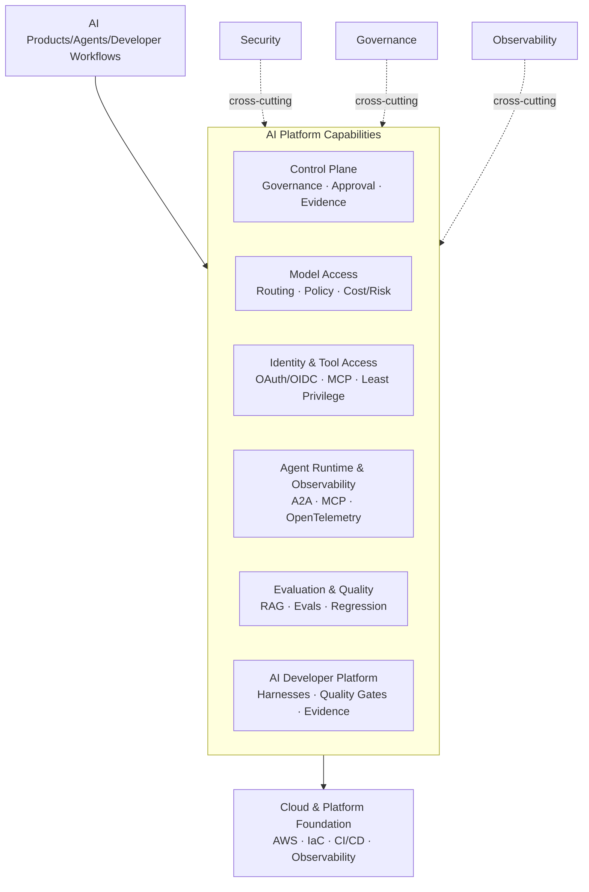

🇺🇸 **English** &nbsp;|&nbsp; 🇧🇷 [Português](README.pt-BR.md)

# Bruno Vicco

### AI Engineer - AI Platforms & Agentic Systems

**AI Platforms · Agent Runtime · MCP/A2A · AI Evaluation · LLMOps · Security & Governance**

📍 São Paulo, Brazil &nbsp;|&nbsp; 🌍 Open to international opportunities and relocation

---

## About

I build and evolve **AI platform capabilities and production AI systems** - especially where the hard problem is not calling a model, but making AI reusable, observable, secure, measurable, and governable across teams.

My work is hands-on and spans engineering and architecture. I enjoy ambiguous problems that require defining the right technical boundaries across LLMs, agents, retrieval, MCP/A2A, model access, identity, evaluation, observability, security, and governance.

A recurring theme in my work is moving critical authority **outside the LLM**: explicit contracts, deterministic controls, scoped authorization, evaluation pipelines, traceable runtime behavior, and human-controlled decisions for high-impact actions.

I bring more than 22 years of experience in financial services, including Caixa, BTG Pactual, Banco do Brasil, Itaú Unibanco, and ASA SCFI. That background helps me connect technology, business, risk, and regulation without treating them as separate problems.

---

## What I build

I am particularly interested in the horizontal capabilities that allow many AI products and teams to operate on a shared foundation:

- **AI control plane:** policy, approvals, runtime authorization, evidence, incidents, and governed response.
- **Model access & runtime policy:** deterministic routing by workload, data classification, risk, context, cost, latency, and availability.
- **Identity & tool access:** OAuth 2.1/OIDC, scoped MCP access, least privilege, protected resources, and fail-closed authorization.
- **Agent runtime & observability:** A2A/MCP boundaries, OpenTelemetry, W3C Trace Context, privacy-safe telemetry, and distributed tracing.
- **Evaluation & quality:** retrieval metrics, answer quality, citation support, golden datasets, regression evaluation, and reproducible benchmarks.
- **AI developer platform:** coding-agent guardrails, repository-owned engineering rules, deterministic execution, quality gates, and evidence-based promotion.
- **Cloud platform engineering:** IAM, infrastructure as code, CI/CD identity, event-driven AWS workloads, observability, and cost controls.

[Explore the complete AI Platform Engineering ecosystem →](./PORTFOLIO_ARCHITECTURE.md)

---

## Selected impact

- Built production AI systems for regulated financial institutions, including conversational and transactional assistants, RAG pipelines, agent workflows, observability, and security controls.
- Led enterprise AI adoption for approximately **400 users**, including Claude Code for around **250 developers** and Claude Enterprise for approximately **150 business users**.
- Reduced the average context of an investment assistant from approximately **70,000 to 3,000 tokens (~95%)** through conditional knowledge retrieval and injection, reducing latency, token usage, and inference cost while preserving response quality.
- Designed semantic routing with intent-specific thresholds, positive/negative examples, and ambiguity handling, reaching approximately **94.7% accuracy** on the validation dataset.
- Established engineering and governance mechanisms for enterprise AI adoption, including development standards, MCP allowlists, risk assessment, auditability, incident response, and controlled rollout.
- Translated governance requirements into executable software through deterministic controls, segregation of duties, evidence-bound decisions, runtime enforcement, and tamper-evident audit history.

---

## Start here

| If you want to evaluate... | Start with |
| --- | --- |
| **AI control plane & runtime assurance** | [**Verifiable AI Governance**](https://github.com/brunovicco/verifiable-ai-governance) |
| **Model access & policy enforcement** | [**Policy Model Router**](https://github.com/brunovicco/policy-model-router) |
| **Secure MCP identity & tool authorization** | [**MCP Server Auth**](https://github.com/brunovicco/mcp-server-auth-template) + [**MCP Client Auth**](https://github.com/brunovicco/mcp-client-auth-template) |
| **Distributed agent observability** | [**a2a-otel-kit**](https://github.com/brunovicco/a2a-otel-kit) |
| **AI evaluation & RAG quality engineering** | [**RAGForge**](https://github.com/brunovicco/ragforge) |
| **AI-assisted software engineering controls** | [**Alicerce**](https://github.com/brunovicco/alicerce) + [**engineering-loop-schemas**](https://github.com/brunovicco/engineering-loop-schemas) |
| **Multi-agent reference workload** | [**Multi-Agent Credit Desk**](https://github.com/brunovicco/multi-agent-credit-desk) |
| **AWS platform engineering** | [**OpsLens**](https://github.com/brunovicco/opslens) |

---

## AI Platform Engineering ecosystem

The repositories are organized as an engineering ecosystem, not as isolated AI demos.

The common engineering principle is simple: **use generative behavior where it adds value, while keeping authorization, policy enforcement, high-impact decisions, and evidence independently verifiable.**

### Control plane & runtime policy

- [**Verifiable AI Governance**](https://github.com/brunovicco/verifiable-ai-governance) - policy → approval → signed runtime authorization → enforcement → runtime assurance → governed response → evidence.
- [**Policy Model Router**](https://github.com/brunovicco/policy-model-router) - fail-closed model-group routing with explainable deterministic constraints and runtime policy enforcement.

### Identity, tools & agent runtime

- [**MCP Server Auth**](https://github.com/brunovicco/mcp-server-auth-template) + [**MCP Client Auth**](https://github.com/brunovicco/mcp-client-auth-template) - executable OAuth 2.1/OIDC reference for protected remote MCP.
- [**a2a-otel-kit**](https://github.com/brunovicco/a2a-otel-kit) - vendor-neutral distributed tracing across A2A agents and MCP services with metadata-only protocol telemetry.

### Evaluation & quality

- [**RAGForge**](https://github.com/brunovicco/ragforge) - benchmarking of retrieval strategies using a 230-question golden dataset, retrieval metrics, answer-quality evaluation, citation support, and auditable experiment evidence.

### AI developer platform

- [**Alicerce**](https://github.com/brunovicco/alicerce) - trusted deterministic execution and evidence-gated engineering loops.
- [**engineering-loop-schemas**](https://github.com/brunovicco/engineering-loop-schemas) - canonical contracts for execution evidence and verdicts.
- [**Claude Python Engineering Harness**](https://github.com/brunovicco/claude-python-engineering-harness) and [**Codex Python Engineering Harness**](https://github.com/brunovicco/codex-python-engineering-harness) - repository-owned rules, hooks, architecture constraints, and quality gates for coding-agent workflows.

### Reference workloads

- [**Multi-Agent Credit Desk**](https://github.com/brunovicco/multi-agent-credit-desk) - in-progress auditable multi-agent workload used to exercise deterministic policy, MCP/A2A boundaries, routing, and telemetry.
- [**Open Finance BR MCP**](https://github.com/brunovicco/openfinance-br-mcp) - mock-first MCP reference for Open Finance Brasil and FAPI-BR security patterns.
- [**Meridian**](https://github.com/brunovicco/meridian) - enterprise knowledge reference combining semantic routing, retrieval-time access control, structured queries, and grounded answers.
- [**OpsLens**](https://github.com/brunovicco/opslens) - AWS-native software supply-chain intelligence platform; its foundation demonstrates IAM Identity Center, GitHub Actions OIDC, Terraform, CloudWatch, CI/CD security gates, and cost-governance practices.

---

## Engineering principles

- Choose architecture based on the problem, not on the popularity of an AI pattern.
- Prefer deterministic workflows when autonomy does not create enough value to justify additional risk.
- Critical business decisions remain deterministic and auditable.
- Authentication and authorization are enforced in code, never delegated to a language model.
- Agents, tools, model providers, identity systems, retrieved data, and telemetry are explicit trust boundaries.
- Structured outputs, typed contracts, bounded retries, idempotency, and fail-closed validation constrain generative behavior.
- Retrieval and generation are evaluated independently whenever possible.
- Evidence must be independently inspectable; model self-report is not proof.
- Telemetry is minimized by design; prompts, model responses, credentials, and arbitrary business payloads are not observability defaults.
- High-impact actions such as deployment, runtime overrides, sensitive tool execution, containment, and restoration remain under explicit authority.

---

## Core expertise

**AI Platforms & Architecture**
Enterprise AI platforms · distributed AI systems · control plane/runtime separation · API/service design · model routing · platform capabilities · developer enablement

**Generative & Agentic AI**
LLMs · RAG · agentic systems · multi-agent architectures · LangGraph · semantic routing · structured outputs · tool calling · MCP · A2A

**Evaluation, LLMOps & Observability**
Golden datasets · retrieval metrics · faithfulness/correctness · regression evaluation · OpenTelemetry · W3C Trace Context · OTLP · Datadog · Langfuse · distributed tracing · latency/token/cost observability

**AI Security & Governance**
OAuth 2.1 · OIDC · least privilege · fail-closed authorization · prompt-injection boundaries · policy enforcement · runtime authorization · evidence · auditability · incident response · human-in-the-loop

**Cloud & Platform Engineering**
AWS · Azure · Terraform · Docker · Kubernetes · CI/CD · GitHub Actions OIDC · IAM · event-driven systems · observability · cost controls

<strong>Technology stack</strong>

 

**Languages & backend:** Python, FastAPI, Pydantic, TypeScript, Node.js, REST APIs, asynchronous and event-driven systems

**AI frameworks & platforms:** LangGraph, DSPy, LangChain, LlamaIndex, LiteLLM, Azure OpenAI, Azure AI Foundry, Amazon Bedrock, Anthropic Claude, Gemini

**Data & retrieval:** Redis Stack, RediSearch, RedisJSON, PostgreSQL, pgvector, OpenSearch, vector search, hybrid retrieval

**Observability & operations:** OpenTelemetry, OTLP, W3C Trace Context, Datadog, Langfuse, CloudWatch, structured logging

**Engineering:** uv, Ruff, Mypy/Pyright strict, Pytest, Bandit, pip-audit, architecture tests, GitHub Actions, Azure DevOps, GitLab CI, Argo CD

<strong>Financial services, regulatory & governance background</strong>

 

Experience translating requirements and controls from BACEN, CMN, LGPD, CVM, ANBIMA, DORA, NIST AI RMF, ISO/IEC 42001, NIST SP 800-53, CIS Controls, MITRE ATLAS, and OWASP guidance into technical and operational mechanisms for LLM and agentic systems.

Professional background includes corporate banking, credit, risk, treasury, financial operations, software engineering, production AI, enterprise enablement, and AI governance.

<strong>Certifications</strong>

 

* AWS Certified AI Practitioner
* AWS Certified Cloud Practitioner
* Microsoft Certified: Azure Fundamentals
* CPA-20 ANBIMA

---

### Let's connect

[LinkedIn](https://linkedin.com/in/brunovicco) · [Email](mailto:bfvicco@gmail.com)

