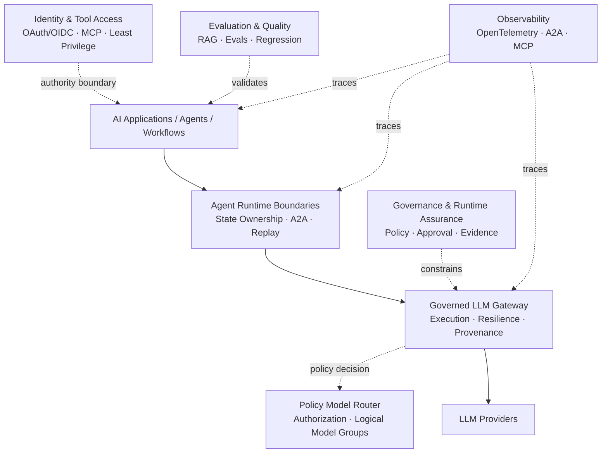

🇺🇸 **English** &nbsp;|&nbsp; 🇧🇷 [Português](README.pt-BR.md)

# Bruno Vicco

### AI Engineer - AI Platforms & Agentic Systems

**AI Platforms · Agent Runtime · LLM Gateway · MCP/A2A · Evals · LLMOps · Security & Governance**

📍 São Paulo, Brazil &nbsp;|&nbsp; 🌍 Open to international opportunities and relocation

---

## About

I build **AI platforms and production AI systems** for environments where reliability, security, observability, evaluation, and governance matter as much as model capability.

My work is hands-on and sits at the intersection of software engineering, distributed AI systems, agentic workflows, LLM infrastructure, security, and architecture.

A recurring principle across my projects is keeping critical authority outside probabilistic components:

> **Models may reason and propose. Trusted software authorizes, constrains, executes, and produces evidence.**

I bring more than **22 years of experience in financial services**, including Caixa, BTG Pactual, Banco do Brasil, Itaú Unibanco, and ASA SCFI. This background shapes how I approach AI systems operating around sensitive data, financial workflows, regulation, auditability, and operational risk.

---

## Flagship projects

These repositories best represent the architecture and engineering problems I am currently focused on.

| Project | What it demonstrates |
| --- | --- |
| [**Governed LLM Gateway**](https://github.com/brunovicco/governed-llm-gateway) | Provider-neutral LLM execution gateway with policy-constrained model selection, centralized credentials, deterministic ranking, retry/fallback, budgets, provenance, and OpenTelemetry. |
| [**Agent Runtime Boundaries Lab**](https://github.com/brunovicco/agent-runtime-boundaries-lab) | Multi-runtime agent architecture with LangGraph as authoritative workflow owner, Agno/CrewAI specialists behind A2A contracts, durable effect-ledger semantics, crash/retry evidence, cross-runtime OpenTelemetry, and governed model execution. |
| [**StateOps**](https://github.com/brunovicco/stateops) | Durable LangGraph state machine with explicit state, parallel investigation, interrupts, Redis checkpointing, restart/resume, replay, forks, idempotent effects, and governed LLM access. |
| [**Verifiable AI Governance**](https://github.com/brunovicco/verifiable-ai-governance) | Governance control plane for policy, approvals, runtime authorization, enforcement, evidence, assurance, and governed response. |
| [**Agentic Security Framework Lab**](https://github.com/brunovicco/agentic-security-framework-lab) | Framework-neutral agent security across LangGraph, CrewAI, LlamaIndex, and Agno with explicit identity, authorization, human approval, tool boundaries, failure evidence, and MCP. |
| [**a2a-otel-kit**](https://github.com/brunovicco/a2a-otel-kit) | Vendor-neutral distributed tracing for A2A agents and MCP services using OpenTelemetry and W3C Trace Context with metadata-only telemetry. |
| [**RAGForge**](https://github.com/brunovicco/ragforge) | RAG benchmarking and evaluation platform with 10 retrieval configurations, a 230-question Brazilian regulatory dataset, citation evaluation, reproducible experiments, and auditable evidence. |

---

## AI Platform Engineering

I am interested in the shared capabilities that allow multiple AI products and teams to run on a common, governed foundation.

The architecture is intentionally modular. Applications should not need provider credentials, provider-specific retry logic, model-selection rules, or hidden authorization logic scattered throughout their codebases.

The same principle applies to agent frameworks: **one runtime should own global execution state; other runtimes should expose bounded capabilities behind explicit contracts rather than competing for the same source of truth.**

[Explore the broader portfolio architecture →](./PORTFOLIO_ARCHITECTURE.md)

---

## Selected impact

- Built production AI systems for regulated financial institutions, including conversational and transactional assistants, RAG pipelines, agent workflows, observability, security controls, and governance mechanisms.
- Led enterprise AI adoption for approximately **400 users**, including Claude Code for around **250 developers** and Claude Enterprise for approximately **150 business users**.
- Reduced an investment assistant's average context from approximately **70,000 to 3,000 tokens (~95%)** using conditional knowledge retrieval and injection, reducing latency, token consumption, and inference cost.
- Designed semantic routing with intent-specific thresholds, positive and negative examples, ambiguity floors, and margin rules, reaching approximately **94.7% accuracy** on its validation dataset.
- Designed engineering controls for enterprise AI adoption including coding-agent guardrails, MCP allowlists, deterministic hooks, architecture rules, auditability, incident procedures, and controlled rollout.
- Translate governance and security requirements into executable mechanisms such as fail-closed authorization, segregation of duties, typed contracts, bounded execution, evidence provenance, and human-controlled high-impact actions.

---

## Engineering principles

- **Authority is explicit.** Model output is not authorization.
- **One runtime owns global workflow state.** Specialist frameworks may keep local context, but should not compete for the same execution truth.
- **Checkpoints and side-effect evidence are different concerns.** Durable workflow state does not by itself prove whether a remote effect already happened.
- **Fail closed when trust is missing.** Missing identity, policy, evidence, or configuration must not silently become permission.
- **Use the simplest architecture that solves the problem.** Agents are not the default answer to every AI workflow.
- **Keep deterministic authority around probabilistic reasoning.** Models can classify, plan, retrieve, synthesize, and propose without owning every consequential decision.
- **Treat identity, tools, providers, retrieved data, runtime boundaries, and telemetry as trust boundaries.**
- **Evaluate retrieval and generation independently whenever possible.**
- **Make evidence inspectable.** Model self-report is not runtime proof.
- **Design for retries and re-execution.** Idempotency, bounded retries, checkpoints, effect ledgers, and explicit failure states matter in distributed agentic systems.
- **Document guarantees and non-guarantees.** A production-oriented architecture should state what it does not prove.

---

## More open-source work

### Model policy, identity & secure tool access

- [**Policy Model Router**](https://github.com/brunovicco/policy-model-router) - deterministic, fail-closed authorization and routing across logical model groups.
- [**MCP Server Auth Template**](https://github.com/brunovicco/mcp-server-auth-template) - protected remote MCP server reference using OAuth/OIDC patterns.
- [**MCP Client Auth Template**](https://github.com/brunovicco/mcp-client-auth-template) - matching authenticated MCP client patterns.
- [**Open Finance BR MCP**](https://github.com/brunovicco/openfinance-br-mcp) - Open Finance Brasil/FAPI-BR-oriented MCP reference architecture.

### Agent architecture & controlled autonomy

- [**Controlled Autonomy Lab**](https://github.com/brunovicco/controlled-autonomy-lab) - experimental comparison of augmented LLMs, chaining, routing, parallelization, evaluator-optimizer, and bounded agents across multiple providers.
- [**Multi-Agent Credit Desk**](https://github.com/brunovicco/multi-agent-credit-desk) - auditable multi-agent reference workload for financial workflows.
- [**Meridian**](https://github.com/brunovicco/meridian) - enterprise knowledge architecture with semantic routing, retrieval-time ACLs, structured queries, DSPy, and grounded answers.

### AI developer engineering

- [**Alicerce**](https://github.com/brunovicco/alicerce) - deterministic execution and evidence-gated engineering loops.
- [**engineering-loop-schemas**](https://github.com/brunovicco/engineering-loop-schemas) - canonical contracts for engineering execution evidence and verdicts.
- [**Claude Python Engineering Harness**](https://github.com/brunovicco/claude-python-engineering-harness) - repository-owned rules, hooks, architecture constraints, and quality gates for Claude Code.
- [**Codex Python Engineering Harness**](https://github.com/brunovicco/codex-python-engineering-harness) - equivalent engineering harness for Codex-based workflows.

### Cloud & applied architecture

- [**OpsLens**](https://github.com/brunovicco/opslens) - AWS architecture lab for software-supply-chain intelligence combining deterministic evidence, Bedrock RAG, security, evaluation, IAM, CI/CD, and cost engineering.
- [**Getnet Multi-Agent Support v2**](https://github.com/brunovicco/getnet-multi-agent-support-v2) - spec-driven multi-agent support system originally implemented under a constrained technical challenge.

---

## Core expertise

**AI Platforms & Architecture**  
Enterprise AI platforms · model gateways · distributed AI systems · control plane/runtime separation · model routing · provider abstraction · runtime boundaries · durable execution · platform capabilities · developer enablement

**Generative & Agentic AI**  
LLMs · RAG · LangGraph · Agno · CrewAI · durable state machines · multi-agent systems · semantic routing · structured outputs · tool calling · MCP · A2A · DSPy

**AI Security & Governance**  
OAuth 2.1 · OIDC · least privilege · fail-closed authorization · tool boundaries · human-in-the-loop · runtime policy · evidence provenance · auditability · prompt-injection authority boundaries

**Evaluation, LLMOps & Observability**  
Golden datasets · retrieval evaluation · answer quality · citation support · regression evaluation · OpenTelemetry · W3C Trace Context · OTLP · Datadog · Langfuse · Grafana · Tempo · distributed tracing · latency/token/cost observability

**Cloud & Platform Engineering**  
AWS · Azure · Amazon Bedrock · Azure OpenAI · Terraform · Docker · Kubernetes · CI/CD · GitHub Actions OIDC · IAM · event-driven systems · observability · cost controls

<strong>Technology stack</strong>

 

**Languages & backend:** Python, FastAPI, Pydantic, TypeScript, Node.js, REST APIs, asynchronous and event-driven systems

**AI frameworks & platforms:** LangGraph, Agno, CrewAI, DSPy, LangChain, LlamaIndex, LiteLLM, Azure OpenAI, Azure AI Foundry, Amazon Bedrock, Anthropic Claude, OpenAI, Gemini

**Data & retrieval:** Redis Stack, RediSearch, RedisJSON, PostgreSQL, pgvector, OpenSearch, vector search, hybrid retrieval

**Observability:** OpenTelemetry, OTLP, W3C Trace Context, Datadog, Langfuse, Grafana, Tempo, CloudWatch, structured logging

**Engineering:** uv, Ruff, Mypy/Pyright strict, Pytest, Bandit, pip-audit, architecture tests, GitHub Actions, Azure DevOps, GitLab CI, Argo CD

---

## Financial services & regulated environments

My professional background spans corporate banking, credit, treasury, financial operations, software engineering, production AI, enterprise AI adoption, and AI governance.

I have worked with requirements and engineering concerns related to environments governed by frameworks and institutions such as **BACEN, CMN, CVM, ANBIMA, LGPD, NIST AI RMF, ISO/IEC 42001, OWASP, MITRE ATLAS, CIS Controls, and NIST security guidance**.

This experience strongly influences how I design AI systems: regulation and governance are not documentation layers added after implementation; they become architecture, controls, runtime behavior, and evidence.

<strong>Certifications</strong>

 

- AWS Certified AI Practitioner
- AWS Certified Cloud Practitioner
- Microsoft Certified: Azure Fundamentals
- CPA-20 ANBIMA

---

### Let's connect

[LinkedIn](https://linkedin.com/in/brunovicco) · [Email](mailto:bfvicco@gmail.com)

