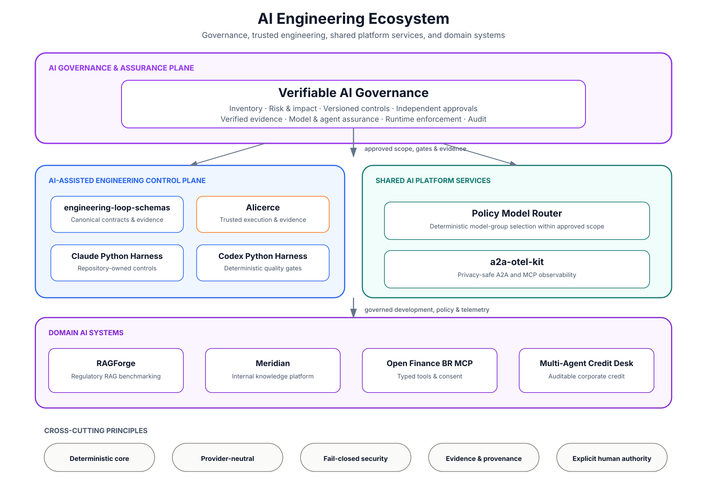

🇺🇸 **English** &nbsp;|&nbsp; 🇧🇷 [Português](README.pt-BR.md)

# Bruno Freitas Vicco

### Senior Generative AI Engineer
**AI Platforms · RAG · Agents · LLMOps · Verifiable AI Governance · Regulated Environments**

📍 São Paulo, Brazil &nbsp;|&nbsp; 🌍 Open to international opportunities and relocation

---

## About

Senior Generative AI Engineer focused on enterprise AI platforms, AI-assisted software engineering, and governed production AI systems.

My work combines architecture, LLM engineering, observability, security, and governance to build reliable systems for regulated environments.

I bring more than 22 years of experience across financial services and software engineering, including Caixa, BTG Pactual, Banco do Brasil, Itaú Unibanco, and ASA SCFI.

---

## AI Engineering Ecosystem

These repositories are designed as one engineering ecosystem rather than isolated demos. The portfolio spans domain systems, shared services, AI-assisted engineering, and a governance plane that connects business context, risk, controls, evidence, approvals, and runtime enforcement.

<picture>
  <source
    media="(prefers-color-scheme: dark)"
    srcset="./assets/architecture/ai-engineering-ecosystem-dark.svg"
  >
  <source
    media="(prefers-color-scheme: light)"
    srcset="./assets/architecture/ai-engineering-ecosystem-light.svg"
  >
  
</picture>

[Explore the complete portfolio architecture, project relationships, and maturity map](./PORTFOLIO_ARCHITECTURE.md)

---

## Selected Impact

- Built and governed production AI systems for regulated financial institutions, including conversational assistants, RAG pipelines, agent workflows, observability, and compliance controls.
- Led enterprise AI adoption for approximately **400 users**, including Claude Code for around **250 developers** and Claude Enterprise for approximately **150 business users**.
- Reduced the average context of an investment assistant from approximately **70,000 to 3,000 tokens** through conditional knowledge injection, improving accuracy while reducing latency and inference cost.
- Established an AI governance function covering usage policies, approval processes, MCP allowlists, risk assessment, auditability, incident response, and phased enterprise adoption.
- Translated governance requirements into a verifiable implementation with deterministic controls, segregation of duties, evidence-bound decisions, runtime enforcement, and tamper-evident audit history.

---

## Career Metrics

<table>
  <tr>
    <td align="center"><strong>22+</strong> Years in financial services and technology</td>
    <td align="center"><strong>17</strong> Years in banking at Caixa</td>
    <td align="center"><strong>400+</strong> Enterprise AI users enabled</td>
    <td align="center"><strong>250+</strong> Developers onboarded to AI-assisted engineering</td>
  </tr>
</table>

---

## Featured Projects

| Project | What it demonstrates |
|---|---|
| [**Verifiable AI Governance**](https://github.com/brunovicco/verifiable-ai-governance) | Reference platform for operational AI governance with deterministic risk classification, versioned controls, independent approvals, verified evidence, runtime enforcement, and tamper-evident audit trails. [Live demo](https://vaigov-app.duckdns.org). |
| [**RAGForge**](https://github.com/brunovicco/ragforge) | Reproducible benchmarking of regulatory RAG strategies over Brazilian financial and legal documents, with structural chunking, relevance judgments, and retrieval evaluation. |
| [**Alicerce**](https://github.com/brunovicco/alicerce) | Trusted execution foundation for deterministic, auditable, evidence-gated engineering loops with controlled workspaces, sandboxing, state, and canonical evidence. |
| [**Open Finance BR MCP**](https://github.com/brunovicco/openfinance-br-mcp) | Typed MCP tools, consent journeys, FAPI-BR security patterns, mock-first execution, and explicit validation boundaries for Brazilian Open Finance. |
| [**Meridian**](https://github.com/brunovicco/meridian) | Internal knowledge platform with semantic routing, retrieval-time access control, structured queries, grounded answers, and zero-setup deterministic providers. |
| [**Claude Python Engineering Harness**](https://github.com/brunovicco/claude-python-engineering-harness) | Governed AI-assisted software engineering with repository-owned instructions, deterministic hooks, architecture boundaries, quality gates, and MCP policy. |
| [**Multi-Agent Credit Desk**](https://github.com/brunovicco/multi-agent-credit-desk) | Incremental multi-agent architecture for auditable corporate credit analysis with deterministic decisions, MCP/A2A boundaries, and optional LLM narratives. |

Additional foundations: [engineering-loop-schemas](https://github.com/brunovicco/engineering-loop-schemas), [a2a-otel-kit](https://github.com/brunovicco/a2a-otel-kit), [Policy Model Router](https://github.com/brunovicco/policy-model-router), and [Codex Python Engineering Harness](https://github.com/brunovicco/codex-python-engineering-harness).

---

## Engineering Principles

- Critical business decisions remain deterministic and auditable.
- Security and authorization are enforced in code, never delegated to the language model.
- Model providers, MCP servers, tools, telemetry, and retrieved data are treated as trust boundaries.
- Structured outputs, explicit contracts, and fail-closed validation constrain generative behavior.
- Evidence must be independently verifiable; model self-reports are not proof.
- Approvals remain bound to the exact reviewed scope, and material changes trigger reassessment.
- Promotion, merge, deployment, and high-impact actions remain under explicit human authority.

---

## Core Expertise

**Generative AI Engineering**  
RAG · agentic systems · multi-agent architectures · semantic and model routing · structured outputs · tool calling · LLM evaluation · guardrails

**AI Platforms and Enablement**  
Enterprise AI platforms · developer productivity · AI-assisted software engineering · internal tooling · rollout and adoption · technical enablement

**Architecture, Security, and Governance**  
Clean Architecture · Hexagonal Architecture · MCP · A2A · least privilege · prompt injection protection · AI risk management · model and agent assurance · auditability · human-in-the-loop

**LLMOps and Observability**  
OpenTelemetry · Datadog · Langfuse · distributed tracing · structured logging · latency percentiles · evaluation pipelines · regression testing · cost and token observability

<strong>Technology stack</strong>

 

**Languages and backend:** Python, FastAPI, Pydantic, TypeScript, Node.js, REST APIs, asynchronous and event-driven systems

**AI frameworks and platforms:** LangGraph, DSPy, LangChain, LlamaIndex, LiteLLM, Azure OpenAI, Azure AI Foundry, Amazon Bedrock, Anthropic Claude, Gemini

**Data and retrieval:** Redis Stack, RediSearch, RedisJSON, PostgreSQL, pgvector, OpenSearch, vector search, hybrid retrieval

**Cloud and platform engineering:** Azure, AWS, GCP, Docker, Kubernetes, OpenShift, Azure DevOps, GitHub Actions, GitLab CI, Argo CD

**Python engineering:** uv, Ruff, Mypy/Pyright strict, Pytest, Bandit, pip-audit, architecture tests, CI quality gates

<strong>Financial services, regulatory, and governance background</strong>

 

Experience translating requirements and controls from BACEN, CMN, LGPD, CVM, ANBIMA, DORA, NIST AI RMF, ISO/IEC 42001, NIST SP 800-53, CIS Controls, MITRE ATLAS, and OWASP guidance for LLM and agentic systems.

Professional background includes corporate banking, credit, risk, treasury, financial operations, software engineering, production AI, enterprise enablement, and AI governance.

<strong>Certifications</strong>

 

- AWS Certified AI Practitioner
- AWS Certified Cloud Practitioner
- Microsoft Certified: Azure Fundamentals
- CPA-20 ANBIMA

---

### Let's Connect

[LinkedIn](https://linkedin.com/in/brunovicco) · [Email](mailto:bfvicco@gmail.com)

<!-- Private profile analytics -->

