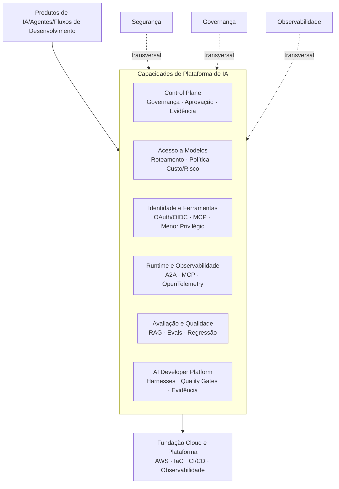

🇧🇷 **Português** &nbsp;|&nbsp; 🇺🇸 [English](README.md)

# Bruno Vicco

### Engenheiro de IA - Plataformas de IA e Sistemas Agênticos

**Plataformas de IA · Runtime de Agentes · MCP/A2A · Avaliação de IA · LLMOps · Segurança e Governança**

📍 São Paulo, Brasil &nbsp;|&nbsp; 🌍 Aberto a relocação

---

## Sobre mim

Atuo na construção e evolução de **capacidades de plataforma de IA e sistemas de IA em produção** - principalmente quando o problema difícil não é chamar um modelo, mas tornar IA reutilizável, observável, segura, mensurável e governável entre diferentes times.

Minha atuação é hands-on e transita entre engenharia e arquitetura. Gosto de problemas ainda pouco estruturados, que exigem definir limites técnicos entre LLMs, agentes, retrieval, MCP/A2A, acesso a modelos, identidade, avaliação, observabilidade, segurança e governança.

Um tema recorrente no meu trabalho é manter autoridade crítica **fora do LLM**: contratos explícitos, controles determinísticos, autorização vinculada a escopo, pipelines de avaliação, comportamento de runtime rastreável e decisões humanas para ações de maior impacto.

Tenho mais de 22 anos de experiência no setor financeiro, com passagens por Caixa, BTG Pactual, Banco do Brasil, Itaú Unibanco e ASA SCFI. Essa trajetória me ajuda a conectar tecnologia, negócio, risco e regulação sem tratá-los como problemas isolados.

---

## O que eu construo

Tenho interesse especial nas capacidades horizontais que permitem a vários produtos e times de IA operar sobre uma base comum:

- **AI control plane:** políticas, aprovações, autorização em runtime, evidências, incidentes e resposta governada.
- **Acesso a modelos e políticas de runtime:** roteamento determinístico por workload, classificação de dados, risco, contexto, custo, latência e disponibilidade.
- **Identidade e acesso a ferramentas:** OAuth 2.1/OIDC, acesso MCP por escopo, menor privilégio, protected resources e autorização fail-closed.
- **Runtime e observabilidade de agentes:** fronteiras A2A/MCP, OpenTelemetry, W3C Trace Context, telemetria com minimização de dados e tracing distribuído.
- **Avaliação e qualidade:** métricas de retrieval, qualidade de resposta, suporte de citações, golden datasets, avaliação de regressão e benchmarks reproduzíveis.
- **AI developer platform:** guardrails para coding agents, regras de engenharia pertencentes ao repositório, execução determinística, quality gates e promoção baseada em evidências.
- **Cloud platform engineering:** IAM, infraestrutura como código, identidade de CI/CD, workloads event-driven na AWS, observabilidade e controles de custo.

[Explore o ecossistema completo de Engenharia de Plataformas de IA →](./PORTFOLIO_ARCHITECTURE.pt-BR.md)

---

## Principais resultados

- Construí sistemas de IA em produção para instituições financeiras reguladas, incluindo assistentes conversacionais e transacionais, pipelines RAG, workflows com agentes, observabilidade e controles de segurança.
- Liderei a adoção corporativa de IA para aproximadamente **400 usuários**, incluindo Claude Code para cerca de **250 desenvolvedores** e Claude Enterprise para aproximadamente **150 profissionais de negócio**.
- Reduzi o contexto médio de um assistente de investimentos de aproximadamente **70 mil para 3 mil tokens (~95%)** por meio de recuperação e injeção condicional de conhecimento, reduzindo latência, uso de tokens e custo de inferência sem regressão relevante de qualidade.
- Estruturei roteamento semântico com thresholds por intenção, exemplos positivos/negativos e tratamento de ambiguidades, alcançando aproximadamente **94,7% de acurácia** no conjunto de validação.
- Estruturei mecanismos de engenharia e governança para adoção corporativa de IA, incluindo padrões de desenvolvimento, allowlists de MCP, avaliação de riscos, auditabilidade, resposta a incidentes e rollout controlado.
- Transformei requisitos de governança em software executável por meio de controles determinísticos, segregação de funções, decisões vinculadas a evidências, enforcement em runtime e histórico de auditoria resistente a adulterações.

---

## Por onde começar

| Se você quer avaliar... | Comece por |
| --- | --- |
| **AI control plane e assurance em runtime** | [**Verifiable AI Governance**](https://github.com/brunovicco/verifiable-ai-governance) |
| **Acesso a modelos e enforcement de políticas** | [**Policy Model Router**](https://github.com/brunovicco/policy-model-router) |
| **Identidade MCP e autorização segura de ferramentas** | [**MCP Server Auth**](https://github.com/brunovicco/mcp-server-auth-template) + [**MCP Client Auth**](https://github.com/brunovicco/mcp-client-auth-template) |
| **Observabilidade distribuída de agentes** | [**a2a-otel-kit**](https://github.com/brunovicco/a2a-otel-kit) |
| **Avaliação de IA e engenharia de qualidade de RAG** | [**RAGForge**](https://github.com/brunovicco/ragforge) |
| **Controles para engenharia de software assistida por IA** | [**Alicerce**](https://github.com/brunovicco/alicerce) + [**engineering-loop-schemas**](https://github.com/brunovicco/engineering-loop-schemas) |
| **Workload multiagente de referência** | [**Multi-Agent Credit Desk**](https://github.com/brunovicco/multi-agent-credit-desk) |
| **Engenharia de plataforma na AWS** | [**OpsLens**](https://github.com/brunovicco/opslens) |

---

## Ecossistema de Engenharia de Plataformas de IA

Os repositórios são organizados como um ecossistema de engenharia, e não como demonstrações isoladas de IA.

O princípio comum é simples: **usar comportamento generativo onde ele agrega valor, mantendo autorização, enforcement de políticas, decisões de alto impacto e evidências verificáveis de forma independente.**

### Control plane e políticas de runtime

- [**Verifiable AI Governance**](https://github.com/brunovicco/verifiable-ai-governance) - política → aprovação → autorização assinada em runtime → enforcement → assurance em runtime → resposta governada → evidência.
- [**Policy Model Router**](https://github.com/brunovicco/policy-model-router) - roteamento fail-closed por grupos lógicos de modelos, com restrições determinísticas explicáveis e enforcement de políticas em runtime.

### Identidade, ferramentas e runtime de agentes

- [**MCP Server Auth**](https://github.com/brunovicco/mcp-server-auth-template) + [**MCP Client Auth**](https://github.com/brunovicco/mcp-client-auth-template) - referência executável de OAuth 2.1/OIDC para MCP remoto protegido.
- [**a2a-otel-kit**](https://github.com/brunovicco/a2a-otel-kit) - tracing distribuído neutro de fornecedor entre agentes A2A e serviços MCP, com telemetria de protocolo baseada somente em metadados.

### Avaliação e qualidade

- [**RAGForge**](https://github.com/brunovicco/ragforge) - benchmark de estratégias de retrieval usando golden dataset de 230 perguntas, métricas de recuperação, avaliação de qualidade das respostas, suporte de citações e evidências auditáveis de experimentos.

### AI developer platform

- [**Alicerce**](https://github.com/brunovicco/alicerce) - execução determinística confiável e loops de engenharia condicionados a evidências.
- [**engineering-loop-schemas**](https://github.com/brunovicco/engineering-loop-schemas) - contratos canônicos para evidências de execução e veredictos.
- [**Claude Python Engineering Harness**](https://github.com/brunovicco/claude-python-engineering-harness) e [**Codex Python Engineering Harness**](https://github.com/brunovicco/codex-python-engineering-harness) - regras, hooks, limites arquiteturais e quality gates pertencentes ao repositório para workflows com coding agents.

### Workloads de referência

- [**Multi-Agent Credit Desk**](https://github.com/brunovicco/multi-agent-credit-desk) - workload multiagente auditável em evolução, utilizado para exercitar política determinística, fronteiras MCP/A2A, roteamento e telemetria.
- [**Open Finance BR MCP**](https://github.com/brunovicco/openfinance-br-mcp) - referência MCP mock-first para Open Finance Brasil e padrões de segurança FAPI-BR.
- [**Meridian**](https://github.com/brunovicco/meridian) - referência de conhecimento corporativo combinando roteamento semântico, controle de acesso durante retrieval, consultas estruturadas e respostas fundamentadas.
- [**OpsLens**](https://github.com/brunovicco/opslens) - plataforma AWS de inteligência sobre software supply chain; sua fundação demonstra IAM Identity Center, GitHub Actions OIDC, Terraform, CloudWatch, gates de segurança em CI/CD e práticas de governança de custos.

---

## Princípios de engenharia

- Escolher a arquitetura de acordo com o problema, não pela popularidade de um padrão de IA.
- Preferir workflows determinísticos quando autonomia não cria valor suficiente para justificar risco adicional.
- Decisões críticas de negócio permanecem determinísticas e auditáveis.
- Autenticação e autorização são aplicadas em código, nunca delegadas ao modelo de linguagem.
- Agentes, ferramentas, provedores de modelos, sistemas de identidade, dados recuperados e telemetria são fronteiras explícitas de confiança.
- Saídas estruturadas, contratos tipados, retries limitados, idempotência e validações fail-closed restringem comportamento generativo.
- Retrieval e geração são avaliados separadamente sempre que possível.
- Evidências precisam ser inspecionáveis de forma independente; autorrelato do modelo não é prova.
- Telemetria é minimizada por design; prompts, respostas de modelos, credenciais e payloads arbitrários de negócio não são o padrão de observabilidade.
- Ações de alto impacto, como deploy, overrides em runtime, execução de ferramentas sensíveis, contenção e restauração permanecem sob autoridade explícita.

---

## Competências principais

**Plataformas e Arquitetura de IA**
Plataformas corporativas de IA · sistemas distribuídos de IA · separação control plane/runtime · APIs e serviços · roteamento de modelos · capacidades de plataforma · developer enablement

**IA Generativa e Agêntica**
LLMs · RAG · sistemas agênticos · arquiteturas multiagente · LangGraph · roteamento semântico · structured outputs · tool calling · MCP · A2A

**Avaliação, LLMOps e Observabilidade**
Golden datasets · métricas de retrieval · faithfulness/correctness · avaliação de regressão · OpenTelemetry · W3C Trace Context · OTLP · Datadog · Langfuse · tracing distribuído · observabilidade de latência/tokens/custos

**Segurança e Governança de IA**
OAuth 2.1 · OIDC · menor privilégio · autorização fail-closed · fronteiras contra prompt injection · policy enforcement · autorização em runtime · evidências · auditabilidade · resposta a incidentes · human-in-the-loop

**Cloud e Engenharia de Plataforma**
AWS · Azure · Terraform · Docker · Kubernetes · CI/CD · GitHub Actions OIDC · IAM · sistemas event-driven · observabilidade · controles de custo

<strong>Stack tecnológica</strong>

 

**Linguagens e backend:** Python, FastAPI, Pydantic, TypeScript, Node.js, APIs REST, sistemas assíncronos e orientados a eventos

**Frameworks e plataformas de IA:** LangGraph, DSPy, LangChain, LlamaIndex, LiteLLM, Azure OpenAI, Azure AI Foundry, Amazon Bedrock, Anthropic Claude, Gemini

**Dados e retrieval:** Redis Stack, RediSearch, RedisJSON, PostgreSQL, pgvector, OpenSearch, busca vetorial e recuperação híbrida

**Observabilidade e operações:** OpenTelemetry, OTLP, W3C Trace Context, Datadog, Langfuse, CloudWatch e logging estruturado

**Engenharia:** uv, Ruff, Mypy/Pyright strict, Pytest, Bandit, pip-audit, testes de arquitetura, GitHub Actions, Azure DevOps, GitLab CI e Argo CD

<strong>Experiência financeira, regulatória e de governança</strong>

 

Experiência na tradução de requisitos e controles de BACEN, CMN, LGPD, CVM, ANBIMA, DORA, NIST AI RMF, ISO/IEC 42001, NIST SP 800-53, CIS Controls, MITRE ATLAS e orientações OWASP em mecanismos técnicos e operacionais para LLMs e sistemas agênticos.

A trajetória inclui banking corporativo, crédito, risco, tesouraria, operações financeiras, engenharia de software, IA em produção, adoção corporativa e governança de IA.

<strong>Certificações</strong>

 

* AWS Certified AI Practitioner
* AWS Certified Cloud Practitioner
* Microsoft Certified: Azure Fundamentals
* CPA-20 ANBIMA

---

### Vamos conversar

[LinkedIn](https://linkedin.com/in/brunovicco) · [E-mail](mailto:bfvicco@gmail.com)

