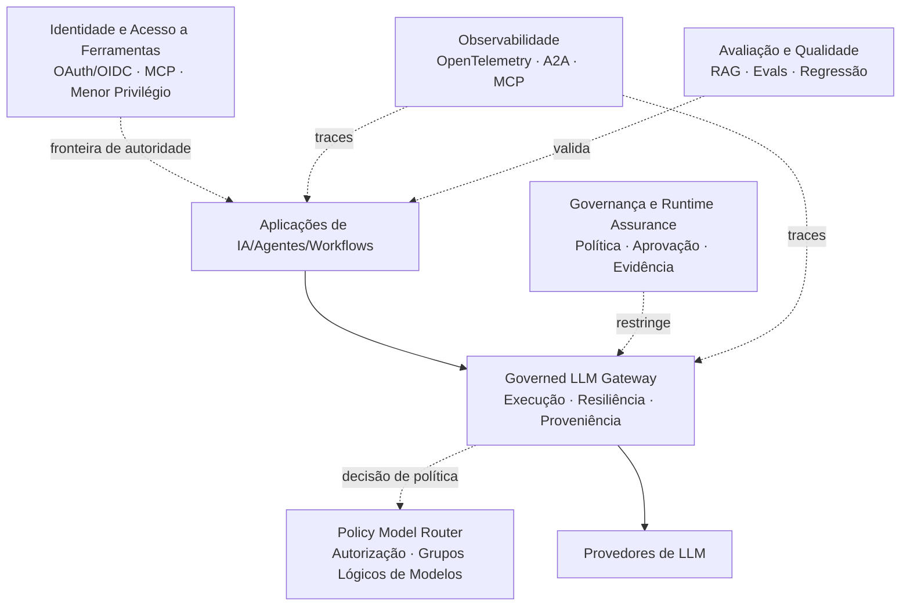

🇧🇷 **Português** &nbsp;|&nbsp; 🇺🇸 [English](README.md)

# Bruno Vicco

### Engenheiro de IA - Plataformas de IA e Sistemas Agênticos

**Plataformas de IA · Runtime de Agentes · LLM Gateway · MCP/A2A · Evals · LLMOps · Segurança e Governança**

📍 São Paulo, Brasil &nbsp;|&nbsp; 🌍 Aberto a relocação

---

## Sobre mim

Construo **plataformas de IA e sistemas de IA em produção** para ambientes em que confiabilidade, segurança, observabilidade, avaliação e governança são tão importantes quanto a capacidade do modelo.

Minha atuação é hands-on e combina engenharia de software, sistemas distribuídos de IA, workflows agênticos, infraestrutura para LLMs, segurança e arquitetura.

Um princípio recorrente nos meus projetos é manter autoridade crítica fora de componentes probabilísticos:

> **Modelos podem raciocinar e propor. Software confiável autoriza, restringe, executa e produz evidências.**

Tenho mais de **22 anos de experiência no setor financeiro**, com passagens por Caixa, BTG Pactual, Banco do Brasil, Itaú Unibanco e ASA SCFI. Essa experiência influencia diretamente a forma como projeto sistemas de IA que operam com dados sensíveis, processos financeiros, regulação, auditabilidade e risco operacional.

---

## Principais projetos

Estes são os repositórios que melhor representam os problemas de arquitetura e engenharia nos quais estou trabalhando atualmente.

| Projeto | O que demonstra |
| --- | --- |
| [**Governed LLM Gateway**](https://github.com/brunovicco/governed-llm-gateway) | Gateway de execução de LLMs neutro de provedor, com seleção de modelos condicionada por políticas, credenciais centralizadas, ranking determinístico, retry/fallback, budgets, proveniência e OpenTelemetry. |
| [**Verifiable AI Governance**](https://github.com/brunovicco/verifiable-ai-governance) | Control plane de governança para políticas, aprovações, autorização em runtime, enforcement, evidências, assurance e resposta governada. |
| [**StateOps**](https://github.com/brunovicco/stateops) | Máquina de estados durável com LangGraph, estado explícito, investigação paralela, interrupts, checkpoints Redis, restart/resume, replay, forks, efeitos idempotentes e acesso governado a LLMs. |
| [**Agentic Security Framework Lab**](https://github.com/brunovicco/agentic-security-framework-lab) | Segurança agêntica independente de framework com LangGraph, CrewAI, LlamaIndex e Agno, incluindo identidade, autorização, aprovação humana, fronteiras de ferramentas, evidências de falha e MCP. |
| [**a2a-otel-kit**](https://github.com/brunovicco/a2a-otel-kit) | Tracing distribuído neutro de fornecedor para agentes A2A e serviços MCP utilizando OpenTelemetry e W3C Trace Context com telemetria baseada apenas em metadados. |
| [**RAGForge**](https://github.com/brunovicco/ragforge) | Plataforma de benchmark e avaliação de RAG com 10 configurações de retrieval, dataset regulatório brasileiro de 230 perguntas, avaliação de citações, experimentos reproduzíveis e evidências auditáveis. |

---

## Engenharia de Plataformas de IA

Tenho interesse especial nas capacidades compartilhadas que permitem que diferentes produtos e times de IA operem sobre uma fundação comum e governada.

A arquitetura é intencionalmente modular. Aplicações não deveriam precisar carregar credenciais de provedores, lógica específica de retry por fornecedor, regras de seleção de modelos ou autorização implícita espalhada pelo código.

O consumidor declara seu workload e seus requisitos. A plataforma determina o que ele pode utilizar, executa dentro desses limites e produz evidências sobre o que realmente aconteceu.

[Explore a arquitetura mais ampla do portfólio →](./PORTFOLIO_ARCHITECTURE.pt-BR.md)

---

## Principais resultados

- Construí sistemas de IA em produção para instituições financeiras reguladas, incluindo assistentes conversacionais e transacionais, pipelines RAG, workflows com agentes, observabilidade, controles de segurança e mecanismos de governança.
- Liderei a adoção corporativa de IA para aproximadamente **400 usuários**, incluindo Claude Code para cerca de **250 desenvolvedores** e Claude Enterprise para aproximadamente **150 profissionais de negócio**.
- Reduzi o contexto médio de um assistente de investimentos de aproximadamente **70 mil para 3 mil tokens (~95%)** por meio de recuperação e injeção condicional de conhecimento, reduzindo latência, consumo de tokens e custo de inferência.
- Estruturei roteamento semântico com thresholds por intenção, exemplos positivos e negativos, pisos de confiança e regras de margem, alcançando aproximadamente **94,7% de acurácia** no conjunto de validação.
- Estruturei controles para adoção corporativa de IA incluindo guardrails para coding agents, allowlists de MCP, hooks determinísticos, regras arquiteturais, auditabilidade, procedimentos de incidentes e rollout controlado.
- Traduzo requisitos de governança e segurança em mecanismos executáveis como autorização fail-closed, segregação de funções, contratos tipados, execução limitada, proveniência de evidências e controle humano sobre ações de alto impacto.

---

## Princípios de engenharia

- **Autoridade precisa ser explícita.** Saída de modelo não é autorização.
- **Falhar fechado quando confiança estiver ausente.** Falta de identidade, política, evidência ou configuração não deve se transformar silenciosamente em permissão.
- **Usar a arquitetura mais simples que resolva o problema.** Agentes não são a resposta padrão para todo workflow de IA.
- **Manter autoridade determinística ao redor do raciocínio probabilístico.** Modelos podem classificar, planejar, recuperar, sintetizar e propor sem controlar todas as decisões consequenciais.
- **Tratar identidade, ferramentas, provedores, dados recuperados e telemetria como fronteiras de confiança.**
- **Avaliar retrieval e geração separadamente sempre que possível.**
- **Produzir evidências inspecionáveis.** Autorrelato do modelo não é prova de execução.
- **Minimizar telemetria por design.** Prompts, respostas, credenciais e payloads arbitrários de negócio não são defaults de observabilidade.
- **Projetar para retry e reexecução.** Idempotência, retries limitados, checkpoints e estados explícitos de falha importam em sistemas agênticos.
- **Documentar garantias e não-garantias.** Uma arquitetura orientada a produção deve dizer claramente também o que ela não prova.

---

## Outros projetos open source

### Políticas de modelo, identidade e acesso seguro a ferramentas

- [**Policy Model Router**](https://github.com/brunovicco/policy-model-router) - autorização e roteamento determinísticos e fail-closed entre grupos lógicos de modelos.
- [**MCP Server Auth Template**](https://github.com/brunovicco/mcp-server-auth-template) - referência de servidor MCP remoto protegido utilizando padrões OAuth/OIDC.
- [**MCP Client Auth Template**](https://github.com/brunovicco/mcp-client-auth-template) - padrões correspondentes para clientes MCP autenticados.
- [**Open Finance BR MCP**](https://github.com/brunovicco/openfinance-br-mcp) - arquitetura MCP orientada a Open Finance Brasil e padrões FAPI-BR.

### Arquitetura de agentes e autonomia controlada

- [**Controlled Autonomy Lab**](https://github.com/brunovicco/controlled-autonomy-lab) - comparação experimental entre augmented LLM, chaining, routing, parallelization, evaluator-optimizer e agentes limitados utilizando múltiplos provedores.
- [**Multi-Agent Credit Desk**](https://github.com/brunovicco/multi-agent-credit-desk) - workload multiagente auditável de referência para processos financeiros.
- [**Meridian**](https://github.com/brunovicco/meridian) - arquitetura de conhecimento corporativo com roteamento semântico, ACL durante retrieval, consultas estruturadas, DSPy e respostas fundamentadas.

### Engenharia de software assistida por IA

- [**Alicerce**](https://github.com/brunovicco/alicerce) - execução determinística e loops de engenharia condicionados a evidências.
- [**engineering-loop-schemas**](https://github.com/brunovicco/engineering-loop-schemas) - contratos canônicos para evidências e veredictos de execução.
- [**Claude Python Engineering Harness**](https://github.com/brunovicco/claude-python-engineering-harness) - regras pertencentes ao repositório, hooks, restrições arquiteturais e quality gates para Claude Code.
- [**Codex Python Engineering Harness**](https://github.com/brunovicco/codex-python-engineering-harness) - harness equivalente para workflows baseados em Codex.

### Cloud e arquiteturas aplicadas

- [**OpsLens**](https://github.com/brunovicco/opslens) - laboratório de arquitetura AWS para software-supply-chain intelligence combinando evidências determinísticas, Bedrock RAG, segurança, avaliação, IAM, CI/CD e engenharia de custos.
- [**Getnet Multi-Agent Support v2**](https://github.com/brunovicco/getnet-multi-agent-support-v2) - sistema multiagente spec-driven criado originalmente sob as restrições de um desafio técnico.

---

## Competências principais

**Plataformas e Arquitetura de IA**
Plataformas corporativas de IA · LLM gateways · sistemas distribuídos de IA · separação control plane/runtime · roteamento de modelos · abstração de provedores · capacidades de plataforma · developer enablement

**IA Generativa e Agêntica**
LLMs · RAG · LangGraph · máquinas de estado duráveis · sistemas multiagente · roteamento semântico · structured outputs · tool calling · MCP · A2A · DSPy

**Segurança e Governança de IA**
OAuth 2.1 · OIDC · menor privilégio · autorização fail-closed · fronteiras de ferramentas · human-in-the-loop · políticas de runtime · proveniência de evidências · auditabilidade · limites de autoridade diante de prompt injection

**Avaliação, LLMOps e Observabilidade**
Golden datasets · avaliação de retrieval · qualidade de respostas · suporte de citações · avaliação de regressão · OpenTelemetry · W3C Trace Context · OTLP · Datadog · Langfuse · tracing distribuído · observabilidade de latência/tokens/custos

**Cloud e Engenharia de Plataforma**
AWS · Azure · Amazon Bedrock · Azure OpenAI · Terraform · Docker · Kubernetes · CI/CD · GitHub Actions OIDC · IAM · sistemas event-driven · observabilidade · controles de custo

<strong>Stack tecnológica</strong>

 

**Linguagens e backend:** Python, FastAPI, Pydantic, TypeScript, Node.js, APIs REST, sistemas assíncronos e orientados a eventos

**Frameworks e plataformas de IA:** LangGraph, DSPy, LangChain, LlamaIndex, LiteLLM, Azure OpenAI, Azure AI Foundry, Amazon Bedrock, Anthropic Claude, OpenAI, Gemini

**Dados e retrieval:** Redis Stack, RediSearch, RedisJSON, PostgreSQL, pgvector, OpenSearch, busca vetorial e retrieval híbrido

**Observabilidade:** OpenTelemetry, OTLP, W3C Trace Context, Datadog, Langfuse, Grafana, Tempo, CloudWatch e logging estruturado

**Engenharia:** uv, Ruff, Mypy/Pyright strict, Pytest, Bandit, pip-audit, testes de arquitetura, GitHub Actions, Azure DevOps, GitLab CI e Argo CD

---

## Setor financeiro e ambientes regulados

Minha trajetória profissional inclui banking corporativo, crédito, tesouraria, operações financeiras, engenharia de software, IA em produção, adoção corporativa de IA e governança.

Tenho experiência trabalhando com requisitos e preocupações de engenharia relacionados a ambientes orientados por referências e instituições como **BACEN, CMN, CVM, ANBIMA, LGPD, NIST AI RMF, ISO/IEC 42001, OWASP, MITRE ATLAS, CIS Controls e orientações de segurança do NIST**.

Essa experiência influencia diretamente a forma como projeto sistemas de IA: regulação e governança não são camadas documentais adicionadas depois da implementação; elas se transformam em arquitetura, controles, comportamento de runtime e evidências.

<strong>Certificações</strong>

 

- AWS Certified AI Practitioner
- AWS Certified Cloud Practitioner
- Microsoft Certified: Azure Fundamentals
- CPA-20 ANBIMA

---

### Vamos conversar

[LinkedIn](https://linkedin.com/in/brunovicco) · [E-mail](mailto:bfvicco@gmail.com)

